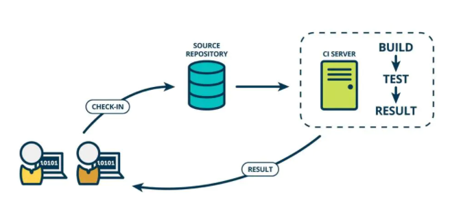
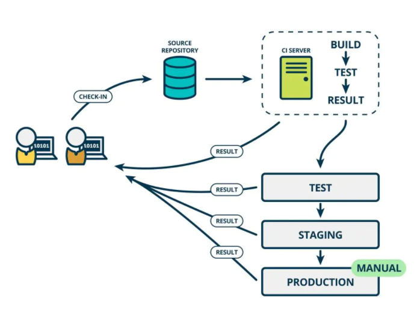

# Jenkins 

## 简介

+ 一款开源的持续集成的工具
+ 底层语言为 Java
+ 通常与版本管理工具（ SVN、Git等）、构建工具（Maven、Ant、Gradle等）结合使用

## Jenkins 特征

+ 开源的 Java 语言开发持续集成工具，支持持续集成、持续部署
+ 易于安装部署配置：可通过 yum 安装或下载 war 包以及通过 Docker 容器等快速实现安装部署
+ 消息通知及测试报告：集成 RSS-E-mail 通过 RSS 发布构建结果或当构建完成时通过 e-mail 通知，生成 JUint/TestNG 测试报告
+ 分布式构建：支持让多台计算机一起构建/测试
+ 文件识别
+ 丰富的插件支持

## CI/CD 介绍

### CI

Continuous integration ，持续集成，是一种开发时间

持续集成强调开发人员提交了代码之后，立即进行构建、测试

### CD

 Continuous Delivery，持续交付，在持续集成基础上，将集成后的代码部署到更贴近真实运行环境中

