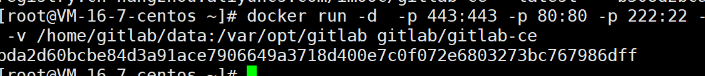
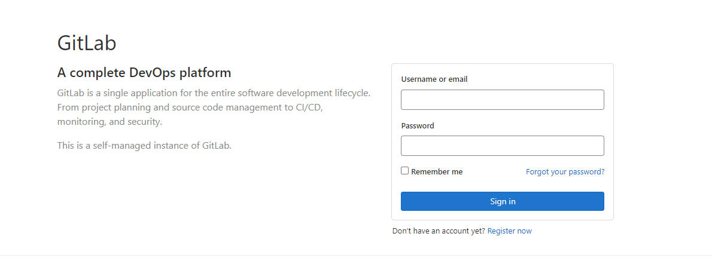

# Docker 环境安装 GitLab

## 前言

Linux 环境：CentOS

## 安装过程

### 镜像下载

官方版本：gitlab/gitlab-ce:latest

```
# docker pull gitlab/gitlab-ce:latest
```

### 运行镜像

```
docker run -d \
           -p 443:443 \
           -p 9001:80 \
           --name mygitlab \
           --restart always \
           --privileged=true \
           -v /home/gitlab/config:/etc/gitlab \
           -v /home/gitlab/logs:/var/log/gitlab \
           -v /home/gitlab/data:/var/opt/gitlab \
           gitlab/gitlab-ce
```

或生成一个 .sh 文件来执行启动

```
#!/bin/bash
HOST_NAME=gitlab.mooc.com
GITLAB_DIR=`/home/gitlab`
docker stop gitlab
docker rm gitlab
docker run -d \\
    --hostname \${HOST_NAME} \\
    -p 443:443 -p 5000:80 -p 8022:22 \\
    --name gitlab \\
    -v \${GITLAB_DIR}/config:/etc/gitlab \\
    -v \${GITLAB_DIR}/logs:/var/log/gitlab \\
    -v \${GITLAB_DIR}/data:/var/opt/gitlab \\
    registry.cn-hangzhou.aliyuncs.com/imooc/gitlab-ce:latest
EOF

后启动 sh start.sh
```

参数解释：

| 参数   | 说明                                                   |
| ------ | ------------------------------------------------------ |
| -d     | 后台运行                                               |
| -p     | 将容器内部端口向外映射                                 |
| --name | 命名容器名称                                           |
| -v     | 将容器内数据文件夹或日志、配置文件夹挂载到主机指定目录 |

运行成功后如下：



### 配置环境

+ 修改 ssh 端口（如果主机端口使用的不是 22 端口）

  修改文件：${GITLAB_DIR}/config/gitlab.rb
  找到这一行：# gitlab_rails['gitlab_shell_ssh_port'] = 22
  把 22 修改为你的宿主机端口（这里是 2222）。然后将注释去掉

+ 重新启动容器 `$ sh start.sh`

### 降低 gitlab 配置

宿主机上修改配置文件
```shell
vi /home/gitlab/logs/gitlab.rb
```
删除以下配置的注释，并修改参数：
+ 修改 worker_processes 减少进程数
```shell
#官方建议 CPU 核心数加一，最小值是 2
unicorn['worker_process']=2
```
+ 减少数据库缓存，可适当改小
```shell
postgresql['shared_buffers']="256MB"
```
+ 减少数据库并发数，可适当改小
```shell
postgresql['max_worker_process']=8
```
+ 减少 sidekiq 并发数，可适当改小
```shell
sidekiq['concurrency']=25
```
修改完成后，可重启容器

### 访问 gitlab 页面

使用 http://IP:9001 访问



（完）