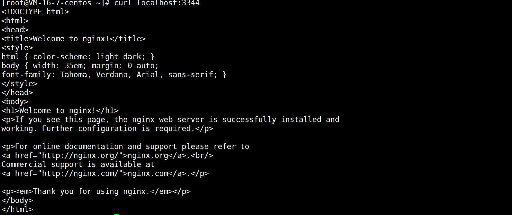
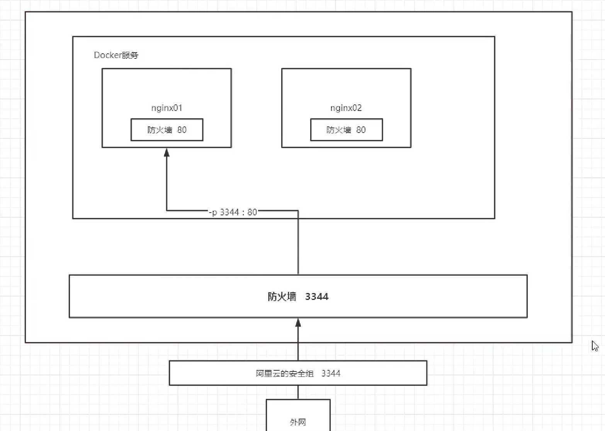

# Nginx 部署

## 搜索镜像

建议可以去 DockerHub 上去搜索

```
docker search nginx
```

## 拉取镜像

```
docker pull nginx
```

## 运行镜像

```
docker run -d --name nginx01 -p 3344:80 nginx
```

+ -d：后台运行
+ -p：端口映射，将容器内部的 80 端口映射到宿主机的 3344 端口
+ --name：给容器命名

## 验证容器运行成功



## 进入容器内部

```
docker exec -it nginx01 bash
```

## 运行原理



+ 外网访问 Linux 的 3344 端口，需要阿里云安全组先开放 3344 端口，才能正常访问
+ 打通宿主机和 Docker 容器，通过宿主机的 3344 端口访问容器内部的 80 端口，就是端口映射

## 每次改动配置文件，都要 exec 进入容器内部吗？

- 不需要
- docker run 命令提供了 -v 参数，它可以做到目录映射，即数据卷挂载