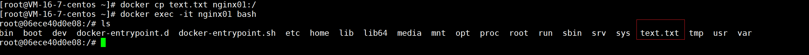

# docker cp

作用：在宿主机与容器中相互复制文件/文件夹

## 语法格式

```
docker cp [OPTIONS] CONTAINER:SRC_PATH DEST_PATH
docker cp [OPTIONS] SRC_PATH CONTAINER:DEST_PATH
```

#### options 说明

| option | 作用                                |
| ------ | ----------------------------------- |
| -a     | 存档模式（复制所有 uid / gid 信息） |
| -L     | 保持源目标中的链接                  |

**重点**:

- 容器 container 可以是正在运行或已停止的容器
- SRC_PATH 或 DEST_PATH 可以是文件或目录 
- 该命令会假定容器路径相对于容器的 /（根）目录
- 而主机路径则是相对于执行 docker cp 命令的当前目录

## SRC_PATH 和 DEST_PATH 

### SRC_PATH 指定一个文件

#### 若 DEST_PATH 不存在

创建 DEST_PATH 所需的文件夹，文件正常保存到 DEST_PATH 中

#### 若 DEST_PATH 不存在，并以 / 结尾

错误：目标目录必须存在

#### 若 DEST_PATH 存在并且是一个文件

目标被源文件的内容覆盖

#### 若 DEST_PATH 存在并且是目录

使用 SRC_PATH 中的基本名称将文件复制到此目录中

### SRC_PATH指定目录

#### 若 DEST_PATH 不存在

将 DEST_PATH 创建为目录，并将源目录的内容复制到该目录中

#### 若 DEST_PATH存在并且是一个文件

错误：无法将目录复制到文件

#### 若 DEST_PATH存在并且是目录

- SRC_PATH 不以 /. 结尾，源目录复制到此目录
- SRC_PATH 以 /. 结尾，源目录的内容被复制到该目录中

## 实例

### 从容器复制文件到主机

复制容器的目录到主机

```
docker cp nginx01:etc/ ./
```


### 从主机复制文件到容器

复制主机文件到容器

```
docker cp text.txt nginx01:/
```



## 参考资料

[官方文档](https://docs.docker.com/engine/reference/commandline/cp/)

（完）