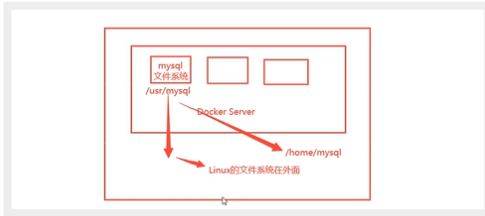

# docker 数据卷

## 为什么要使用数据卷

+ 数据存储在容器中，容器被删除，数据就会丢失，希望数据能够持久化
+ 每次修改文件的配置时，都要进入容器内部，比较麻烦

## 什么是容器数据卷

+ 为了实现容器之间数据共享，将 Docker 容器中产生的数据，同步到本地
+ 实际上就是目录的挂载
+ 实现数据同步和数据持久化
+ 可以实现容器间的数据共享，需要创建专门的数据卷容器



## 如何使用数据卷

### 方式一：指定目录挂载

```shell script
docker run -it -v 主机目录：容器内目录 -p 宿主机端口:容器内端口
```
例子：

```shell script
docker run -it -v /home/ceshi:/home centos:centos7 /bin/bash
```
查看挂载：
```shell script
docker inspect c2baae501793
```
结果：
```shell script
  "Mounts": [
            {
                "Type": "bind",
                "Source": "/home/ceshi",   # Linux 路径
                "Destination": "/home",    # 容器中的路径
                "Mode": "",
                "RW": true,
                "Propagation": "rprivate"
            }
        ],
```
挂载成功后，就可以在容器和 Linux 中相应的路径中修改文件后，会相互同步

::: tip 总结
+ 要挂载多个目录，可以使用多个 -v 

+ 挂载成功后即可相互修改文件同步更新，即使容器被 stop

  :::

### 方式二：匿名挂载

```shell script
docker run -it -v 容器内目录 
```
例子：匿名挂载 Nginx
```shell script
docker run -d -p 80:80 -v /etc/ngnix nginx
```
查看所有 volume 的情况：
```shell script
docker volume -h

Commands:
  create      Create a volume  # 新增卷
  inspect     Display detailed information on one or more volumes  # 显示卷的相信信息
  ls          List volumes   # 列出所有的卷
  prune       Remove all unused local volumes # 移除所有不可用的卷
  rm          Remove one or more volumes  # 删除一个或多个卷

```
结果：
```shell script
[root@VM-16-7-centos data]# docker volume ls
DRIVER    VOLUME NAME
local     2e9fa961b3a9439eacb947154d3a7624c0422a22da8339e01b5b7544915b98e2
local     1185c635a511a02e9600a632b14b229569fb73cc8280510f47a67e7f2a42f8b7
```
上面的方式就是匿名挂载，系统会随机生成一个卷号

### 方式三：具名挂载

```shell script
docker run -it -v 卷名:容器内目录 
```
例子：具名挂载 Nginx
```shell script
docker run -d -p 80:80 -v juming-nginx:/etc/ngnix --name nginx01 nginx 
```
查看卷：
```shell script
[root@VM-16-7-centos data]# docker volume ls
DRIVER    VOLUME NAME
local     2e9fa961b3a9439eacb947154d3a7624c0422a22da8339e01b5b7544915b98e2
local     1185c635a511a02e9600a632b14b229569fb73cc8280510f47a67e7f2a42f8b7
local     juming-nginx
```

查看卷具体信息：
```shell script
[root@VM-16-7-centos data]# docker volume inspect juming-nginx
[
    {
        "CreatedAt": "2022-04-05T14:12:27+08:00",
        "Driver": "local",
        "Labels": null,
        "Mountpoint": "/var/lib/docker/volumes/juming-nginx/_data",   # Linux 中生成的目录
        "Name": "juming-nginx",
        "Options": null,
        "Scope": "local"
    }
]
```
::: danger 总结
+ 所有的 docker 内的卷，没有指定目录的情况下，都是在 /var/lib/docker/volumes/xxx/_data
+ 大多数的情况下使用具名挂载，可以方便的找到
:::

#### 拓展

通过 ro、rw 改变读写权限
```shell script
-v 容器内路径:ro

-v 容器内路径:rw
```
+ ro：只读
+ rw: 可读写，默认

```shell script
docker run -d -p 80:80 -v juming-nginx:/etc/ngnix:ro --name nginx01 nginx 
docker run -d -p 80:80 -v juming-nginx:/etc/ngnix:rw --name nginx01 nginx

```
+ 设置容器内的路径只读，只能通过宿主机来操作
+ 设置容器内的路径可读写，能在容器内操作

### 方式四：使用 DockerFile 进行挂载

+ 用来构建 docker 镜像的构建文件
+ 镜像是一层一层的，脚本的每个命令就是一层

DockerFile 内容：
```shell script
FROM  cnetos
VOLUME ['volume1', 'volume2']   # 匿名挂载
CMD echo 'success'
```
使用 `docker build` 构建
```shell script
docker build -f dockerfile -t xuef/mycentos .
```
结果：
```shell script
[root@VM-16-7-centos test-volume]# docker build -f /home/dockerfile -t snowji/mycentos .
Sending build context to Docker daemon  1.583kB
Step 1/3 : FROM centos
latest: Pulling from library/centos
a1d0c7532777: Pull complete 
Digest: sha256:a27fd8080b517143cbbbab9dfb7c8571c40d67d534bbdee55bd6c473f432b177
Status: Downloaded newer image for centos:latest
 ---> 5d0da3dc9764
Step 2/3 : VOLUME ["volume01","volume02"]
 ---> Running in 3ea0015ed7ed
Removing intermediate container 3ea0015ed7ed
 ---> 3d795c480134
Step 3/3 : CMD echo "success"
 ---> Running in 24eaaa92fe2d
Removing intermediate container 24eaaa92fe2d
 ---> 7d327e2e64f3
Successfully built 7d327e2e64f3
Successfully tagged snowji/mycentos:latest

[root@VM-16-7-centos test-volume]# docker images
REPOSITORY      TAG       IMAGE ID       CREATED              SIZE
snowji/mycentos   latest    7d327e2e64f3   About a minute ago   231MB
```
查看挂载具体信息：
```shell script
# 运行刚刚构建的镜像
docker run -it 7d327e2e64f3 /bin/bash
# 查看容器的元数据
docker inspect 83d3fe414be1
```
结果：
```shell script
        "Mounts": [
            {
                "Type": "volume",
                "Name": "1cf1df8a6e04c508ed272502e2de1bd83c3ccc7b91a3dc1f465b308bcceacf14",
                "Source": "/var/lib/docker/volumes/1cf1df8a6e04c508ed272502e2de1bd83c3ccc7b91a3dc1f465b308bcceacf14/_data",
                "Destination": "volume01",
                "Driver": "local",
                "Mode": "",
                "RW": true,
                "Propagation": ""
            },
            {
                "Type": "volume",
                "Name": "66904eb6add3a676102e3c26ebc48d164fd706bf0ec97743552716fd5b091985",
                "Source": "/var/lib/docker/volumes/66904eb6add3a676102e3c26ebc48d164fd706bf0ec97743552716fd5b091985/_data",
                "Destination": "volume02",
                "Driver": "local",
                "Mode": "",
                "RW": true,
                "Propagation": ""
            }
        ],
```
可以看到，上面挂载成功，这种方式使用的非常多

## 数据卷容器

```shell script
# 第一步: 创建一个数据卷容器和宿主机目录进行挂载
docker run -it -v 宿主机目录:容器内目录 --name nginx01 nginx /bin/bash

# 第二步：创建其他容器和数据卷容器进行挂载，使用--volumes-from命令进行指定。
docker run -it --volumes-from nginx01 --name nginx02 nginx /bin/bash

# 第三步: 创建其他容器和数据卷容器进行挂载
docker run -it --volumes-from nginx01 --name nginx03 nginx /bin/bash

# 此时nginx02和nginx03之间的数据就是可以共享的了。
```
+ 容器之间的信息传递，数据卷的生命周期一直存在到没有容器使用
+ 一但数据持久化到本地，本地的数据是不会被删除

