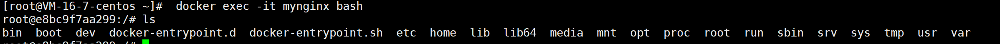
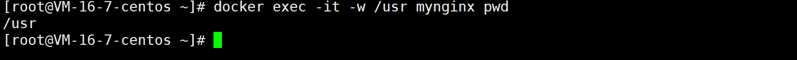
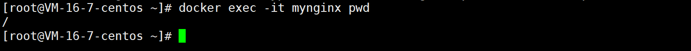
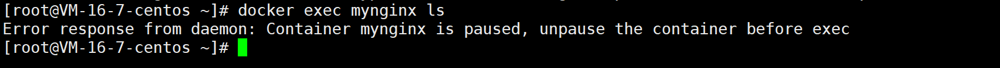
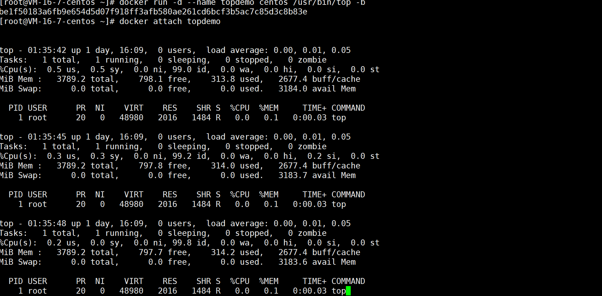

# docker exec/attach
## exec

作用：在正在运行的容器中运行命令

### 语法格式

```
 docker exec [OPTIONS] CONTAINER COMMAND [ARG...]
```

介绍常用 options 说明：

| option     | 说明                                      |
| ---------- | ----------------------------------------- |
| -d         | 在后台运行命令                            |
| -i         | 即使没有附加也保持 STDIN 打开，和 -t 配合 |
| -t         | 进入容器的 CLI 模式                       |
| -e         | 设置环境变量                              |
| --env-file | 读入环境变量文件                          |
| -w         | 需要执行命令的目录                        |
| -u         | 指定访问容器的用户名                      |

### docker exec 实例

#### 进入容器的 CLI 模式(常用)

```bash
docker exec -it mynginx bash
```



#### 指定目录执行命令

```
docker exec -it -w /root mynginx pwd
```



#### 执行命令

```
docker exec -it mynginx pwd
```



####  以 root 用户身份进入容器（重点）

```
docker exec -it -uroot mynginx bash
```
好处就是，你在容器里敲命令就是 root 用户，畅通无阻，不存在权限不足的问题

**注意**：

`docker exec ` 不能在暂停的容器中运行命令，会报错



## attach
作用：进入容器正在执行的终端
### 语法格式
```
docker attach [OPTIONS] CONTAINER
```

option 说明：

| option        | 说明                       |
| ------------- | -------------------------- |
| --detach-keys | 覆盖用于分离容器的键序列   |
| --no-stdin    | 不要附加标准输入           |
| --sing-proxy  | 所有接收到的信号代理到进程 |

### docker attach 实例

```
docker run -d --name topdemo centos /usr/bin/top -b
docker attach topdemo
```



能看到 topdemo 容器内部正在执行的命令，1s 输出一次

## exec 与 attach 区别
```
#进入当前容器后开启一个新的终端，可以在里面操作。（常用）
docker exec 

# 进入容器正在执行某个命令的终端，不能在里面操作
docker attach 
```