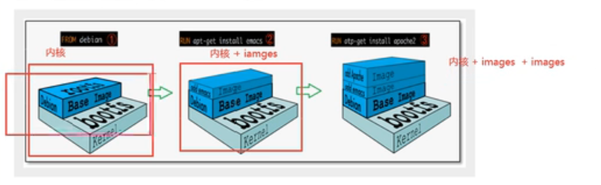
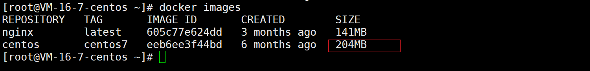
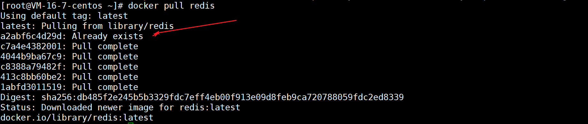
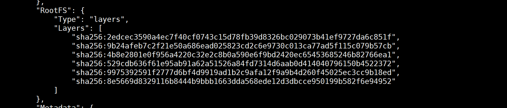
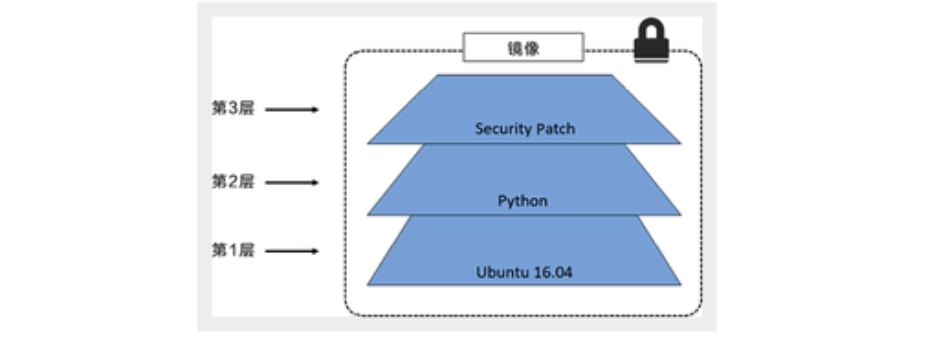
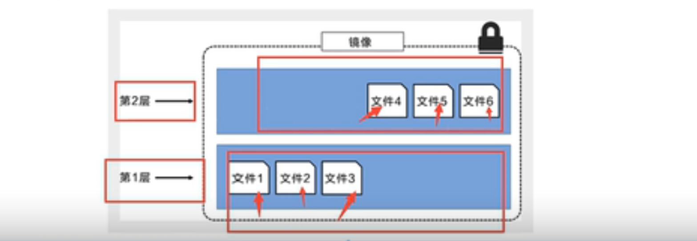
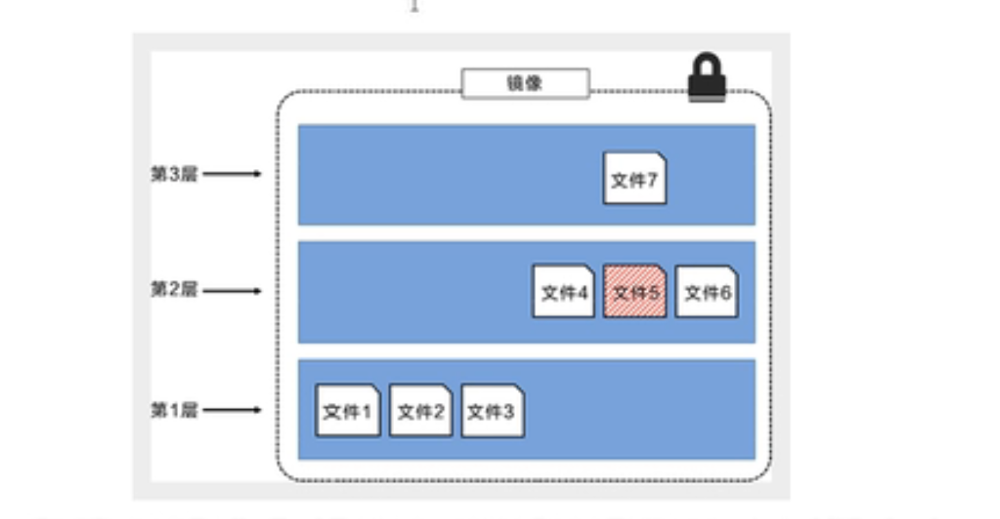
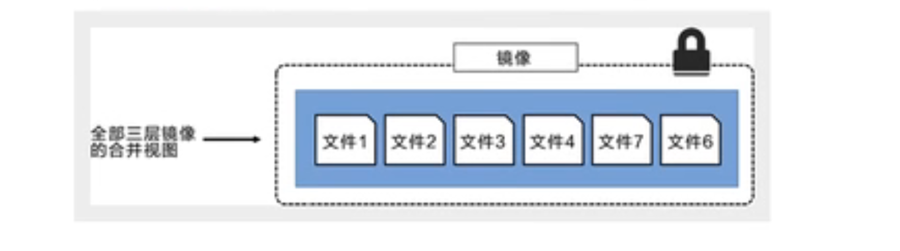
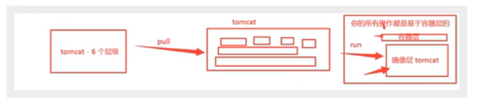

# 镜像原理

## 镜像是什么

+ 镜像是一种轻量级、可执行的独立软件保，用来打包软件运行环境和基于运行环境开发的软件
+ 他包含运行某个软件所需的所有内容，包括代码、运行时库、环境变量和配置文件
+ 所有应用，都可以直接打包 docker 镜像，就可以直接跑起来

## 如何得到镜像

+ 从远程仓库下载
+ 别人拷贝给你
+ 自己制作一个镜像 DockerFile


## UnionFs （联合文件系统）

+ Union文件系统（UnionFs）是一种分层、轻量级并且高性能的文件系统
+ 他支持对文件系统的修改作为一次提交来一层层的叠加，同时可以将不同目录挂载到同一个虚拟文件系统下
+ Union文件系统是 Docker 镜像的基础
+ 可以通过分层来进行继承，基于基础镜像（没有父镜像），可以制作各种具体的应用镜像
+ 特性：一次同时加载多个文件系统，但从外面看起来，只能看到一个文件系统，联合加载会把各层文件系统叠加起来，这样最终的文件系统会包含所有底层的文件和目录


## Docker 镜像加载原理

+ Docker 的镜像实际上由一层一层的文件系统组成，这种层级的文件系统叫 UnionFS
+ boots(boot file system）主要包含 bootloader 和 Kernel, bootloader 主要是引导加载 kernel, Linux 刚启动时会加 bootfs 文件系统，在 Docker 镜像的最底层是 boots，几乎不变
+ 这一层与我们典型的 Linux/Unix 系统是一样的，包含 bootloader 和 Kernel
+ 当 boot 加载完成之后，整个内核就都在内存中了，此时内存的使用权已由 bootfs 转交给内核，此时系统也会卸载 bootfs
+ rootfs（root file system),在 bootfs 之上，包含的就是典型 Linux 系统中的 /dev、/proc/bin、/etc 等标准目录和文件
+ rootfs 就是各种不同的操作系统发行版，比如 Ubuntu, Centos 等等



平时我们安装进虚拟机的 CentOS 都是好几个 G，为什么 Docker 这里才 200M？



+ 对于个精简的 OS , rootfs 可以很小，只需要包合最基本的命令，工具和程序库就可以了
+ 因为底层直接用主机的 kernel，自己只需要提供 rootfs 就可以了
+ 由此可见对于不同的 Linux 发行版， boots 基本是一致的， rootfs 会有差別，因此不同的发行版可以公用 bootfs
+ 所以虚拟机启动是分钟级别，容器是秒级！

## Docker 镜像分层

下载镜像时，可以看到一层一层的在下载



::: tips 为什么 Docker 镜像要采用这种分层的结构呢？
+ 最大的好处，我觉得莫过于资源共享了！
+ 比如有多个镜像都从相同的 Base 镜像构建而来，那么宿主机只需在磁盘上保留一份 base 镜像，同时内存中也只需要加载一份 base 镜像
+ 这样就可以为所有的容器服务了，而且镜像的每一层都可以被共享
+ Already exists 代表宿主机已存在镜像所需的文件，所以不再需要下载，直接使用即可
+ Downloading 代表宿主机没有所需的文件，所以需要下载，下载完之后就会存在宿主机，以后下载其他镜像时如果用到这些文件就可以直接拿来用，不用二次下载了
:::

查看镜像分层
```bash
docker inspect redis
```


### 分层理解：

+ 所有的 Docker 镜像都起始于一个基础镜像层，其实就是 rootfs，像 Ubuntu、CentOS
+ 当进行修改或添加新的内容时，就会在当前镜像层之上，创建新的镜像层

例子：
+ 基于 Ubuntu Linux16.04 创建一个新的镜像，这就是新镜像的第一层
+ 如果在该镜像中添加 Python 包，就会在基础镜像层之上创建第二个镜像层
+ 如果继续添加一个安全补丁，就会创健第三个镜像层
+ 该镜像当前已经包含 3 个镜像层
+ 现在可以把它再次打包成一个新的镜像（commit）提供给其他人下载，其他人 pull 下来之后就会有三层东西



**重点**：
在添加额外的镜像层的同时，镜像始终保持是当前所有镜像的组合

下图中举了一个简单的例子，每个镜像层包含 3 个文件，而镜像包含了来自两个镜像层的 6 个文件



上图中的镜像层跟之前图中的略有区別，主要目的是便于展示文件

下图中展示了一个稍微复杂的三层镜像，在外部看来整个镜像只有 6 个文件，这是因为最上层中的文件7 是 文件5 的一个更新版



这种情況下，上层镜像层中的文件覆盖了底层镜像层中的文件

这样就使得文件的更新版本作为一个新镜像层添加到镜像当中

**存储引擎**

+ Docker 通过存储引擎（新版本采用快照机制）的方式来实现镜像层堆栈，并保证多镜像层对外展示为统一的文件系统
+ Linux 上可用的存储引撃有 AUFS、 Overlay2、 Device Mapper、Btrfs 以及 ZFS
+ 每种存储引擎都基于 Linux 中对应的文件系统或者块设备技术，井且每种存储引擎都有其独有的性能特点
+ Docker 在 Windows上仅支持 windowsfilter 一种存储引擎，该引擎基于 NTFS 文件系统之上实现了分层和 CoW

**镜像层合并**

+ 下图展示了与系统显示相同的三层镜像
+ 所有镜像层堆并合井，对外提供统一的视图



上面有查看 redis 镜像的 layer 是 6 层，跟上图差不多，6 个文件就是 6 个 layer

### 特点

+ Docker 镜像都是只读的，当容器启动时，一个新的可写层加载到镜像的顶部
+ 这一层就是我们通常说的容器层，容器之下的都叫镜像层


## 参考资料

[镜像原理之联合文件系统](https://www.bilibili.com/video/BV1og4y1q7M4?p=18)

[镜像原理之分层](https://www.bilibili.com/video/BV1og4y1q7M4?p=18)