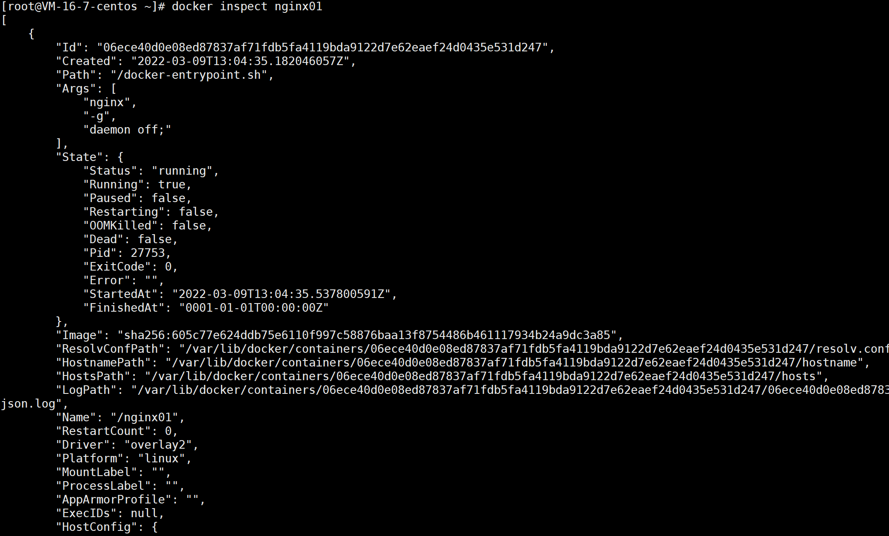
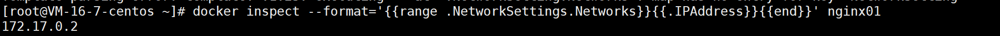
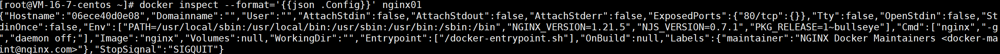
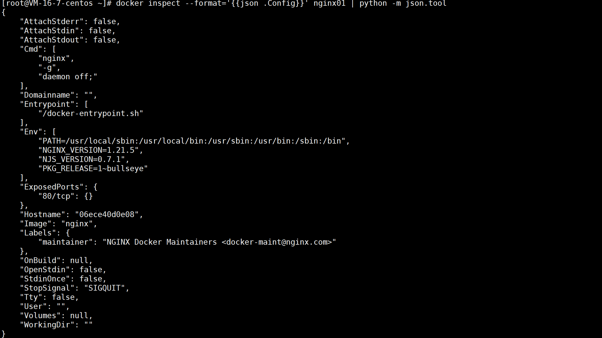

# docker inspect

作用：获取容器的元数据（JSON 格式）

## 语法格式

```
docker inspect [OPTIONS] NAME|ID [NAME|ID...]
```

options 说明

| option      | 说明                             |
| ----------- | -------------------------------- |
| -f,--format | 指定返回值的模板文件             |
| -s,--size   | 如果类型为容器，则显示文件总大小 |
| --type      | 返回指定类型的 JSON              |

## 实例

### 获取 Nginx 的元数据



### 获取 IP 地址

```
 docker inspect --format='{{range .NetworkSettings.Networks}}{{.IPAddress}}{{end}}' $INSTANCE_ID
```



更简单的方式：

```
docker inspect nginx01 | grep IPAddress
```


### 获取指定端口映射

使用 index 

```
docker inspect --format='{{(index (index .NetworkSettings.Ports "80/tcp") 0).HostPort}}' $INSTANCE_ID
```


### 获取配置

使用 json 格式

```
 docker inspect --format='{{json .Config}}' $INSTANCE_ID
```



输出的结果不太友好，可以使用 Python 中的 json.tool 或 jq 美化输出

```
#使用 Python 的 json 模块美化

docker inspect --format="{{json .Config}}" container | python -m json.tool

#使用 jq 美化

docker inspect --format="{{json .Config}}" container | jq
```




## 参考资料
[官方文档](https://docs.docker.com/engine/reference/commandline/inspect/)

（完）