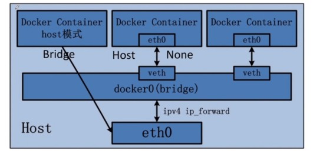

# docker 网络

## 网络类型



+ Bridge (默认模式)

  + host 与容器中的服务通过 Bridge 连接
  + 容器有自己的 IP 地址
  + 在 Bridge 模式下，需要使用到端口映射

+ Host

  + host 与服务器中的服务直接连接

  + 容器与 host 在同一局域网类

+ None

  无网络模式

## 理解 docker0

先使用 `ip addr` 查看下地址情况


那 docker 是如何处理容器网络访问的？

先运行一个 tomcat 容器

```shell script
# 运行容器
docker run -d -P --name tomcat01 tomcat

# 查看 ip
docker inspect  tomcat01
```
结果：
```shell script
"Networks": {
                "bridge": {
                    "IPAMConfig": null,
                    "Links": null,
                    "Aliases": null,
                    "NetworkID": "1a34c6878d70eff9c776795be79d3af53d90d02387738ce9cdecc9f7a7628a12",
                    "EndpointID": "e945b60a33d589ea48e113b3667729469c2d798f724dcbf4fecb2511554f9b98",
                    "Gateway": "123.12.0.1",
                    "IPAddress": "123.12.0.2",
                    "IPPrefixLen": 16,
                    "IPv6Gateway": "",
                    "GlobalIPv6Address": "",
                    "GlobalIPv6PrefixLen": 0,
                    "MacAddress": "02:42:xx:11:xx:02",
                    "DriverOpts": null
                }
            }
```
上面结果中发现：
+ 容器的地址与 docker0 的地址在同一网段
+ 容器的网关设置为 docker0 的地址

再次在 Linux 上查看 ip
```shell script
[root@VM-16-7-centos ~]# ip addr
1: lo: <LOOPBACK,UP,LOWER_UP> mtu 65536 qdisc noqueue state UNKNOWN group default qlen 1000
    link/loopback 00:00:00:00:00:00 brd 00:00:00:00:00:00
    inet 127.0.0.1/8 scope host lo
       valid_lft forever preferred_lft forever
    inet6 ::1/128 scope host 
       valid_lft forever preferred_lft forever
2: eth0: <BROADCAST,MULTICAST,UP,LOWER_UP> mtu 1500 qdisc mq state UP group default qlen 1000
    link/ether 52:54:00:23:33:ec brd ff:ff:ff:ff:ff:ff
    inet 123.0.16.7/22 brd 10.0.19.255 scope global eth0
       valid_lft forever preferred_lft forever
    inet6 fe80::5054:ff:fe23:33ec/64 scope link 
       valid_lft forever preferred_lft forever
3: docker0: <BROADCAST,MULTICAST,UP,LOWER_UP> mtu 1500 qdisc noqueue state UP group default 
    link/ether 02:42:f8:a5:25:5b brd ff:ff:ff:ff:ff:ff
    inet 123.17.0.1/16 brd 123.17.255.255 scope global docker0
       valid_lft forever preferred_lft forever
    inet6 fe80::42:f8ff:fea5:255b/64 scope link 
       valid_lft forever preferred_lft forever
119: veth705ec28@if118: <BROADCAST,MULTICAST,UP,LOWER_UP> mtu 1500 qdisc noqueue master docker0 state UP group default 
    link/ether 0e:91:3d:df:ad:20 brd ff:ff:ff:ff:ff:ff link-netnsid 0
    inet6 fe80::c91:3dff:fedf:ad20/64 scope link 
       valid_lft forever preferred_lft forever
```
+ 可以看到则增加了一个接口 119：veth705ec28@if118，此接口为 tomcat01 容器的接口
+ 接口是成对出现的，这是因为使用了 evth-pair 技术
+ evth-pair 技术充当桥梁，连接各种虚拟网络设备

在 Linux 上使用 ping 命令测试 Linux 与 容器之间是否连通:
```shell script
[root@VM-16-7-centos ~]# ping 123.17.0.2
PING 123.17.0.2 (123.17.0.2) 56(84) bytes of data.
64 bytes from 123.17.0.2: icmp_seq=1 ttl=64 time=0.039 ms
64 bytes from 123.17.0.2: icmp_seq=2 ttl=64 time=0.036 ms
```
发现是可以测试成功的

再启动一个 tomcat02 时，tomcat01 和 tomcat02 是可以相互 ping 通的

**容器网络访问（重点）**：


::: danger 总结：
+ Docker 使用 Linux 桥接
+ Dcoker 中所有的网络接口都是虚拟的，内网转发效率高
+ Docker 会给容器分配一个可用的 IP 
+ 默认不指定网络的情况下，所有的容器共用一个路由 docker0
+ 删除容器，对应的一对网桥就没了
:::

**核心原理图**：

