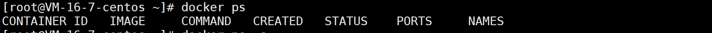
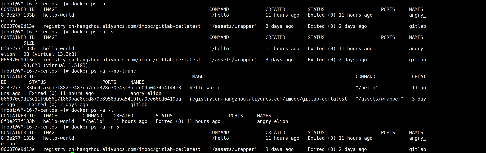

# docker ps

作用：查看容器

## 语法格式

```
 docker ps [OPTIONS]
```

option 说明：

| option          | 说明                                         |
| --------------- | -------------------------------------------- |
| -a,--a          | 显示所有容器(默认显示运行中的)               |
| -f,--filter     | 查看指定条件的容器                           |
| --format string | 使用 Go 模板优美的输出                       |
| -n,--last int   | 查看最近创建的 n 个容器（默认 -1，代表全部） |
| -l,--latest     | 显示最近创建的容器（包括所有状态的容器）     |
| --no-trunc      | 显示完整的镜像 ID                            |
| -q,--quit       | 静默模式，只显示容器 ID                      |
| -s,--size       | 显示总的文件大小                             |

## 实例

### 不带 options



### 带 options



**列表字段**：

- `CONTAINER ID`：容器 ID
- `IMAGE`：所属镜像
- `COMMAND`：启动容器时后，容器运行的命令
- `CREATED`：容器创建时间
- `STATUS`：容器状态
- `PORTS`：实际运行端口，若有指定运行端口则会显示指定的端口和默认运行端口，以及连接类型（ tcp / udp ）
- `NAMES`：容器名称
- `SIZE`：容器全部文件的总大小，也会显示容器大小

#### filter

| filter            | 说明                                              |
| ----------------- | ------------------------------------------------- |
| id                | 容器 ID                                           |
| name              | 容器名称                                          |
| lable             | 键或键值对的任意字符串，如 `<key>` 或 `<key>=<value>` |
| exited            | 显示容器退出码，仅对 -a 参数有效                  |
| status            | 容器状态                                          |
| ancestor          | 显示共享容器的子容器                              |
| before or since   | 显示在给定容器 ID 或名称之前或之后创建的容器      |
| volume            | 显示已经挂在的在运行中的容器                      |
| network           | 显示连接到网络的在运行中的容器                    |
| publish or expose | 显示指定端口的容器                                |
| health            | 根据容器的健康状态过滤                            |
| isolation         | 仅限 Windows 守护进程                             |
| is-task           | 显示作为服务的容器                                |

**容器的状态**：

- created：已创建
- restarting：重启中
- running：运行中
- removing：迁移中
- paused：暂停
- exited：停止
- dead：死亡

（完）