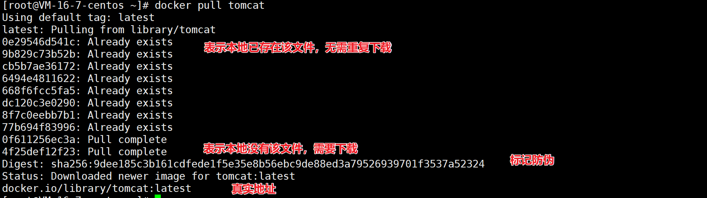
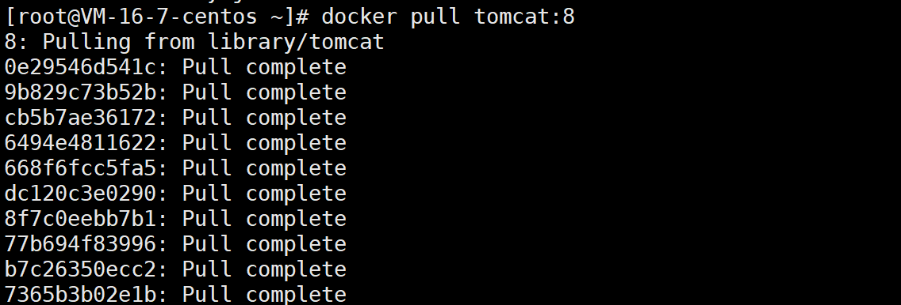

# docker pull

作用：从镜像仓库中拉取或更新镜像

## 语法格式

```
 docker pull [OPTIONS] NAME[:TAG|@DIGEST]
 
 tag：默认是 latest
```

option 说明：

| option                  | 说明                               |
| ----------------------- | ---------------------------------- |
| -a, --all-tags          | 拉取所有 tagged 镜像               |
| --disable-content-trust | 忽略镜像的校验，默认开启           |
| --platform              | 若服务支持多平台，这里可以设置平台 |
| --quiet，-q             | 概要输出                           |

## 拉取镜像

拉取最新的 tomcat 镜像的过程



```
docker pull tomcat === docker pull docker.io/library/tomcat:latest
```

拉取指定 tag 的 tomcat 镜像



