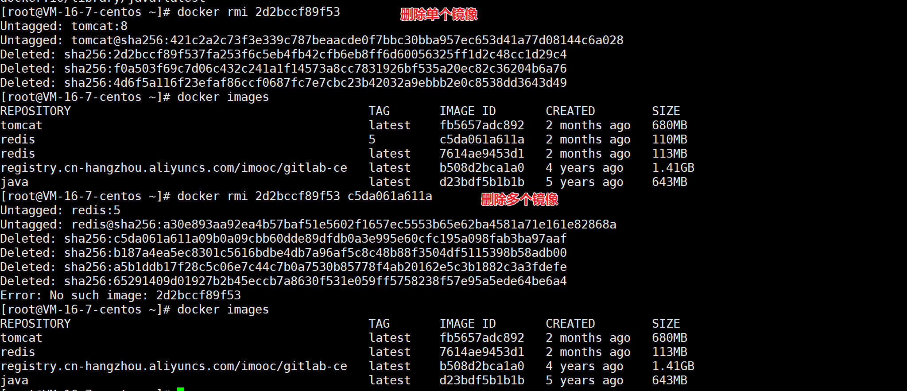
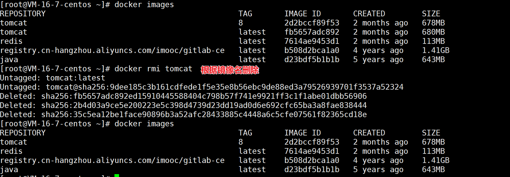
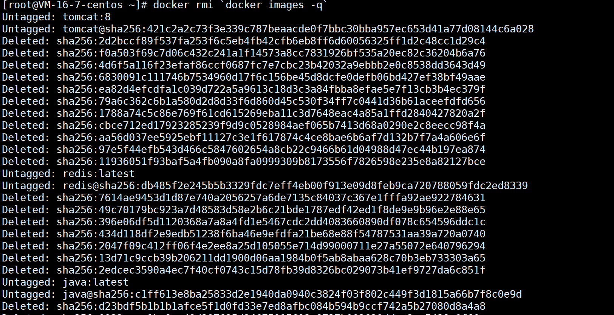
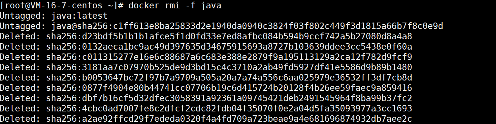

# docker rmi

作用：删除一个或多个镜像

## 语法格式

```
 docker rmi [OPTIONS] IMAGE [IMAGE...]
```

option 说明：

| option      | 说明           |
| ----------- | -------------- |
| --force，-f | 强制删除镜像   |
| --no-prune  | 不删除未标记的 |

## 删除镜像

### 不带 option

#### 根据镜像 ID 删除



#### 根据镜像名删除



默认删除的是 latest 版本

#### 组合删除



#### 强制删除



**注意**:

如果通过某个镜像创建了容器，则该镜像无法删除。

**解决办法**：先删除镜像中的容器，再删除该镜像。