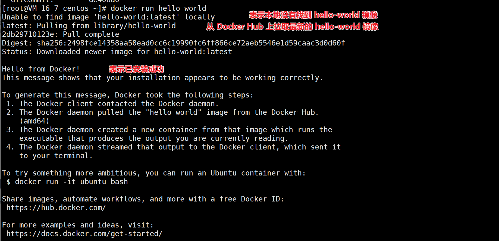
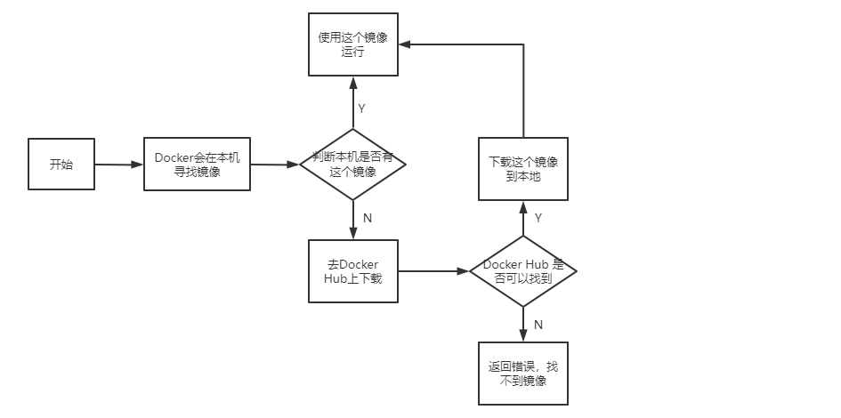
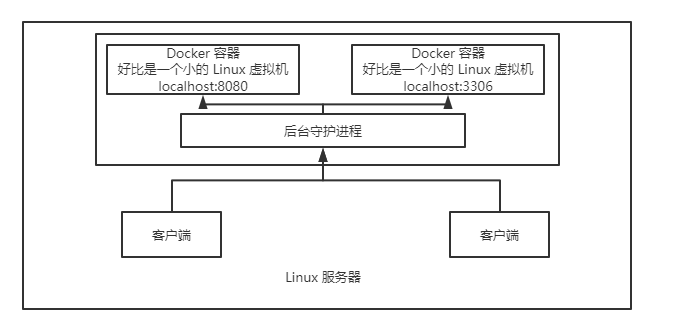

# docker run 流程和原理

## dockers run 流程

+ 一般学习一门语言都是从 `hello world` 开始
+ Docker 安装完成后，可以使用 `docker run hello-world` 来验证 Docker Engine 是否已正确安装

### hello-world

根据上面的结果，docker run 的流程如下：

## Docker 底层原理

### Docker 是如何工作的

+ docker 是一个 C/S 结构的系统
+ docker 的守护进程运行在主机上
+ 通过 Socket 从客户端访问
+ docker-Server 接收到 docker-Client 的指令，就会执行这个命令

- docker-client：可以理解为 cmd 窗口，可以敲 docker 命令
- docker-host：其实就是 docker-server，里面包含了守护进程、容器、镜像
- docker daemon：就是守护进程，收到命令后就会去执行命令

如图：

+ Linux 系统中输入 docker 命令
+ 客户端访问 docker 的后台守护进程
+ 后台守护进程执行命令，作用于不同的容器

（完）