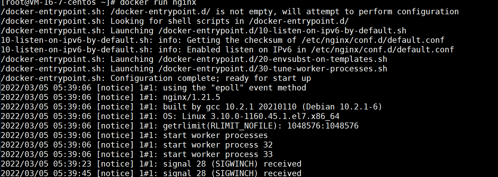
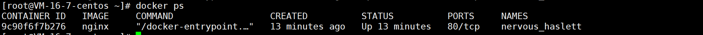
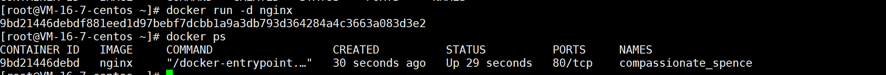
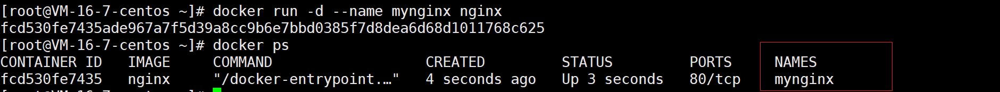
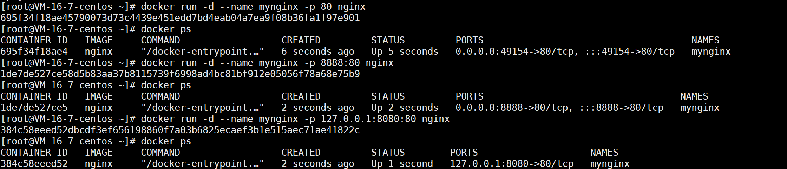
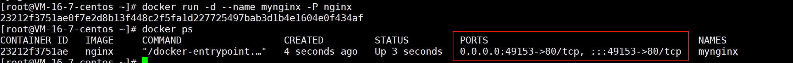
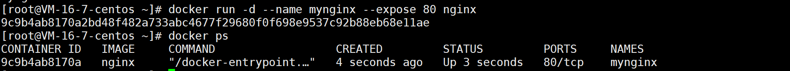
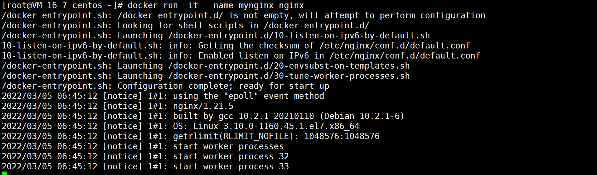
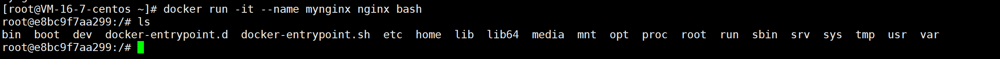

# docker run

作用：创建并进入容器

## 语法格式

```
 docker run [OPTIONS] IMAGE [COMMAND] [ARG...]
```

**COMMAND**：需要在容器内执行的命令

**docker run 执行流程**：

- 首先在指定镜像上创建一个可写的容器层
- 然后使用指定的命令（COMMAND）启动它
- docker run 相当于执行了两个 API：`/containers/create`、`/containers/(id)/start`

常用 options 说明：

| options               | 说明                                                 |
| --------------------- | ---------------------------------------------------- |
| -i，--interactive     | 以交互模式运行容器，通常与 -t 同时使用               |
| -t，--tty             | 启动容器后，为容器分配一个命令行，通常与 -i 同时使用 |
| -d, --detach          | 后台运行容器并打印容器 ID                            |
| --name                | 给容器添加名字                                       |
| -p, --publish         | 指定端口映射，格式：主机(宿主)端口:容器端口          |
| -P, --publish-all     | 随机端口映射，容器内部端口**随机**映射到主机的端口   |
| -u                    | 以什么用户身份创建容器                               |
| -m, --memory          | 设置容器使用内存最大值                               |
| --privileged          | 容器内是否使用真正的 root 权限                       |
| -e username="ritchie" | 设置环境变量                                         |
| --dns                 | 指定容器 dns 服务器                                  |

## docker run 实例

### 无 options

使用镜像 nginx



此时会将容器日志打印，无法输入其他命令

重新新开一个终端，使用 `docker ps` 查看容器



### 带 options

#### -d 

后台运行容器方式



**注意**：

+ 容器使用后台运行，就必须要有一个前台进程
+ docker 发现没有应用，就会停止

#### --name

给容器添加名字



#### 端口映射

##### 方式一：-p

3 种格式：

```
# 指定 ip 和端口
docker run -p ip:主机端口:容器端口
# 指定端口
docker run -p 主机端口:容器端口 （常用）
# 随机端口，与 -P 类似
docker run -p 容器端口
```



##### 方式二：-P



可以看到将容器端口随机映射到主机主机的 49153 端口上了

##### 方式三：--expose



可以看到将容器端口随机映射到主机主机的 80 端口上了

#### -it

##### 不带 bash



没有进入 CLI 界面

##### 带 bash



进入了 CLI 界面，可以进行命令操作

##### 退出当前容器

```
exit         #退出 CLI 容器直接 stop
ctrl +P +Q   #容器不停止退出     ---注意：这个很有用的操作
```

（完）