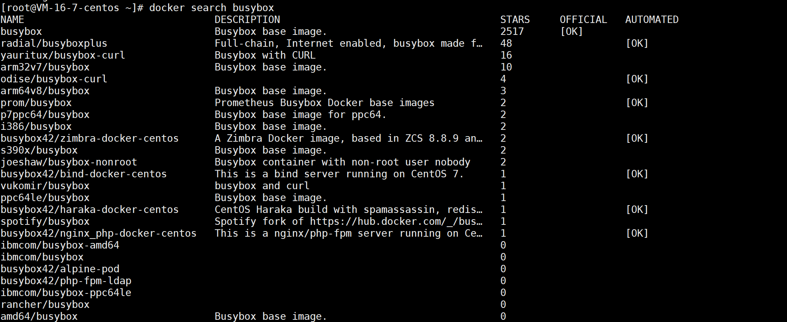
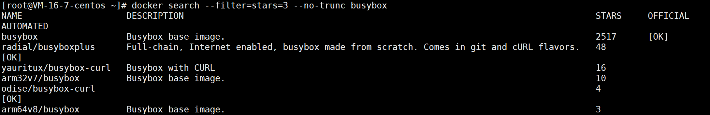
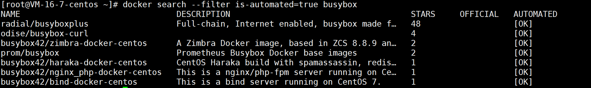
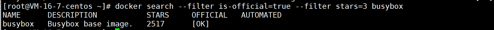
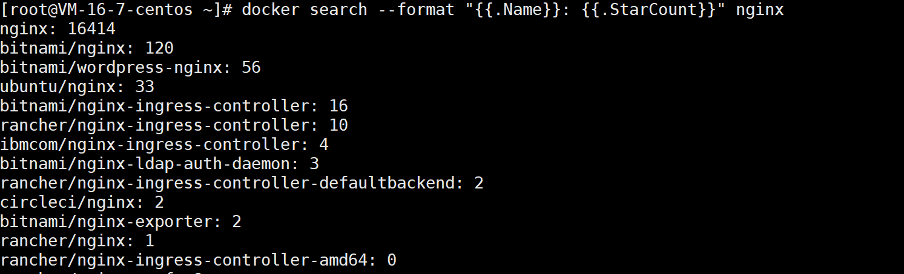
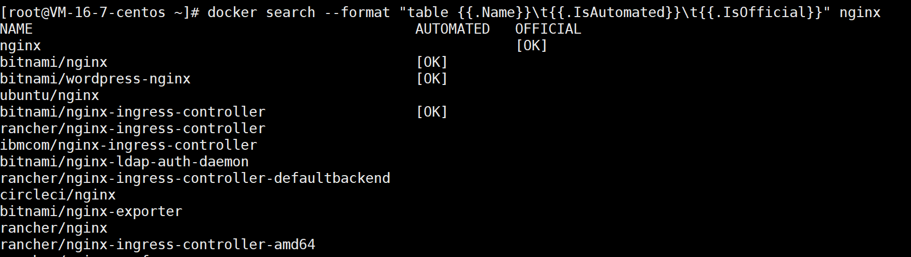

# docker search

作用：从 Docker Hub 搜索镜像

## 语法格式

```
 docker search [OPTIONS] TERM
```

options 说明：

| option              | 作用                         |
| ------------------- | ---------------------------- |
| -f, --filter filter | 根据提供的 filter 过滤输出   |
| --limit             | 搜索结果的最大数目（默认25） |
| --no-trunc          | 显示完整的镜像 description   |
| --format            | 使用 Go 模板进行美观打印     |

## 搜索镜像

### 不带 options 

通过搜索镜像名



**列表含义**:

- `NAME`：镜像名称
- `DESCRIPTION`：镜fil像描述
- `STARS`：用户评价，反映一个镜像的受欢迎程度
- `OFFICIAL`：是否为官方构建
- `AUTOMATED`：自动构建，表示该镜像由 Docker Hub 自动构建流程创建的

## 带 options

#### limit

限制返回结果数


#### --no-trunc

搜索 star 数量 >=3 的 busybox 镜像并打印详细描述



#### filter

##### stars

搜索 star 数量 >=3 的 busybox 镜像


##### is-automated

搜索自动构建的 busybox 镜像



看到 AUTOMATED 都是【OK】

##### is-official

搜索 star 数量 >=3 且是官方版本的 busybox 镜像



看到 OFFICIAL 都是【OK】

##### --format

输出 name：StarCount 格式的 nginx 镜像



输出表格格式的 nginx 镜像



（完）