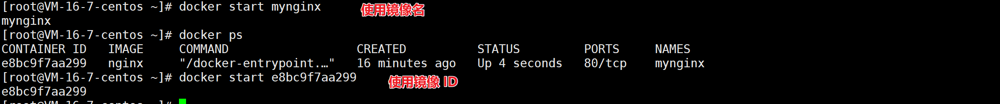
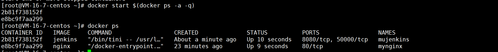

# docker start/restart

作用：启动/重启一个或多个容器

## 语法格式

```
docker start [OPTIONS] CONTAINER [CONTAINER...]
docker restart [OPTIONS] CONTAINER [CONTAINER...]
```

restart 的常用 options：

| option     | 说明                                 |
| ---------- | ------------------------------------ |
| --time, -t | 设置等多杀秒后重启容器，默认是 10 秒 |

## docker start/restat 实例

### 启动/重启单个容器

```
# 使用容器名启动
docker start mynginx   
# 使用容器ID 启动
docker start e8bc9f7aa299
# 使用容器名重启
docker restart mynginx
# 使用容器ID 重启
docker restart e8bc9f7aa299
```




### 启动/重启多个容器

```
docker start $(docker ps -a -q)
docker restart $(docker ps -a -q)
```

使用 `docker ps -a -q ` 获取所有容器的 ID



