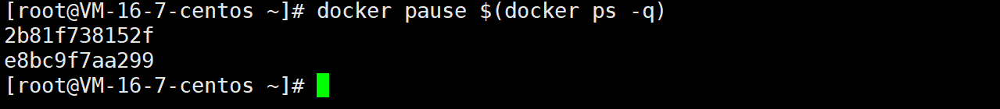

# docker stop/pause

作用：停止/暂停一个或多个容器

## 语法格式

```
 docker stop [OPTIONS] CONTAINER [CONTAINER...]
 docker pause CONTAINER [CONTAINER...]
```

stop option 说明：

| option     | 说明                                 |
| ---------- | ------------------------------------ |
| --time, -t | 设置等多杀秒后停止容器，默认是 10 秒 |

## docker stop/pause 实例

### 停止/暂停单个容器

```
# 使用容器名停止
docker stop mynginx   
# 使用容器ID 停止
docker stop e8bc9f7aa299
# 使用容器名暂停
docker pause mynginx
# 使用容器ID 暂停
docker pause e8bc9f7aa299
```


### 停止/暂停多个容器

使用 `docker ps -a -q ` 获取所有容器的 ID


