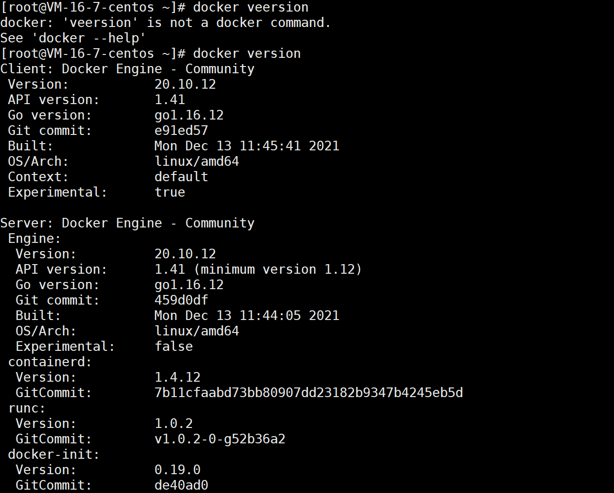
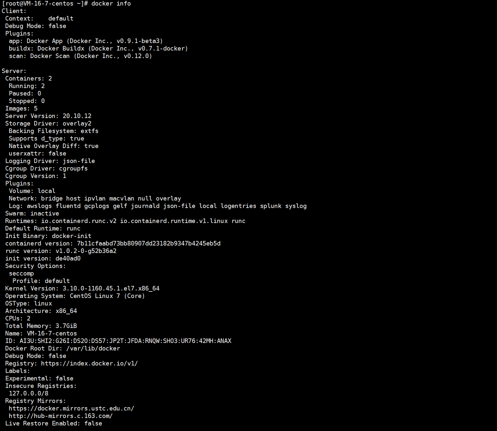

# docker version/info

version：查看 Docker 的版本信息

info：显示 Docker 系统信息，包括镜像和容器数

## docker version
### 语法格式

```
docker version [OPTIONS]
```

options 说明：

| option       | 说明                     |
| ------------ | ------------------------ |
| --format,-f  | 使用 Go 模板进行美观打印 |
| --kubeconfig | Kubernetes 配置文件      |

### 实例

#### 不带 option



可以看到 Docker Client 和 Docker Server 信息

#### 带 option

##### --format

获取 Server 版本


## docker info
### 语法格式
```
docker info [OPTIONS]
```

options 说明：

| -f   | ：使用给定的模板格式化输出（一般不用） |
| ---- | -------------------------------------- |



- Client：docker 客户端信息
- Server：docker 服务端信息
- Containers：容器数量
- Images：镜像数量
- Server Version：docker 版本
- Docker Root Dir：docker 根目录
- Registry Mirrors：当前使用的镜像源 

 
