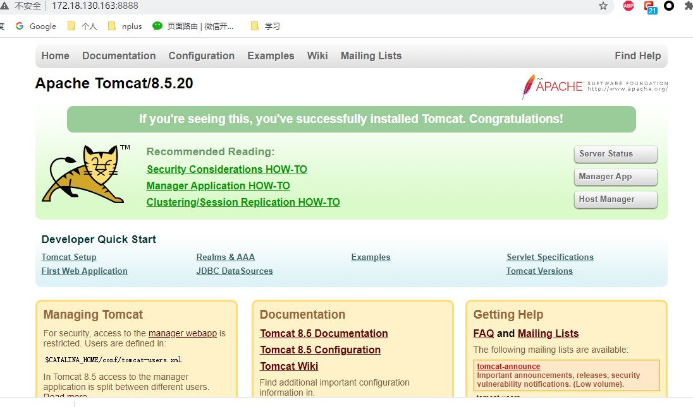
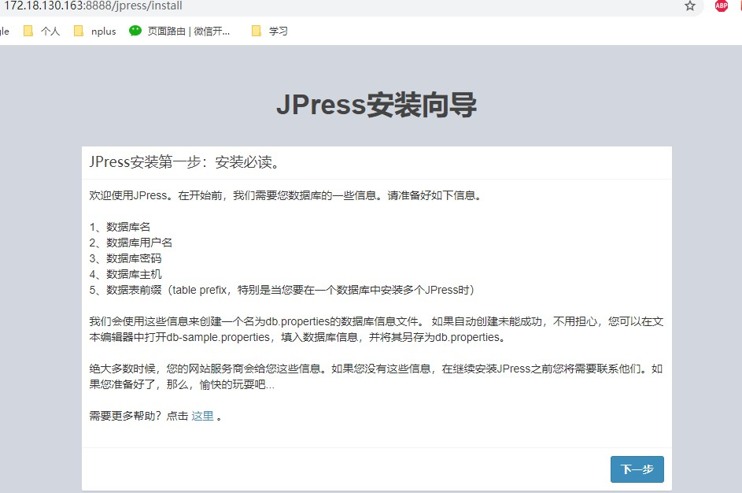
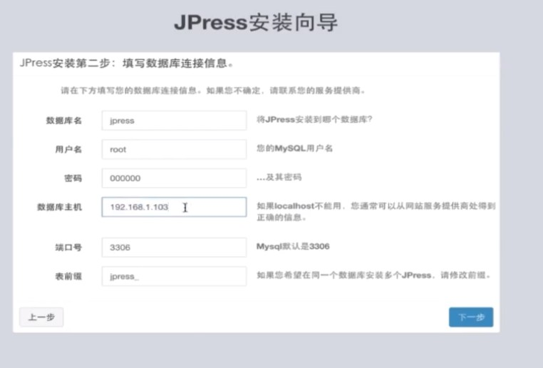
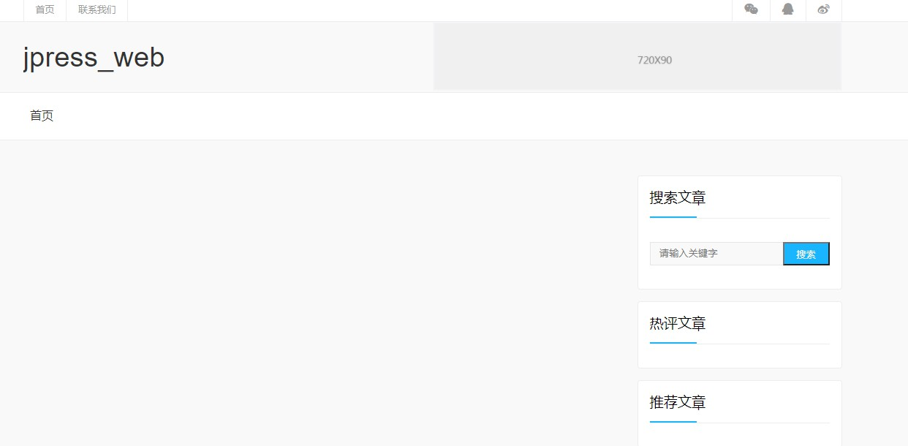

# Docker 镜像制作

**必须文件**：Dockerfile

以安装 JPress 为例

+ 下载 tomacat

  docker pull hub.c.163.com/library/tomcat:latest

+ 编写 Dockerfile

```
from hub.c.163.com/library/tomcat #将tomcat作为底层镜像

MAINTAINER xuefeng   #制作者信息

COPY jpress.war /usr/local/tomcat/webapps 将jpress.war文件拷贝至tomcat的webaps下
```

+ docker build -t jpress .

  在 Dockerfile 文件所在目录进行 build

+ 运行镜像

  docker run -d -p 8888:8080 jpress

  访问 8888 端口：

  

  访问 jpress

  

+ 安装 mysql 数据库

  docker pull hub.c.163.com/library/mysql:latest

  docker run -d -p 3306:3306 -e MYSQL_ROOT_PASSWORD=000000 -e MYSQL_DATABASE=jpress hub.c.163.com/library/mysql

+ 下一步填写 mysql 信息



+ 重启 jpress 容器

  docker restart 13

  重新加载网页：

  

