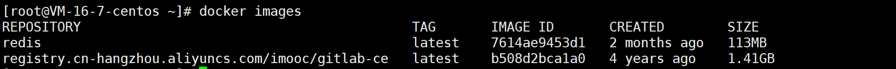
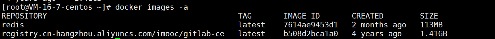
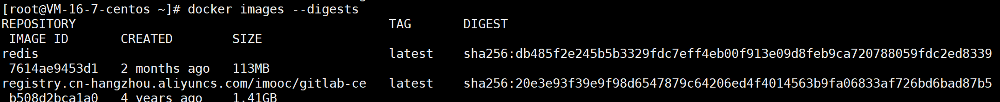
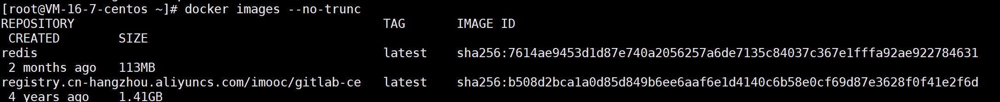
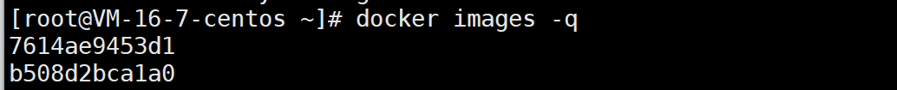
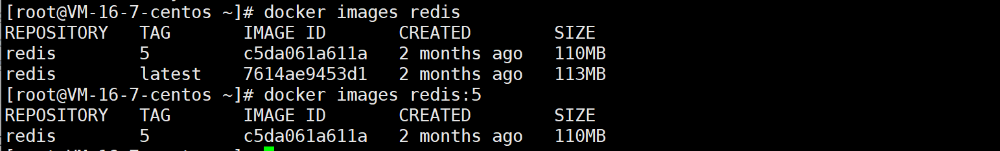

# docker images 命令

作用：列出本机所有镜像

## 语法格式:

```
 docker images [OPTIONS] [REPOSITORY[:TAG]]
```

options 说明:

| options      | 作用                                                         |
| ------------ | ------------------------------------------------------------ |
| -a, --all    | 列出本地所有的镜像（含中间镜像层，默认情况下，过滤掉中间映像层） |
| --digests    | 显示镜像的摘要信息                                           |
| -f, --filter | 显示满足条件（filter）的镜像                                 |
| --format     | 使用模板格式化输出                                           |
| --no-trunc   | 显示完整的镜像信息                                           |
| -q, --quiet  | 只显示镜像 ID                                                |

## 查看镜像：

```
docker images
```



**列表含义**：

- `REPOSITORY`：镜像在仓库中的名称
- `TAG`：镜像标签
- `IMAGE ID`：镜像 ID
- `CREATED`：镜像的创建日期（不是获取该镜像的日期）
- `SIZE`：镜像大小

### 带 option

#### -a



#### --digests



#### --no-trunc



#### -q



#### 指定镜像名或tag



（完）