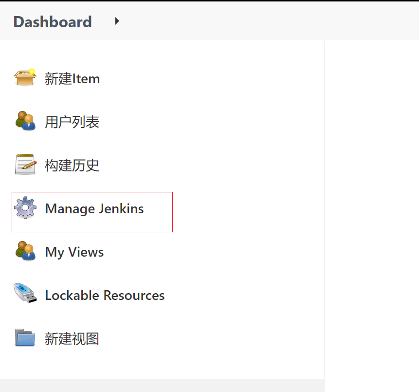
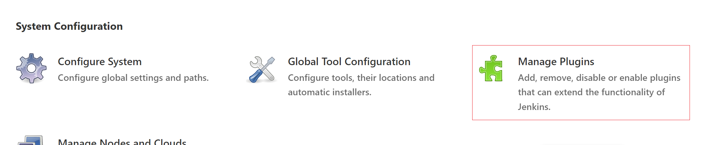
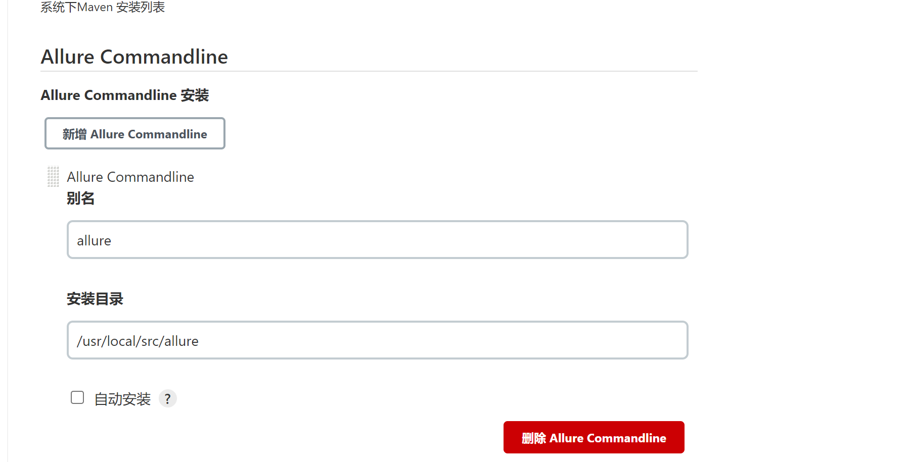
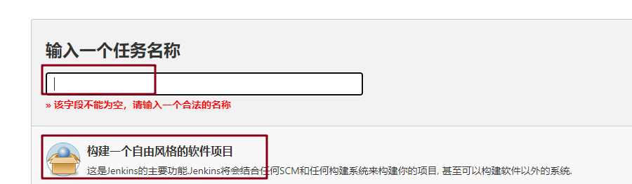
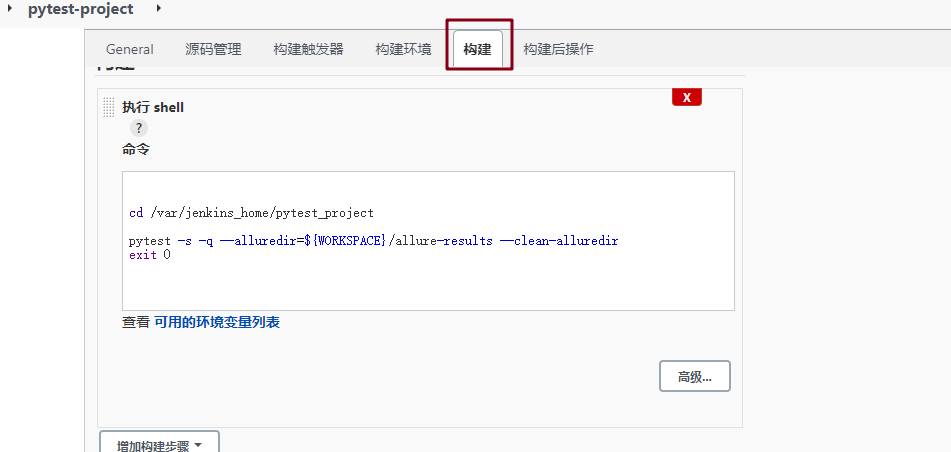
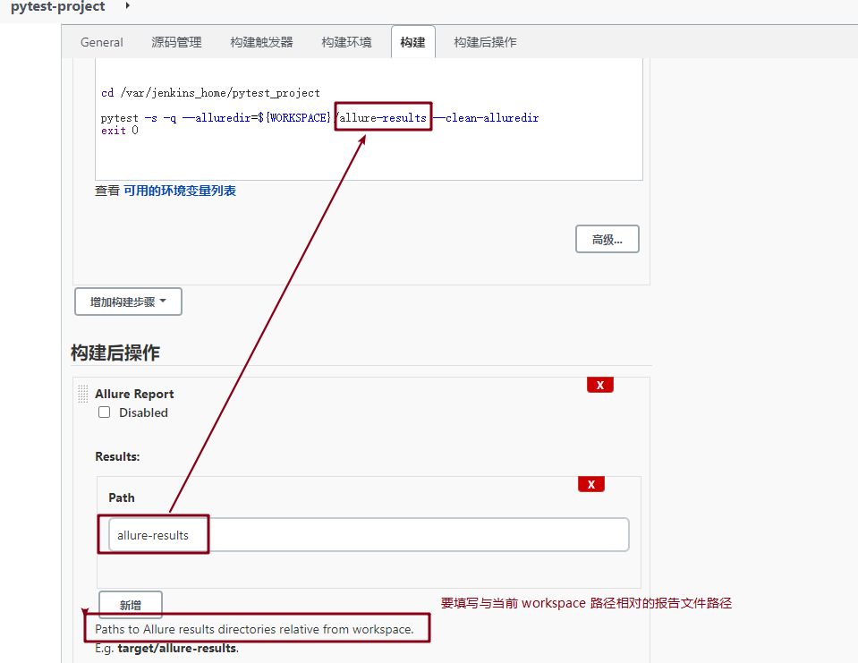
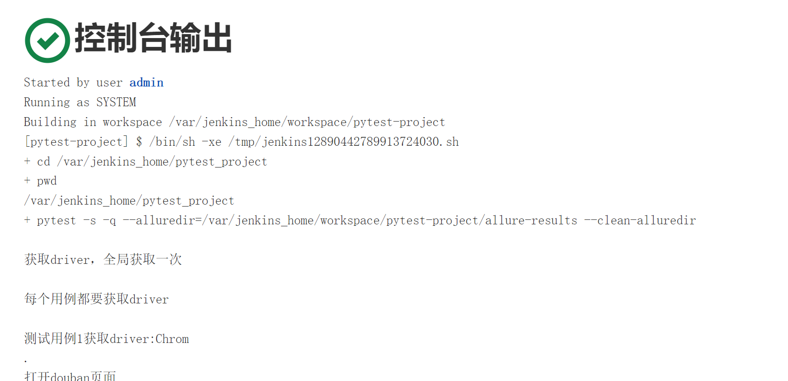

# 使用 Jenkins 构建 Pytest 项目生成 Allure 报告

## 前言

+ docker 中安装 Jenkins，可参考 [Jenkins 安装](/basic-skills/docker/jenkins.md)
+ Jenkins 容器中配置好 Python+Pytest+Allure 环境

## 安装插件

### 安装插件 Allure

左边列表中选择 Manage Jenkins 

System Configuration 中选择 Manage Plugins

在插件管理中，选择可安装的选项，并在搜索框中输入 allure，选择 Allure 并安装

完成后，在全局工具配置中，设置 Allure 的路径，并保存

## Jenkins 配置

### 上传项目

+ 将本地已有的 Pytest 项目上传到服务器 `/var/jenkins_node/pytest_project`中

+ 因为这个目录在创建 Jenkins 容器时已经映射到容器的内部了
+ 进入容器中的此目录下，执行 `pytest -sq --alluredir=./allure-results --clean-alluredir`，执行成功

### Jenkins 中配置

**第一步**：新建一个任务，填入名称并选择”构建一个自由风格的软件项目“，并确定

**第二步**：进入配置页进行配置

构建：配置要执行的 Pytest 的命令

构建后操作：输入要生成报告的文件目录

完成配置后，在创建的项目中点击构建，构建成功后，可以看到 console 控制台的输出

（完）