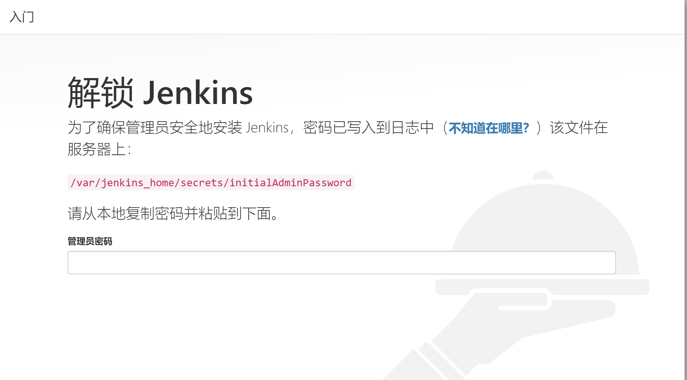
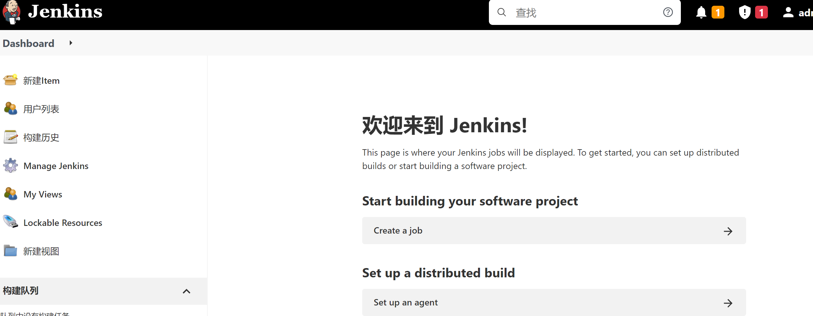

# Docker 安装 Jenkins 

## 安装步骤

+ 下载 Jenkins 镜像
```shell script
docker pull jenkins/jenkins
```
+ 在 Linux 服务器中创建个目录用于后面做目录映射
```shell script
mkdir -p /var/jenkins_mount

chmod 777 /var/jenkins_mount
```

+ 创建容器
```shell script
docker run -d -p 8080:8080 -p 5000:50000 -v /var/jenkins_mount:/var/jenkins_home -v /etc/localtime:/etc/localtime --name myjenkins jenkins/jenkins
```
创建成功后，查看
```shell script
[root@VM-16-7-centos ~]# docker ps
CONTAINER ID   IMAGE                 COMMAND                  CREATED         STATUS         PORTS                                                                                             NAMES
044b1cd93ce8   jenkins/jenkins:lts   "/sbin/tini -- /usr/…"   8 seconds ago   Up 6 seconds   0.0.0.0:5000->5000/tcp, :::5000->5000/tcp, 0.0.0.0:8080->8080/tcp, :::8080->8080/tcp, 50000/tcp   myjenkins
```

+ 配置镜像加速
进入 /var/jenkins_mount 目录，修改 hudson.model.UpdateCenter.xml 里的内容

将 url 修改为 https://mirrors.tuna.tsinghua.edu.cn/jenkins/updates/update-center.json

+ 访问 Jenkins 页面，使用 IP:8080



打开上图中提示的 /var/jenkins_mount/secrets/initialAdminPassword 文件获取密码

输入密码，并确定

+ 进入安装插件页，这里选择第一种种方式，并选择推荐的插件安装

插件安装完成后，后面按照提示的进行就行啦

+ Jenkins 安装完成后，成功进入界面



（完）