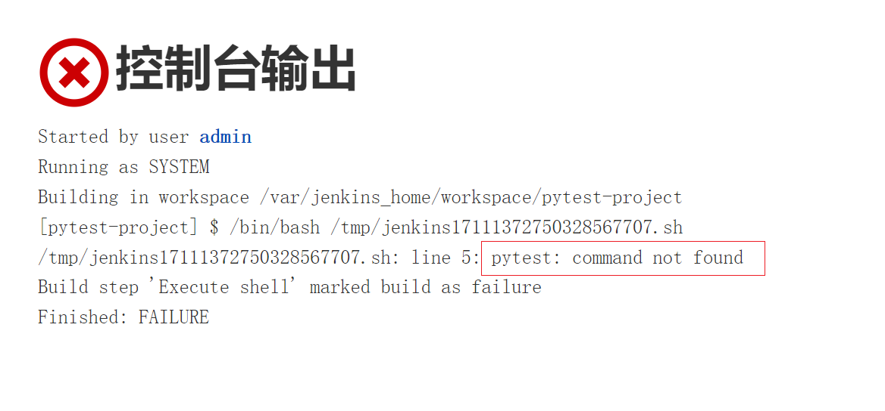
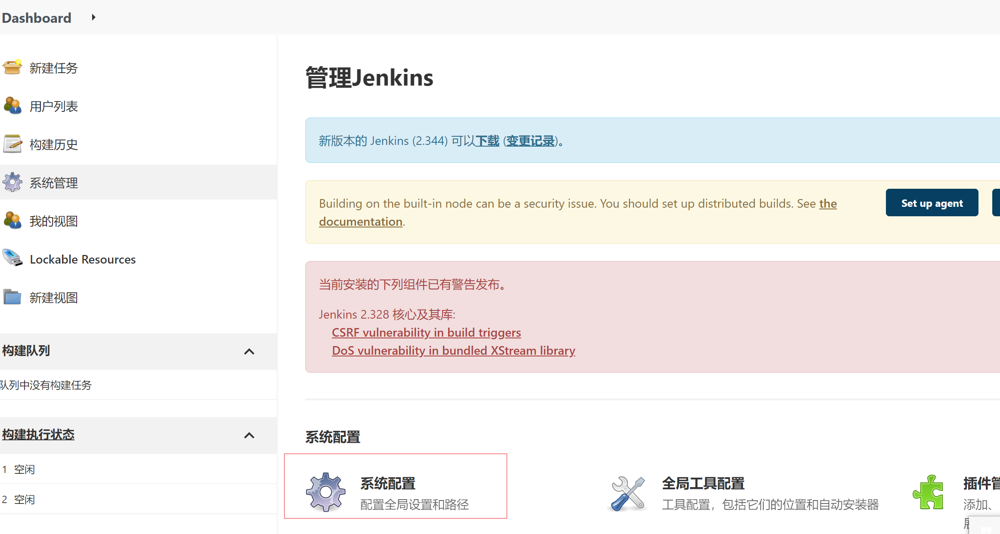
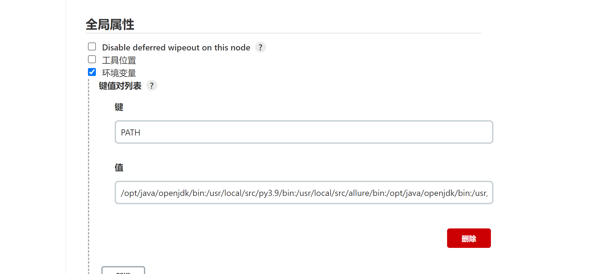

# 解决 Jenkins 执行找不到 pytest 命令

## 问题

+ 在 Jenkins 容器中执行 pytest 测试时，可以执行成功
+ 在 Jenkins 中创建实例时，执行同样的命令时，却无法找到 pytest 命令


## 问题分析

可能是 Jenkins 执行时，没有 pytest 命令的权限，导致提示找不到

## 解决方案

### 方式一

在 Jenkins 执行 shell 的命令的框首行增加如下信息：
```shell script
#!/bin/bash il
```
添加该命令后，重新构建，构建成功

### 方式二

将容器中的环境变量配置到 Jenkins 中

#### 获取容器中的环境变量

```shell script
echo $PATH

/opt/java/openjdk/bin:/usr/local/src/py3.9/bin:/usr/local/src/allure/bin:/opt/java/openjdk/bin:/usr/local/sbin:/usr/local/bin:/usr/sbin:/usr/bin:/sbin:/bin

```

#### 将环境变量添加到 Jenkins 中

+ 找到系统设置


+ 进入系统设置中，找到全局属性，并添加


+ 保存之后，重新构建，构建成功


