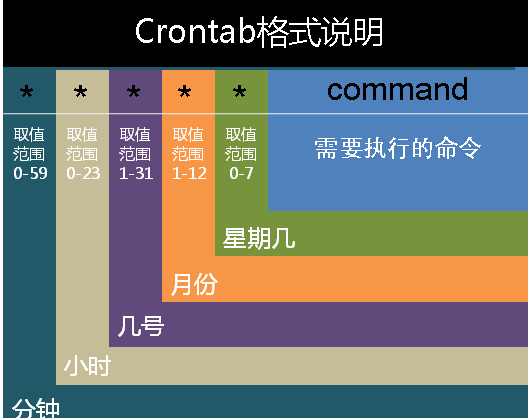

# Crontab

## 简介

作用：用于设置周期性被执行的指令

定时任务包含：

+ cron：服务名称
+ crond：后台进程
+ crontab：计划任务表

## 任务分类

### 系统任务调度

系统周期性所要执行的工作

在 /etc 目录下有一个 crontab 文件，如下：


前四行用来配置 crontab 任务运行的环境变量：

+ SHELL 

   指定了系统要使用哪个 shell 

+ PATH

   指定了系统执行命令的路径 

+ MAILTO

   指定了crond 的任务执行信息将通过电子邮件发送给 root 用户，如果 MAILTO 变量的值为空，则表示不发送任务执行信息给用户 

+ HOME

   指定了在执行命令或者脚本时使用的主目录

### 用户任务调度

 用户定期要执行的工作 

 使用 crontab 来定制自己的计划任务

 所有用户定义的 crontab 文件都被保存在 `/var/spool/cron` 目录下  

## Crontab 命令

+ crontab [-u user] file

   将 file 做为 crontab 的任务列表文件并载入 crontab 

   如果没有指定这个文件，crontab 命令将接受标准输入（键盘）上键入的命令，并将它们载入crontab 

+ crontab [-u user] -e

  编辑某个用户的 crontab 文件内容

  如果不指定用户，则表示编辑当前用户的 crontab 文件内容。 

+ crontab [-u user] -l

  显示某个用户的 crontab 文件内容

  如果不指定用户，则表示显示当前用户的c rontab 文件内容。 

+ crontab [-u user] -[i]r

  从 `/var/spool/cron` 目录中删除某个用户的 crontab 文件

  如果不指定用户，则默认删除当前用户的 crontab 文件

  -i 参数指定在删除用户的 crontab 文件时是否给确认提示 

## Crontab 内容格式

任务格式：

```
minute   hour   day   month   week   command     
```



+ minute： 表示分钟，可以是从 0 到 59 之间的任何整数

+ hour：表示小时，可以是从 0 到 23 之间的任何整数

+ day：表示日期，可以是从 1 到 31 之间的任何整数

+ month：表示月份，可以是从 1 到 12 之间的任何整数

+ week：表示星期几，可以是从 0 到 7 之间的任何整数，这里的 0 或 7 代表星期日

+ command：要执行的命令，可以是系统命令，也可以是自己编写的脚本文件

**在以上各个字段中，还可以使用以下特殊字符：**

星号（*）：代表所有可能的值，例如 month 字段如果是星号，则表示在满足其它字段的制约条件后每月都执行该命令操作

逗号（,）：可以用逗号隔开的值指定一个列表范围，例如，“1,2,5,7,8,9”

中杠（-）：可以用整数之间的中杠表示一个整数范围，例如 “2-6” 表示 “2,3,4,5,6”

正斜线（/）：可以用正斜线指定时间的间隔频率，例如 “0-23/2” 表示每两小时执行一次，同时正斜线可以和星号一起使用，例如 */10，如果用在 minute字段，表示每十分钟执行一次

### 使用实例

**实例1**：每 1 分钟执行一次 command

**命令：**

```
* * * * * command
```

**实例2**： 每小时的第 3 和第 15 分钟执行

**命令：**

```
3,15 * * * * command
```

**实例3**：每隔两天的上午 8点 到 11点 的第 3 和第 15 分钟执行

**命令：**

```
3,15 8-11 */2 * * command
```

**实例4**：每周六、周日的 1 : 10 重启 smb

**命令：**

```
10 1 * * 6,0 /etc/init.d/smb restart
```

## Crond服务操作命令

+ `yum install crontabs`   安装 crontab 

+  `/sbin/service crond start`     启动服务 
+  `/sbin/service crond stop`     关闭服务 
+  `/sbin/service crond restart`     重启服务 
+  `/sbin/service crond reload`     重新载入配置
+  `/sbin/service crond status`    服务是否运行

## 使用注意事项

### 环境变量问题

问题：任务无法自动执行，但却可以手动执行

原因：在 crontab 文件中没有指定环境变量，而系统执行任务时，不会加载任何环境变量

注意：

+ 脚本中涉及文件路径时写全局路径

+ 脚本执行需要用到 Java 或其他环境变量时，通过 source 命令引入环境变量，如：

  ```
  cat start_cbp.sh
  
  #!/bin/sh
  
  source /etc/profile
  
  export RUN_CONF=/home/d139/conf/platform/cbp/cbp_jboss.conf
  
  /usr/local/jboss-4.0.5/bin/run.sh -c mev &
  ```

+ 手动执行脚本 OK 时，但是 crontab 不执行， 可以尝试在 crontab 中直接引入环境变量解决问题，如：

  ```
  0 * * * * . /etc/profile;/bin/sh /var/www/java/audit_no_count/bin/restart_audit.sh
  ```

###  **清理系统用户的邮件日志** 

问题：系统调度执行完成后，会输出信息，长期执行时，会导致日志信息会非常大

解决：将输出进行重定向

```
0 */3 * * * /usr/local/apache2/apachectl restart >/dev/null 2>&1
```

 `/dev/null 2>&1` ： 先将标准输出重定向到 `/dev/null` ， 然后将标准错误重定向到标准输出 

### 系统级与用户级任务调度

+ 可以将用户级任务调度放到系统级任务调度中完成，一般不建议做
+ 不可以将系统级任务调度放到用户级任务调度中完成
+  要定义一个定时重启系统的任务，就必须将任务放到 `/etc/crontab`文件，即使在 root 用户下创建一个定时重启系统的任务也是无效的 

### 其他注意事项

+ 新创建的 job 在不重启 cron 时，不会马上执行，至少要过 2 分钟才执行
+  当 crontab 突然失效时，可以尝试 `/etc/init.d/crond restart` 或者查看日志看某个 job 有没有执行报错 `tail -f /var/log/cron` 
+ 谨慎使用  `crontab -r` ， 会删除用户的 Crontab 文件 
+  在 crontab 中 % 是有特殊含义的，需要使用 `\%` 转义

