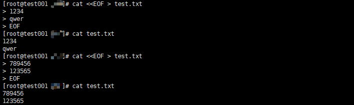
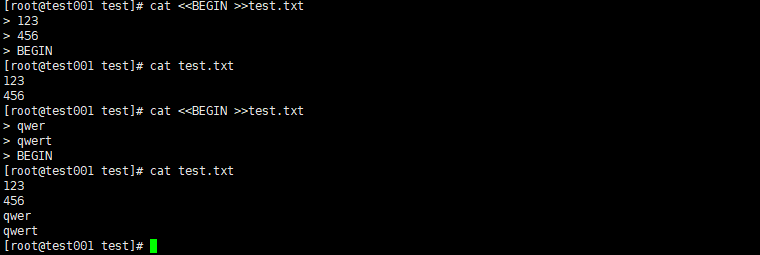

# EOF 

作用：向文件中自动追加内容(追加的内容比较多)

## 语法格式

```
<<EOF    //开始
....
EOF     //结束
```

**PS**：

+ EOF 不是固定的，可以自定义其他
+ 自定义的起始符和结束符要保持一致

## 重定向符号

```
< :输入重定向
> :输出重定向
>> :输出重定向,追加,不覆盖之前内容
<< :标准输入来自命令行的一对分隔号的中间内容.
```

## 实例

### 以覆盖方式向文件中写入内容

```
cat << EOF > test.txt
或
cat > test.txt << EOF
```



可以看到 test.txt 中的内容被覆盖了

### 以追加方式向文件中写入内容

自定义了 EOF 

```
cat << BEGIN > test.txt
或
cat > test.txt << BEGIN
```



可以看到 test.txt 中的内容没有被覆盖

**重点**：

+ 输出的文件如果不存在，会自动创建