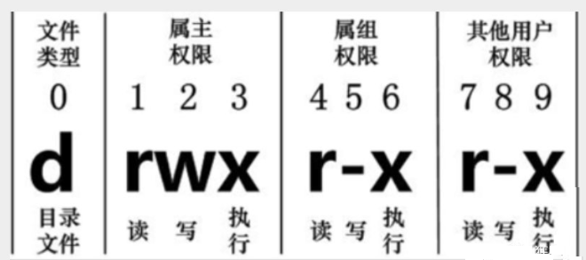

# 权限操作

**目的**：限制用户对文件的操作

## 基本权限

Linux 系统是一种典型的多用户系统，不同的用户处于不同的地位，拥有不同的权限。为了保护系统的安全性，Linux 系统对不同的用户访问同一文件（包括目录文件）的权限做了不同的规定

在 Linux 中我们可以使用 `ll` 或者` ls –l` 命令来显示一个文件的属性以及文件所属的用户和组，如：
```bash
[root@test /]# ls -la
total 40
drwxr-xr-x    1 root root    84 Nov 12 18:04 .
drwxr-xr-x    1 root root    84 Nov 12 18:04 ..
-rw-r--r--    1 root root    11 Jan  7  2019 123
lrwxrwxrwx    1 root root     7 Jun  1  2018 bin -> usr/bin
drwxr-xr-x    5 root root   360 Nov 12 18:04 dev
-rwxr-xr-x    1 root root     0 Nov 12 18:04 .dockerenv
drwxr-xr-x    1 root root   219 Jan 21 10:52 etc
drwxr-xr-x    3 root root    19 Nov  5  2019 home
lrwxrwxrwx    1 root root     7 Jun  1  2018 lib -> usr/lib
lrwxrwxrwx    1 root root     9 Jun  1  2018 lib64 -> usr/lib64
drwxr-xr-x    2 root root     6 Apr 11  2018 media
drwxr-xr-x    2 root root     6 Apr 11  2018 mnt
drwxr-xr-x    1 root root    32 Dec 26  2018 opt
dr-xr-xr-x 1273 root root     0 Nov 12 18:04 proc
-rw-r--r--    1 root root  8944 Jan  7  2019 .readahead
dr-xr-x---    1 root root   106 Apr  6 15:00 root
drwxr-xr-x    1 root root    64 Jan 21 11:18 run
lrwxrwxrwx    1 root root     8 Jun  1  2018 sbin -> usr/sbin
drwxr-xr-x    2 root root     6 Apr 11  2018 srv
dr-xr-xr-x   13 root root     0 Jul 20  2020 sys
drwxrwxrwt    1 root root 20480 Apr  7 00:00 tmp
drwxr-xr-x    1 root root    94 Jun  1  2018 usr
drwxr-xr-x    1 root root    68 Dec 26  2018 var
```
第一个字符代表这个文件是目录、文件或链接文件等等：
+ [ d ] ：表示目录
+  [ - ] ：表示文件
+  [ l ] ：表示为链接文档 ( link file )
+  [ b ]：表示为装置文件里面的可供储存的接口设备 ( 可随机存取装置 )
+ [ c ]：表示为装置文件里面的串行端口设备，例如键盘、鼠标 ( 一次性读取装置 )

接下来的字符中，以三个为一组，且均为『rwx』 的三个参数的组合
+ [ r ]：代表可读(read)
+ [ w ]：代表可写(write)
+ [ x ]：代表可执行(execute)

::: tip 注意
这三个权限的位置不会改变，如果没有权限，就会出现减号[ - ]而已
:::

每个文件的属性由左边第一部分的 10 个字符来确定（如下图）：



从左至右用 0-9 这些数字来表示

+ 第 0 位确定文件类型
+ 第 1-3 位确定属主（该文件的所有者）拥有该文件的权限
+ 第 4-6 位确定属组（所有者的同组用户）拥有该文件的权限
+ 第 7-9 位确定其他用户拥有该文件的权限

## 修改文件属性

### chgrp

更改文件属组

**语法**:
```bash
chgrp [-R] 属组名 文件名
```
**参数**:
-R：递归更改文件属组，在更改某个目录文件的属组时，加上 -R 的参数，那么该目录下的所有文件的属组都会更改

### chown

更改文件属主，也可以同时更改文件属组

**语法**：
```bash
chown [–R] 属主名 文件名
chown [-R] 属主名：属组名 文件名
```

### chmod

更改文件 9 个属性

**语法**:

```bash
chmod [-cfvR] [--help] [--version] mode file...
```

**参数**：

mode：权限设定字串，格式如下 :

```bash
[ugoa...][[+-=][rwxX]...][,...]
```

- u 表示该文件的拥有者
- g 表示与该文件的拥有者属于同一个群体(group)者
- o 表示其他以外的人
- a 表示这三者皆是
- `\+` 表示增加权限
- `-`  表示取消权限
- `=` 表示唯一设定权限
- r 表示可读取，w 表示可写入，x 表示可执行
- X 表示只有当该文件是个子目录或者该文件已经被设定过为可执行

其他参数说明：

- -c : 若该文件权限确实已经更改，才显示其更改动作
- -f : 若该文件权限无法被更改也不要显示错误讯息
- -v : 显示权限变更的详细资料
- -R : 对目前目录下的所有文件与子目录进行相同的权限变更(即以递归的方式逐个变更)
- --help : 显示辅助说明
- --version : 显示版本

Linux 文件属性有两种设置方法，一种是数字，一种是符号:

+ Linux 文件的基本权限就有九个，分别是 `owner/group/others` 三种身份各有自己的 `read/write/execute` 权限
+ 数字表示：r : 4、 w : 2、x : 1
+ 每种身份（`owner/group/others`）各自的三个权限（r/w/x）分数是需要累加的，例如当权限为：[-rwxrwx---] 分数则是：
+ owner = rwx = 4+2+1 = 7
+ group = rwx = 4+2+1 = 7
+ others= --- = 0+0+0 = 0

**示例**:

将文件 file1.txt 设为所有人皆可读取 :

```bash
chmod ugo+r file1.txt
```

将文件 file1.txt 设为所有人皆可读取 :

```bash
chmod a+r file1.txt
```

将文件 file1.txt 与 file2.txt 设为该文件拥有者，与其所属同一个群体者可写入，但其他以外的人则不可写入 :

```bash
chmod ug+w,o-w file1.txt file2.txt
```

为 ex1.py 文件拥有者增加可执行权限:

```bash
chmod u+x ex1.py
```

将目前目录下的所有文件与子目录皆设为任何人可读取 :

```bash
chmod -R a+r *
```

此外 chmod 也可以用数字来表示权限如 :

```bash
chmod 777 file
```