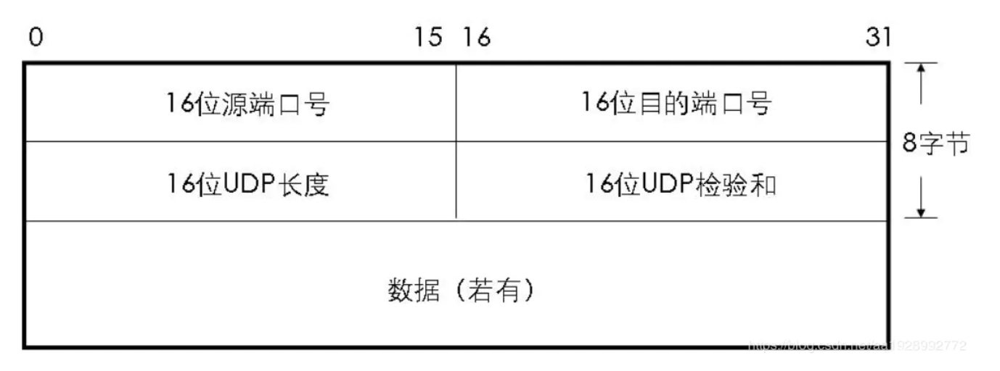

# UDP 协议

## 简介

UDP：User Datagram Protocol，用户数据报协议，是一种无连接的传输协议

网络层级：在 OSI 模型中属于第四层

## UDP 首部格式

共 8 个字节，一共 4 个字段，每个字段的长度都是 2 个字节：
+ 16 位源端口号
  发送方的端口号，不用的话可以置为 0
+ 16 位目的端口号
  接收方的端口号
+ 16 位 UDP 长度
  + 首部 + 数据的总长度，单位为字节
  + 一个 UDP 能传输的数据最大长度是 64k（包含 UDP 首部）
  + 当我们需要传输的数据超过 64k 时，就需要在应用层手动分包，多次发送，并在接收端手动拼接
+ 16 位 UDP 校验和
  + 为了接收方进行数据校验设计的
  + 如果校验不通过的话数据会被丢弃

## UDP 的特点

+ 无连接
  + 进行数据传输之前不需要先建立连接
  + 没有各种重传机制、拥塞机制和流量控制
  + 传输速度快，消耗低，延迟小，数据传输效率高
  + 适合对可靠性要求不高或可以保障可靠性的应用程序，如：DNS、TFTP、SNMP 等

+ 不可靠
  + 只负责数据的发送，不关心数据是否到达
  + 没有确认机制，主机收到数据也不会有响应

+ 面向报文
  + 对于应用层交下来的报文段不进行拆分合并，直接保留原有报文段的边界后添加 UDP 的首部就交给网络层
  + 不论报文的长短，UDP 都不会进程处理
  + 避免报文段过短降低传输效率以及报文段过长导致网络层对 IP 数据进行分片操作，应用层应该选择合适长度的报文交付给运输层的 UDP

+ 没有拥塞控制

+ 支持一对一、一对多、多对一和多对多的交互通信

+ 首部开销小
  + TCP 的首部字节是 20，UDP 的首部是 8 字节

## UDP 应用

+ 多媒体应用
  + IP 电话
  + 实时视频会议
  + 流媒体

+ 应用层协议
  + DNS（域名服务）
  + DHCP（动态主机配置协议）
  + TFTP（简单文件传输协议）
  + SNMP（简单网络管理协议）
  + RIP（路由协议）

## 参考资料

[UDP 协议](http://docs.52im.net/extend/docs/book/tcpip/vol1/11/)

（完）