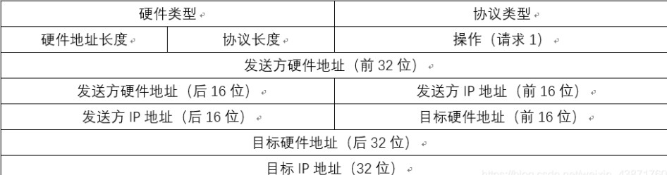
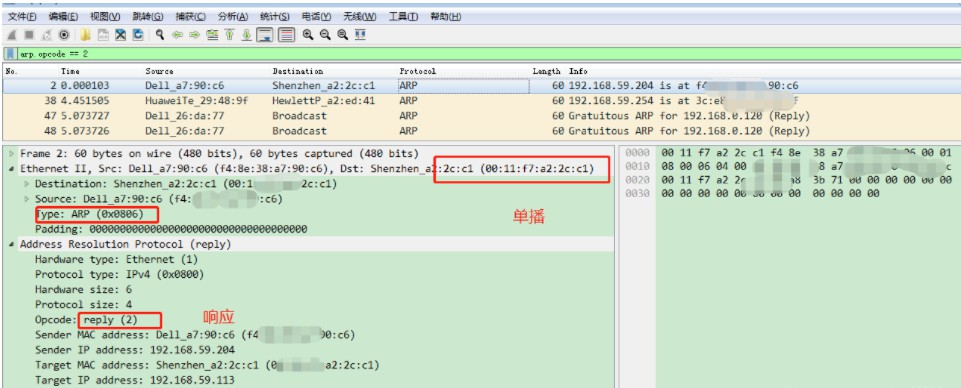

# ARP 协议

简介： ARP 全称 Address Resolution Protocol，地址解析协议

目的：实现 IP 地址到 MAC 地址的转换

**MAC 地址**：

+ 设备的唯一标识，基本在出厂时就已经固定，且不易更改，一般为48 位
+ 是数据链路层能够识别的地址

Windows 查看 MAC 地址：

```
ipconfig /all
```


**IP 地址**：

+ 是网络层标识的地址
+ 一般都是人为指定的，32 位，常用点分十进制表示

在 OSI 模型中，一方发送数据时，需要从上到下对数据进行封装，另一方收到数据时需要对数据从上到下进行解包，但是网络层识别的是 IP 地址，数据链路层识别的是 MAC 地址，因此需要对 IP 和 MAC 进行映射。

具体介绍可以参考[IP地址](/basic-skills/network/IP地址)

## ARP 原理之请求应答

**ping 命令之 ARP 请求应答栗子**：

发送方：PC1，IP 地址为 IP1，MAC 地址为 MAC1

接收方：PC2，IP 地址为 IP2，MAC 地址为 MAC2


步骤：

+ PC1 发送 ping IP2，由上到下封装数据

+ 数据链路层封装 PC2 的 MAC 

+ PC1 先在本地的 ARP 缓存表中查找
+ 本地缓存中没有找到，在同一广播域内发送广播消息寻求 PC2 MAC，如果同一广播域内没有回应，则会通过二层交换机进行转发到其他的局域网内
+ 等收到 PC2 的 MAC 地址后，封装到数据中，随后存入本地的缓存表中

+ 数据封装完成后，将数据发送给 PC2 

+ PC2 收到数据后，开始解包，拿到 PC1 的 MAC 后存入自己本地的缓存

**查看 arp 缓存表**：

```
arp -a
```


## ARP 报文

**报文格式**：



**硬件类型**：表明 ARP 协议实现在哪种类型的网络上  
**协议类型**：表示解析协议（上层协议）。这里一般是 0800，即 IP  
**硬件地址长度**：MAC 地址长度，此处为 6 个字节  
**协议地址长度**：IP 地址长度，此处为 4 个字节  
**操作类型**：表示 ARP 协议数据类型。1 表示 ARP 协议请求数据报，2 表示 ARP 协议应答数据报  
**源MAC地址**：发送端 MAC 地址  
**源IP地址**：发送端 IP 地址  
**目标MAC地址**：接收端 MAC 地址  
**目标IP地址**：接收端 IP 地址   

根据原理描述的过程，在 PC1 ping PC2 时使用 wireshark 抓包如下：

+ ARP请求包

  PC1 本地 ARP 缓存表中未有 PC2 MAC 地址时，会进行广播

  

+ ARP 响应包

  PC2 收到广播消息后，以单播的形式回复给 PC1

  

以上所述均在局域网中，跨局域网的需要 代理 ARP 实现

## ARP 类型

### 普通 ARP

功能：通过 IP 获得 MAC 地址

工作过程：

+ A 发数据给 B ，先查 ARP 缓存表
+ 缓存表中没有时，发送广播请求
+ B 收到广播消息后，将 MAC 以单播的形式发给 A

### 翻转 ARP(RARP)

功能：通过 MAC 获取 IP 地址

### 免费 ARP

功能：查询想使用的 IP 地址是否在局域网中已被占用
报文介绍：源目 IP 都是写本机的 IP，源 MAC 写本机的 MAC，目的 MAC 写广播地址
用途：

+ 确定设备的 IP 是否与其他设备 IP 冲突，当其他设备接收到免费 ARP 时，就会核对是否与本机 IP冲突，如果冲突了就会返回一个 ARP 应答包告知 IP 地址已被占用
+ 设备改变物理地址时，可以通过免费 ARP 报文通知其他设备更新 ARP 表项

### 代理 ARP

功能：在跨局域网获取 MAC 地址时，由路由器或三层交换机会将自己连接查询者的端口的 MAC 回复给查询者，同时将广播消息发送到其他广播域中

工作过程：

+  网段 A 的设备广播 ARP request 包，源 MAC 写自己的 MAC 地址，目的 MAC 写 FFFF.FFFF.FFFF,网关收到后返回接口的 MAC 地址 
+  A 收到网关返回的 ARP reply 包后更新自己的 ARP 缓存表 
+  A 发出去的包都要通过网关路由器转发，网关路由器再在从网段 B 中广播得到 B 的 MAC 地址 

### 逆向 ARP

 功能：通过物理地址获得 IP 地址
一般存在于帧中继网络中，用于实现 IP 和 DLCI 地址的映射 

（完）


