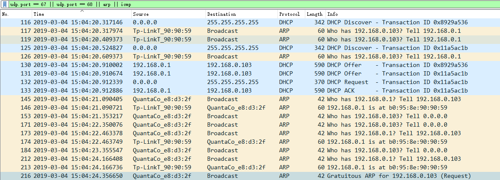
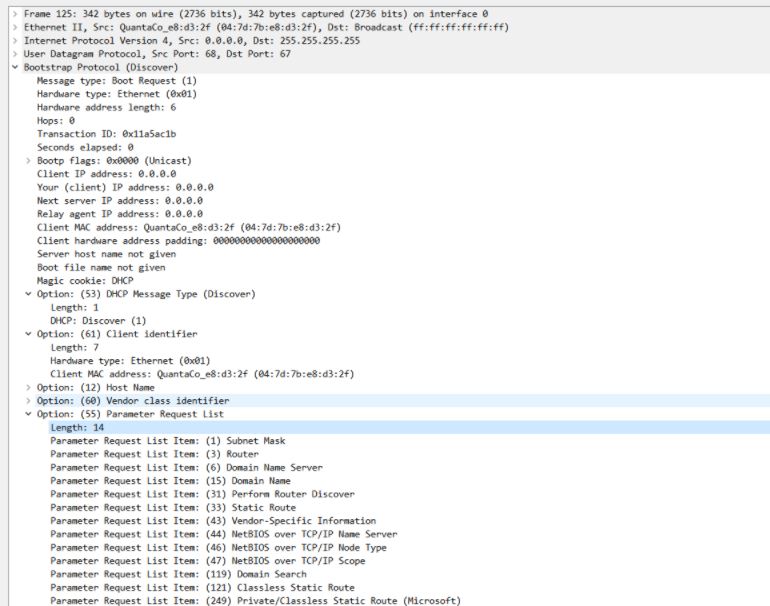
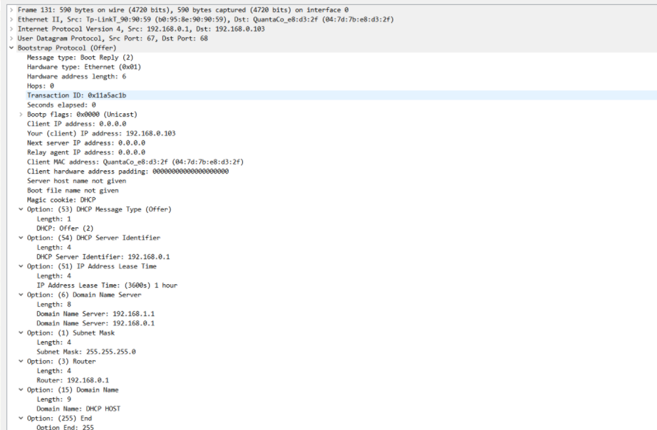
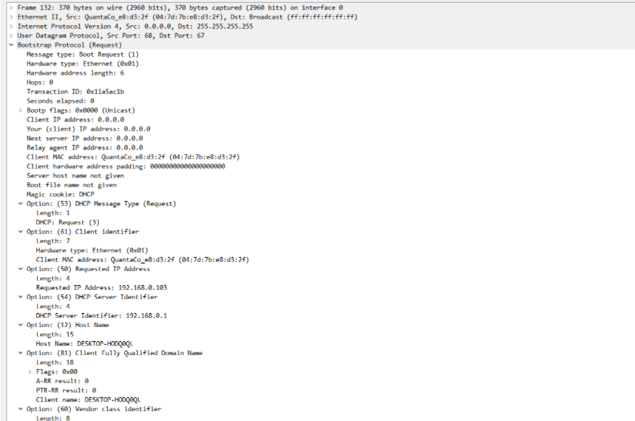
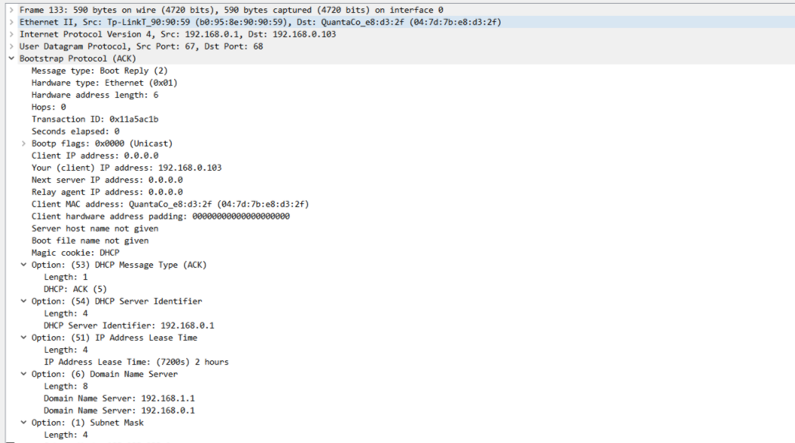
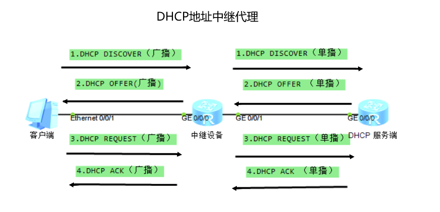

# DHCP 协议

## 概述

DHCP：Dynamic Host Configuration Protocol ，动态主机配置协议

作用：集中管理、动态分配 IP 地址给客户端

端口号：67（服务器）、68（客户端）

使用协议：UDP

## DHCP 报文

### 报文种类

DHCP 中一共有 8 种报文：

+ DHCP  Discover 
  + 客户端以广播方式发送该报文用来发现 DHCP 服务器，源地址为 0.0.0.0，目的地址为 255.255.255.255  
  + DHCP 服务器收到该报文后发送应答报文，客户端据此知道服务器位置
  + 如果没有得到服务器的回应，客户端会从 169.254.0.0/16 这个地址段中选择一个地址，并每隔 5 分钟重新广播一次
+ DHCP  Offer
  + 服务器收到 Discover 报文后，会在配置的地址池中查找一个合适的 IP 地址，加上租约期限和其他信息，构造成该报文，发送给客户端，源地址为服务器地址，目标地址 255.255.255.255
  + 该报文只是告诉客户端可以提供地址，还需检测该地址是否重复
+ DHCP  Request
  + 未获得 IP 地址的客户端在收到的 Offer 报文中，通常选择第一个应答报文的服务器为自己的目标服务器，随后发送一个广播的 Request 请求报文，告知服务器希望获得的 IP 地址
  + 源地址为 0.0.0.0，目标地址为 255.255.255.255
  + 已获得 IP 地址的客户端在租约期过 50% 时，重新发送 Request 请求延续租约，如果没有收到 ACK 报文，在租期达到 87.5% 时，会再次发送广播的 Request 请求报文以请求续延租约
+ DHCP  ACK
  +  DHCP 服务器收到 Request 请求报文后，根据 Request 报文中携带的用户 MAC 来查找有没有相应的租约记录，如果有则发送 ACK 应答报文，通知用户可以使用分配的 IP 地址 
  + 客户端收到该报文时，会发送三个针对此 IP 地址的 ARP 解析请求执行冲突检测
+ DHCP  NAK
  +  如果 DHCP 服务器收到 Request 请求报文后，没有发现有相应的租约记录或者由于某些原因无法正常分配IP地址，则向 DHCP 客户端发送 NAK 应答报文，通知用户无法分配合适的 IP 地址 
+ DHCP  Release
  +  DHCP 客户端不再需要使用分配 IP 地址时( 一般出现在客户端关机、下线等状况 )，主动向 DHCP 服务器发送 RELEASE 请求报文，告知服务器用户不再需要分配 IP 地址，请求 DHCP 服务器释放对应的IP地址 
+ DHCP  Decline
  +  DHCP 客户端收到 DHCP 服务器 ACK 应答报文后，通过地址冲突检测发现服务器分配的地址冲突或者由于其他原因导致不能使用，则会向 DHCP 服务器发送 Decline 请求报文，通知服务器所分配的 IP 地址不可用，以期望获得新的 IP 地址 
+ DHCP  Inform
  +  DHCP 客户端如果需要从 DHCP 服务器端获取更为详细的配置信息，则向 DHCP 服务器发送Inform 请求报文 
  +  DHCP 服务器在收到该报文后，将根据租约进行查找到相应的配置信息后，向 DHCP 客户端发送 ACK 应答报文 

### 工作过程

正常的获取 IP 地址的过程如下：

<svg id="SvgjsSvg1006" width="631" height="227" xmlns="http://www.w3.org/2000/svg" version="1.1" xmlns:xlink="http://www.w3.org/1999/xlink" xmlns:svgjs="http://svgjs.com/svgjs"><defs id="SvgjsDefs1007"><marker id="SvgjsMarker1022" markerWidth="14" markerHeight="10" refX="10" refY="5" viewBox="0 0 14 10" orient="auto" markerUnits="userSpaceOnUse" stroke-dasharray="0,0"><path id="SvgjsPath1023" d="M0,0 L14,5 L0,10 L0,0" fill="#323232" stroke="#323232" stroke-width="1"></path></marker><marker id="SvgjsMarker1032" markerWidth="14" markerHeight="10" refX="10" refY="5" viewBox="0 0 14 10" orient="auto" markerUnits="userSpaceOnUse" stroke-dasharray="0,0"><path id="SvgjsPath1033" d="M0,0 L14,5 L0,10 L0,0" fill="#323232" stroke="#323232" stroke-width="1"></path></marker><marker id="SvgjsMarker1042" markerWidth="14" markerHeight="10" refX="10" refY="5" viewBox="0 0 14 10" orient="auto" markerUnits="userSpaceOnUse" stroke-dasharray="0,0"><path id="SvgjsPath1043" d="M0,0 L14,5 L0,10 L0,0" fill="#323232" stroke="#323232" stroke-width="1"></path></marker><marker id="SvgjsMarker1052" markerWidth="14" markerHeight="10" refX="10" refY="5" viewBox="0 0 14 10" orient="auto" markerUnits="userSpaceOnUse" stroke-dasharray="0,0"><path id="SvgjsPath1053" d="M0,0 L14,5 L0,10 L0,0" fill="#323232" stroke="#323232" stroke-width="1"></path></marker></defs><g id="SvgjsG1008" transform="translate(25,46)"><path id="SvgjsPath1009" d="M 0 4Q 0 0 4 0L 96 0Q 100 0 100 4L 100 148Q 100 152 96 152L 4 152Q 0 152 0 148Z" stroke="rgba(50,50,50,1)" stroke-width="2" fill-opacity="1" fill="#ffffff"></path><g id="SvgjsG1010"><text id="SvgjsText1011" font-family="微软雅黑" text-anchor="middle" font-size="13px" width="80px" fill="#323232" font-weight="400" align="middle" lineHeight="125%" anchor="middle" family="微软雅黑" size="13px" weight="400" font-style="" opacity="1" y="66.375" transform="rotate(0)"><tspan id="SvgjsTspan1012" dy="16" x="50"><tspan id="SvgjsTspan1013" style="text-decoration:;">DHCP 客户端</tspan></tspan></text></g></g><g id="SvgjsG1014" transform="translate(504,50)"><path id="SvgjsPath1015" d="M 0 4Q 0 0 4 0L 98 0Q 102 0 102 4L 102 148Q 102 152 98 152L 4 152Q 0 152 0 148Z" stroke="rgba(50,50,50,1)" stroke-width="2" fill-opacity="1" fill="#ffffff"></path><g id="SvgjsG1016"><text id="SvgjsText1017" font-family="微软雅黑" text-anchor="middle" font-size="13px" width="82px" fill="#323232" font-weight="400" align="middle" lineHeight="125%" anchor="middle" family="微软雅黑" size="13px" weight="400" font-style="" opacity="1" y="66.375" transform="rotate(0)"><tspan id="SvgjsTspan1018" dy="16" x="51"><tspan id="SvgjsTspan1019" style="text-decoration:;">DHCP 服务端</tspan></tspan></text></g></g><g id="SvgjsG1020"><path id="SvgjsPath1021" d="M146 56L315.5 56L315.5 56L485 56" stroke="#323232" stroke-width="2" fill="none" marker-end="url(#SvgjsMarker1022)"></path></g><g id="SvgjsG1024" transform="translate(156,25)"><path id="SvgjsPath1025" d="M 0 0L 317 0L 317 25L 0 25Z" stroke="none" fill="none"></path><g id="SvgjsG1026"><text id="SvgjsText1027" font-family="微软雅黑" text-anchor="middle" font-size="14px" width="317px" fill="#323232" font-weight="400" align="middle" lineHeight="125%" anchor="middle" family="微软雅黑" size="14px" weight="400" font-style="" opacity="1" y="1.75" transform="rotate(0)"><tspan id="SvgjsTspan1028" dy="17" x="158.5"><tspan id="SvgjsTspan1029" style="text-decoration:;">第 1 步：客户端发送 Discover 广播消息</tspan></tspan></text></g></g><g id="SvgjsG1030"><path id="SvgjsPath1031" d="M486 103L316.5 103L316.5 103L147 103" stroke="#323232" stroke-width="2" fill="none" marker-end="url(#SvgjsMarker1032)"></path></g><g id="SvgjsG1034" transform="translate(156,73)"><path id="SvgjsPath1035" d="M 0 0L 317 0L 317 25L 0 25Z" stroke="none" fill="none"></path><g id="SvgjsG1036"><text id="SvgjsText1037" font-family="微软雅黑" text-anchor="middle" font-size="14px" width="317px" fill="#323232" font-weight="400" align="middle" lineHeight="125%" anchor="middle" family="微软雅黑" size="14px" weight="400" font-style="" opacity="1" y="1.75" transform="rotate(0)"><tspan id="SvgjsTspan1038" dy="17" x="158.5"><tspan id="SvgjsTspan1039" style="text-decoration:;">第 2 步：服务端回应 Offer，提供地址租约</tspan></tspan></text></g></g><g id="SvgjsG1040"><path id="SvgjsPath1041" d="M147 147L316.5 147L316.5 147L486 147" stroke="#323232" stroke-width="2" fill="none" marker-end="url(#SvgjsMarker1042)"></path></g><g id="SvgjsG1044" transform="translate(156,121)"><path id="SvgjsPath1045" d="M 0 0L 317 0L 317 25L 0 25Z" stroke="none" fill="none"></path><g id="SvgjsG1046"><text id="SvgjsText1047" font-family="微软雅黑" text-anchor="middle" font-size="14px" width="317px" fill="#323232" font-weight="400" align="middle" lineHeight="125%" anchor="middle" family="微软雅黑" size="14px" weight="400" font-style="" opacity="1" y="1.75" transform="rotate(0)"><tspan id="SvgjsTspan1048" dy="17" x="158.5"><tspan id="SvgjsTspan1049" style="text-decoration:;">第 3 步：客户端选择并发送 Request 请求地址租用</tspan></tspan></text></g></g><g id="SvgjsG1050"><path id="SvgjsPath1051" d="M486 188L318 188L318 188L150 188" stroke="#323232" stroke-width="2" fill="none" marker-end="url(#SvgjsMarker1052)"></path></g><g id="SvgjsG1054" transform="translate(156,161)"><path id="SvgjsPath1055" d="M 0 0L 329 0L 329 23L 0 23Z" stroke="none" fill="none"></path><g id="SvgjsG1056"><text id="SvgjsText1057" font-family="微软雅黑" text-anchor="middle" font-size="14px" width="329px" fill="#323232" font-weight="400" align="middle" lineHeight="125%" anchor="middle" family="微软雅黑" size="14px" weight="400" font-style="" opacity="1" y="0.75" transform="rotate(0)"><tspan id="SvgjsTspan1058" dy="17" x="164.5"><tspan id="SvgjsTspan1059" style="text-decoration:;">第 4 步：服务端发送 ACK 确认将地址租用给客户端</tspan></tspan></text></g></g></svg>
如果地址租约快到期时，会重新发送 Request 请求续约

### 数据包

使用 wireshark 进行数据抓包：

Discover 包数据：

Offer 数据包：

Request 数据包：

ACK 数据包：

## DHCP 中继

**作用**：在处于不同网段的 DHCP 服务器和客户端之间转发 DHCP 数据包 

**过程**：

服务端与客户端属于不同网段

+ 客户端发送的报文均由中继发送到 DHCP 服务器
+ DHCP 发送的消息由中继转发给客户端

（完）

