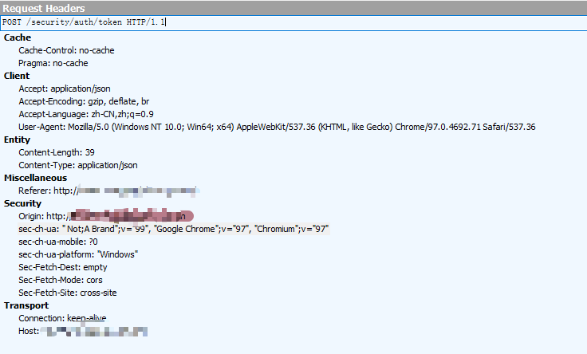
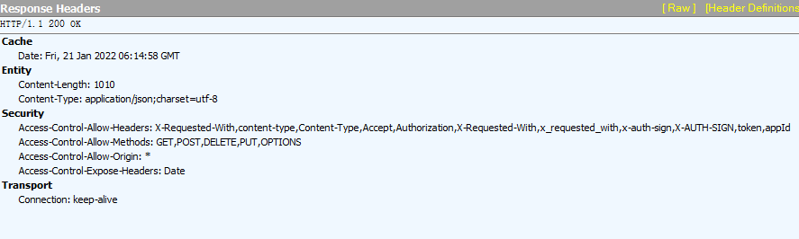

# HTTP 协议

## 简介

HTTP：Hyper Text Transfer Protocol，超文本传输协议，应用层协议

作用：用于从服务器传输超文本到本地浏览器的传送协议

构成：请求 + 响应

端口号：默认 80，基于 TCP 协议

无状态：协议对于事务处理没有记忆能力 

版本：

+ HTTP/1.0 ，发送请求，创建一次连接，获得一个 web 资源，断开连接
+ HTTP/1.1 ，发送请求，创建一次连接，获得多个 web 资源，断开连接

## HTTP 请求报文

组成：请求行 + 请求头 + 请求体



### 请求行

**格式**：请求方式 资源路径 协议版本

如：`post /api/ HTTP/1.1`

#### 请求方式

在 REST 架构分隔中，有严格规定对于不同的请求类型要设置合适的请求方法，可参考 [Restful规范](/test/interface-test/Restful规范/)

+ GET
  + 将请求参数追加在 URL 后面，不安全
  + URL 长度限制 GET 请求方式数据的大小
  + 没有请求体
+ POST
  + 请求参数在请求体中，相对于 GET 来说较安全
  + 请求数据大小没有限制
+ HEAD
  + 服务端值返回响应头，没有响应内容
+ DELETE
  + 删除一个资源
+ OPTIONS
  + 用于获取当前 URL 所支持的方法
  + 请求成功后，会在HTTP头中包含一个名为 “Allow” 的头，值是所支持的方法 
+ TRACE
  + 回显服务器收到的请求，主要用于测试或诊断
+ CONNECT
  +  HTTP/1.1 协议预留的，能够将连接改为管道方式的代理服务器 
  +  通常用于 SSL 加密服务器的链接与非加密的 HTTP 代理服务器的通信 

### 请求头

如：`Host:39.108.107.149:8080`

请求头从第二行开始，到第一个空格结束

常以键值对 {key:value} 方式

**常见请求头**：

| 请求头          | 解释                                                         | 示例                                            |
| :-------------- | ------------------------------------------------------------ | ----------------------------------------------- |
| Referer         | 表示从哪个 URL 跳转来的                                      | Referer: http://www.zcmhi.com/archives/71.html  |
| Accept          | 指定客户端能够接收的内容类型                                 | Accept: text/plain, text/html                   |
| Cokkie          | HTTP 请求发送时，会把保存在该请求域名下的所有cookie 值一起发送给web服务器 | Cookie: $Version=1; Skin=new;                   |
| User-Agent      | User-Agent的内容包含发出请求的用户信息                       | User-Agent: Mozilla/5.0 (Linux; X11)            |
| Connection      | 表示是否需要持久连接，HTTP 1.1 默认进行持久连接              | Connection: close                               |
| Host            | 指定请求的服务器的域名和端口号                               | Host: www.zcmhi.com                             |
| Content-Type    | 请求的与实体对应的 MIME 信息                                 | Content-Type: application/x-www-form-urlencoded |
| Accept-Encoding | 指定浏览器可以支持的 web 服务器返回内容压缩编码类型          | Accept-Encoding: compress, gzip                 |
| Cache-Control   | 指定请求和响应遵循的缓存机制                                 | Cache-Control: no-cache                         |

更多请求头属性可参考 [HTTP请求头信息对照表](http://tools.jb51.net/table/http_header)

###  请求体

当请求方式是 POST 时，请求体会有请求的参数，格式如下：

```json
{
    'username': 'zhangsan',
    'password': '123456'
}
```

## HTTP 响应报文

组成：响应行 + 响应头 + 响应体



### 响应行

格式：HTTP 版本 返回状态码  状态码描述

如：

```
HTTP/1.1 200 OK
```

#### 状态码

+ 1xx: 信息，请求收到了，继续处理
+ 2xx: 代表成功. 行为被成功地接收、理解及采纳
  + 200 OK [GET]: 服务器端成功返回用户请求的数据
  + 201 CREATED [POST/PUT/PATCH]: 用户新建或修改数据成功
  + 202 Accepted: 表示一个请求已经进入后台排队（一般是异步任务）
  + 204 NO CONTENT -[DELETE]: 用户删除数据成功
+ 3xx: 重定向
+ 4xx: 客户端错误，请求包含语法错误或请求无法实现
  + 400：Bad Request - [POST/PUT/PATCH]: 用户发出的请求有错误，服务器不理解客户端的请求，未做任何处理
  + 401: Unauthorized 表示用户没有权限(令牌、用户名、密码错误)
  + 403：Forbidden: 表示用户得到授权了，但是访问被禁止了, 也可以理解为不具有访问资源的权限
  + 404：Not Found: 所请求的资源不存在，或不可用
  + 405：Method Not Allowed: 用户已经通过了身份验证, 但是所用的 HTTP 方法不在它的权限之内
  + 406：Not Acceptable: 用户的请求的格式不可得(比如用户请求的是 JSON 格式，但是只有XML 格式)
  + 410：Gone - [GET]: 用户请求的资源被转移或被删除，且不会再得到的
  + 415: Unsupported Media Type: 客户端要求的返回格式不支持，比如，API 只能返回 JSON 格式，但是客户端要求返回 XML 格式
  + 422：Unprocessable Entity: 客户端上传的附件无法处理，导致请求失败
  + 429：Too Many Requests: 客户端的请求次数超过限额
+ 5xx: 服务器端错误
  + 500：INTERNAL SERVER ERROR 服务器发生错误
  + 502：网关错误
  + 503: Service Unavailable 服务器端当前无法处理请求
  + 504：网关超时

### 响应头

 响应头也是用键值对 `k：v `

**常见响应头**：

| 常见响应头       | 解释                                                         | 示例                                                  |
| ---------------- | ------------------------------------------------------------ | ----------------------------------------------------- |
| Location         | 用来重定向接收方到非请求 URL 的位置来完成请求或标识新的资源  | Location: http://www.zcmhi.com/archives/94.html       |
| Content-Type     | 返回内容的 MIME 类型                                         | Content-Type: text/html; charset=utf-8                |
| Set-Cookie       | 设置 Http Cookie                                             | Set-Cookie: UserID=JohnDoe; Max-Age=3600; Version=1   |
| Content-Encoding | web 服务器支持的返回内容压缩编码类型                         | Content-Encoding: gzip                                |
| Content-length   | 响应体的长度                                                 | Content-Length: 348                                   |
| Refresh          | 应用于重定向或一个新的资源被创造，在 5 秒之后重定向（由网景提出，被大部分浏览器支持） | Refresh: 5; url=http://www.zcmhi.com/archives/94.html |
| Server           | web 服务器软件名称                                           | Server: Apache/1.3.27 (Unix) (Red-Hat/Linux)          |
| Cache-Control    | 告诉所有的缓存机制是否可以缓存及哪种类型                     | Cache-Control: no-cache                               |

更多响应头属性可参考 [HTTP响应头信息对照表](http://tools.jb51.net/table/http_header)

### 响应体

 是服务器回写给客户端的页面正文，浏览器将正文加载到内存，然后解析渲染显示页面内容 

## HTTP 扩展

### 传输文件过大

对于服务器返回的资源文件过大时，通常有以下方式解决方法：

#### 压缩文件

+ 服务端需要能支持文件的压缩功能，浏览器能够针对被压缩的文件进行解压缩
+ 浏览器可以指定 Accept-Encoding 来告诉服务器我当前支持的编码类型 `Accept-Encoding:gzip,deflate`，那服务端会根据支持的编码类型，选择合适的类型进行压缩
+ 常见的编码方式有：`gzip/deflate`

#### 分割传输

 传输大容量数据时，通过分块传输编码 ，把数据分割成多块，能够让浏览器逐步显示页面 

### 请求连接

HTTP 1.0 版本：

+ 每一次通信都必须重新进行一次 TCP 连接，增加了通信开销
+  发送请求后需等待并收到响应，才能发送下一个请求 

HTTP 1.1 版本：

+  通过 `Connection:Keep-Alive` 字段保持持久链接，即只需要进行一次 TCP 连接，极大减少了连接开销
+  事务处理结束之后将连接关闭，必须向报文中显示地添加一个 `Connection：close` 首部 
+  允许在持久连接上使用请求管道，能同时并行发送多个请求 

### 无状态

 HTTP 协议本身不会对请求和响应之间的通信状态做保存 

无状态例子：

 访问一个 电商网站，先登录，然后去选购商品，当点击一个商品加入购物车以后又提示你登录 

**通常使用以下解决方案解决 HTTP 无状态**：

+ Cookies(客户端支持)
+ Session(服务端支持)
+ token

具体原理请参考 [三种状态机制](/test/interface-test/三种状态机制.md)

（完）


