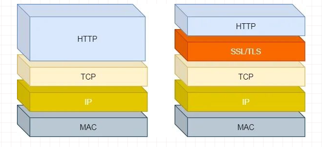
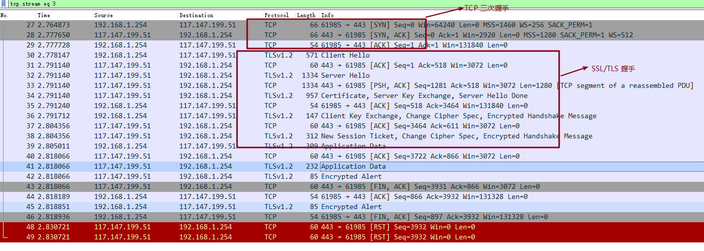
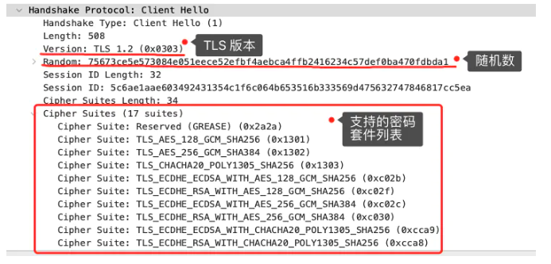
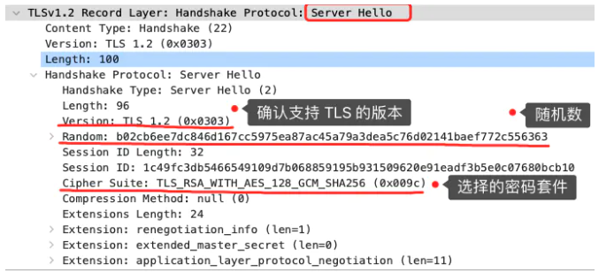
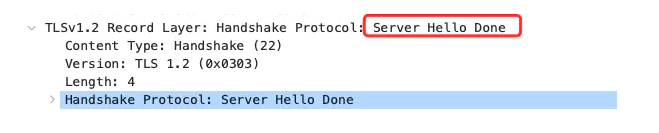
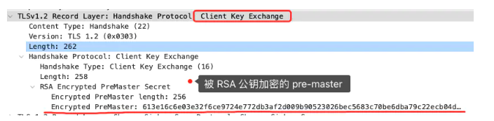
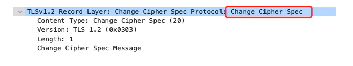
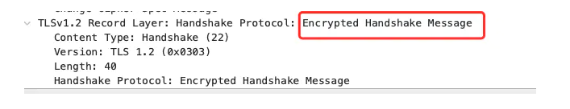

# HTTPS 协议

## 什么是 HTTPS 协议

HTTPS：Hyper Text Transfer Protocol over SecureSocket Layer

+ 在 HTTP 上建立 SSL 加密层，并对传输数据进行加密
+ 是 HTTP 协议的安全版

HTTPS 主要作用是：
+ 对数据进行加密，并建立一个信息安全通道，来保证传输过程中的数据安全
+ 对网站服务器进行真实身份认证

组成部分：HTTP + SSL/TLS

## HTTPS 连接建立过程

通过 Wireshark 抓包了解 HTTPS 建立过程

可以看出连接建立过程：

+ TCP 三次握手
+ SSL/TLS 握手
+ 数据传输

### TCP 三次握手

这里就不重点展开了，可以参考 [TCP 三次握手](/docs/basic-skills/network/TCP协议)

### SSL/TLS 建立过程

#### TSL 第一次握手

+ 客户端向服务器发起加密通信请求，也就是 ClientHello 消息
+ 消息里面有客户端使用的 TLS 版本号、支持的密码套件列表，以及生成的随机数（Client Random）
+ 这个随机数会被服务端保留，它是生成对称加密密钥的材料之一

  
  
#### TSL 第二次握手

+ 服务端收到 Client Hello 消息后，确认 TSL 版本号是否支持，从密码套件列表中选择一个密码套件，以及生成随机数
+ 服务端返回 Server Hello 消息，消息里面有服务器确认的 TLS 版本号，也给出了随机数（Server Random），然后从客户端的密码套件列表选择了一个合适的密码套件

  
  
+ 服务端发送 Server Hello Done 消息，告诉客户端相关信息已给，本次打招呼完毕

  
  
+ 客户端进行证书验证

#### TSL 第三次握手

+ 客户端验证完证书后，认为可信则继续
+ 客户端生成一个新的随机数，并用服务器的 RSA 公钥加密该随机数
+ 客户端发送 Change Cipher Key Exchange 消息传送给服务端

  
  
+ 服务端收到后，用 RSA 私钥解密，得到客户端发来的随机数 (pre-master)
+ 客户端和服务端双方都共享了三个随机数，分别是 Client Random、Server Random、pre-master
+ 双方根据已经得到的三个随机数，生成对称会话密钥（Master Secret），用于对后续的 HTTP 请求/响应的数据加解密
+ 生成完会话密钥后，客户端会发送 Change Cipher Spec，告诉服务端开始使用加密方式发送消息

   
   
+ 客户端再发送 Encrypted Handshake Message（Finishd）消息，把之前所有发送的数据做个摘要，再用会话密钥（master secret）加密一下，让服务器做个验证，验证加密通信是否可用和之前握手信息是否有被中途篡改过

   
   

可以发现，Change Cipher Spec 之前传输的 TLS 握手数据都是明文，之后都是对称密钥加密的密文

#### TSL 第四次握手

+ 服务器同样发送 Change Cipher Spec 和 Encrypted Handshake Message 消息
+ 如果双方都验证加密和解密没问题，那么握手正式完成
+ 握手完成后，使用用会话密钥加解密 HTTP 请求和响应

（完）

