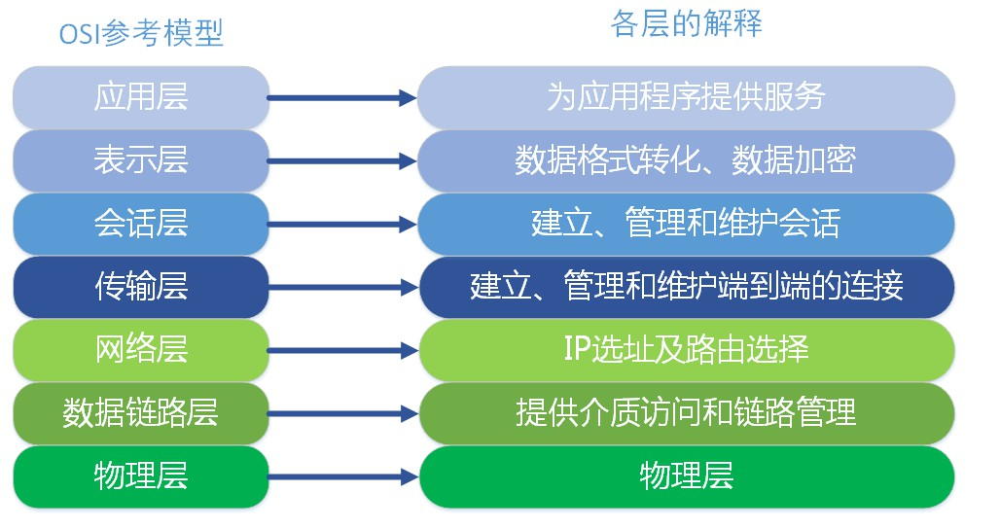
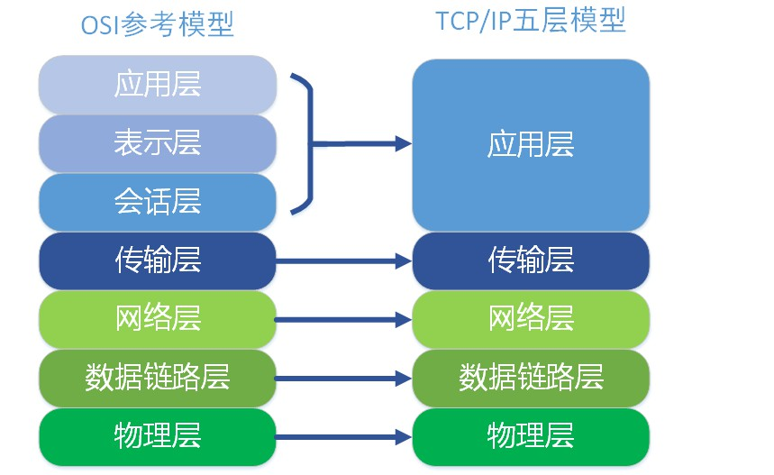

# 网络分层模型

## OSI 七层模型

**OSI（Open System Interconnect ）**：

开放式系统互联，是 ISO（国际标准化组织）组织的网络互联模型

### 模型划分及各层功能定义

#### 物理层

所属层级：第一层

作用：通过物理介质传输比特流，实现信号的传输

常用设备：集线器、中继器、调制解调器、网线、双绞线、同轴电缆等传输介质

#### 数据链路层

所属层级：第二层

作用：将比特流组成字节，再将字节组合成帧，使用链路层地址（MAC 地址）来访问介质，并进行差错检测

**链路层的 2 个子层**：

+ 逻辑链路控制子层（LLC）

  定义了一些字段使上次协议能共享数据链路层，此子层并非必需

+ 媒体访问控制子层（MAC）

  主要处理 CSMA/CD（带有冲突检测的载波侦听多路访问 ） 算法、数据出错校验、成帧等

常用设备：二层交换机

常见协议：ARP、RARP等

#### 网络层

所属层级：第三层

作用：通过 IP 地址进行寻址，通过交换机或路由设备选择合适的路由，将源端送来的分组传送给目的端

常用设备：三层交换机、路由器

常见协议：IP、ICMP、IGMP等

#### 传输层

所属层级：第四层

作用：建立主机端到端的链接，为上层协议提供端到端的可靠和透明的数据传输服务，包括处理差错控制和流量控制等问题

常见协议：TCP、UDP

#### 会话层

所属层级：第五层

作用：负责建立、管理、和终止表示层实体之间的通信会话，该层的通信由不同设备中的应用程序之间的服务请求和响应组成

#### 表示层

所属层级：第六层

作用：

+ 提供各种用于应用层数据的编码和转换功能，确保一个系统的应用层发送的数据能被另一个系统的应用层识别。
+ 如果必要，该层可提供一种标准表示形式，用于将计算机内部的多种数据格式转换成通信中采用的标准表示形式
+ 数据压缩和加密也是表示层可提供的转换功能之一

#### 应用层

所属层级：第七层

作用：是最靠近用户的一层，是为计算机用户提供应用接口，也为用户直接提供各种网络服务 

常见网络服务协议：HTTP，HTTPS，FTP，POP3、SMTP等 
### 通信特点

对等通信：为了使数据分组从源传送到目的地，源端 OSI 模型的每一层都必须与目的端的对等层进行通信，在每一层通信过程中，使用本层自己协议进行通信 

## TCP/IP 模型

OSI  是理想中的网络参考模型，实际中使用的还是 TCP/IP 五层模型。

 TCP/IP 五层协议和OSI的七层协议对应关系如下：

由上可以看出，TCP/IP 是将 OSI 最上面的三层统称为应用层，其他每层的功能及协议与 OSI 基本一致。

（完）