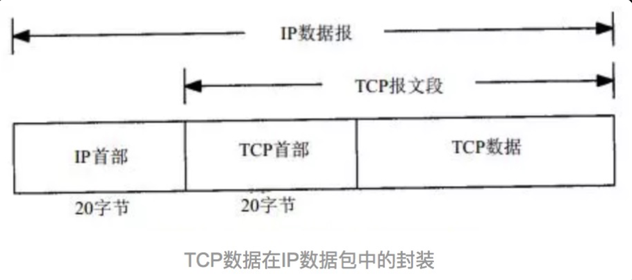

# TCP 协议

## 简介

TCP：Transmission Control Protocol，传输控制协议，是一种面向连接（连接导向）的、可靠的、 基于 IP 的传输层协议 

网络层级：在 OSI 模型中属于第四层

具体网络层级及功能可以参考 [网络分层](/basic-skills/network/网络分层/)

## TCP 头部结构和字段

TCP 报文：TCP 协议是封装在 IP 数据包中

TCP 报文格式：

字段解释：

+ 源端口和目的端口
  + 各占 2 个字节
  + 端口加上源/目的 IP 唯一确定一个 TCP 连接
+ 序号
  + 占 4 个字节，是本报文段所发送的数据项目组第一个字节的序号 
  +  TCP 传送的数据流中，每一个字节都有一个序号(包含了数据的字节数)
+ 确认序号
  +  占 4 个字节，是期望收到对方下次发送的数据的第一个字节的序号 
  +  确认序号应该是上次已成功收到数据字节序号 +1 
  +  只有 ACK 标志为 1 时，确认序号才有效 
+ 数据偏移
  +  占 4 比特，表示数据开始的地方离 TCP 段的起始处有多远，即 TCP 段首部的长度
  +   由于首部长度不固定，因此数据偏移字段是必要的 
  +  数据偏移以 4 个字节为长度单位
  +  TCP首部的最大长度是 60 个字节，即偏移最大为 15 个长度单位=1532位=154字节 
+ 保留
  +  6 比特，供以后应用，现在置为 0 
+ 6个标志位比特
  + URG：当 URG=1 时，注解此报文应尽快传送，而不要按本来的列队次序来传送。与“紧急指针”字段共同应用，紧急指针指出在本报文段中的紧急数据的最后一个字节的序号，使接管方可以知道紧急数据共有多长
  +  ACK：只有当 ACK=1 时，确认序号字段才有效
  +  PSH：当 PSH=1 时，接收方应该尽快将本报文段立即传送给其应用层
  +  RST：当 RST=1 时，表示出现连接错误，必须释放连接，然后再重建传输连接。复位比特还用来拒绝一个不法的报文段或拒绝打开一个连接
  +  SYN：SYN=1,ACK=0 时表示请求建立一个连接，携带 SYN 标志的 TCP 报文段为同步报文段 
  +  FIN：发端完成发送任务
+ 窗口
  +  TCP通过滑动窗口的概念来进行流量控制，解决发送端发送数据的速度和接收端接收速度却不一致的情况 
  +  滑动窗口可以理解成接收端所能提供的缓冲区大小
  + TCP 利用一个滑动的窗口来告诉发送端对它所发送的数据能提供多大的缓冲区
  +  窗口大小是一个 16bit 字段，因而窗口大小最大为 65535 字节 
+ 校验和
  +  检验 TCP 首部和数据，是一个强制性的字段 
  +  一定是由发端计算和存储，并由收端进行验证
+ 紧急指针
  +  只有当 URG 标志置 1 时紧急指针才有效 
  +  紧急指针是一个正的偏移量，和序号字段中的值相加表示紧急数据最后一个字节的序号 

## TCP 连接

### 三次握手

**第一次握手**：

+ 客户端向服务器发出连接请求报文
+ 报文首部中的同步位 SYN 置为 1，同时随机生成初始序列号 seq=x
+ TCP 客户端进程进入 SYN-SENT（同步已发送）状态
+ 报文不携带数据

**第二次握手**：

+ TCP 服务器收到请求报文后，如果同意连接则发出确认报文
+ 确认报文中将 ACK/SYN 置为1，确认号 `ack=x+1` ，随机初始化一个序列号 `seq=y`
+ TCP 服务进程进入了 SYN-RCVD（同步收到）状态
+ 报文不携带数据

**第三次握手**：

+ TCP 客户进程收到确认后，给出确认报文  `ACK=1`，`ack=y+1`
+ TCP 连接建立，客户端进入 ESTABLISHED（已建立连接）状态 
+  ACK 报文段可以携带数据

**思考**：为什么要三次握手，两次握手不行么？

例子：已失效的连接请求报文

+ client 发送了第一个连接的请求报文，由于网络不好，请求没有立即送达服务端，直到某个时间才到达 server
+ server 收到这个请求报文后，仍向 client 发出确认报文，同意连接

不采用三次握手：

+ 只要 server 发出确认，新的连接就建立了，不管是否这个请求是已经失效的请求
+ client 不需要向 server 发送确认请求，server 在连接建立后一直等待 client 发送数据，会导致很多资源被占用

### 四次挥手

目的：为了确保数据能够完成传输

原因：

+ 当 server 收到 client 的 FIN 报文时，说明 client 已经没有数据发送到 server 了，但 server 端已经将所有的数据发往 client 了，所以不会立马关闭 SOCKET 
+ 先发送 ACK 确认报文，告诉 client FIN 报文收到了
+ server 发送完所有数据后，发送 FIN 表示可以关闭连接，因此需要 4 次挥手

过程：

**第一次挥手**：

+ TCP 发送一个 FIN（结束），用来关闭 client 到 server 的连接
+ client 发出连接释放报文，`FIN=1`，其序列号为 `seq=u` ，并停止发送数据
+ client 进入 FIN-WAIT-1（终止等待 1）状态

**第二次挥手**：

+ server 收到这个 FIN ，发出确认报文 `ACK=1`，`ack=u+1`，并且带上自己的序列号 `seq=v`
+ server 端进入 CLOSE-WAIT（关闭等待）状态
+ client 收到确认后，client 端进入 FIN-WAIT-2（终止等待2）状态，等待服务器发送连接释放报文
+ 在释放连接请求发送前，client 需要接受 server 发送的最后的数据

**第三次挥手**：

+ server 发送最后的数据后，发送释放报文，`FIN=1`，`ack=u+1`
+ server 进入 LAST-ACK（最后确认）状态，等待 client 确认

**第四次挥手**：

+ client 收到释放报文后，发出确认报文，`ACK=1`，`ack=w+1`
+ client 进入 TIME-WAIT（时间等待）状态
+ TCP 连接没有立即释放，等报文段寿命（2**MSL）的时间过后，client 撤销相应的 TCP 连接，进入 CLOSED 状态
+ server 在接收到确认后，立即撤销 TCP 连接，进入 CLOSED 状态

**思考**：客户端突然挂掉了怎么办？

 问题：

正常连接时，client 突然挂掉了，如果没有措施处理这种情况，那么就会出现 client 和 server 端出现长时期的空闲

解决办法：

是在服务器端设置保活计时器，每当服务器收到客户端的消息，就将计时器复位。超时时间通常设置为 2 小时。若服务器超过 2 小时没收到客户的信息，他就发送探测报文段。若发送了 10 个探测报文段，每一个相隔 75 秒，还没有响应就认为客户端出了故障，因而终止该连接

## TCP 流量控制

解决问题：接受端与发送端速度不一致，可能导致缓存溢出

解决方法：滑动窗口协议，通过**接收方**来控制流量的一种方式

### 什么是滑动窗口

接受数据端使用的窗口大小，用于告诉发送端接收端的缓存大小，控制发送端发送数据的大小，达到流量控制的目的

过程：

+ 发送方接收到了对方发来的报文  `ack = 33`, `win = 10`，知道对方收到了 33 号前的数据，现在期望接收 [33, 43) 号数据，那我们开始发送[33, 43) 号的数据 
+ [33, 43) 号的数据你是已经发送了，但接受方并没有接受到 [36,37] 数据，所以接收方发送回对报文段 A 的确认：`ack = 35`, `win = 10`
+ 发送方收到了 `ack = 35`, `win = 10`，对方期望接收 [35, 45) 号数据，那么发送方再发送 [35, 45) 
+ 接收方接收到了报文段 [35, 41)，接收方发送：`ack = 41`, `win = 10`
+ 发送方收到了 `ack = 41`, `win = 10`，对方期望接收 [41, 51) 号数据
+  这样一直传输数据，直到数据发送完成，如果某数据没有获取到，那么ack永远不会跳过它，保证了数据数据的可靠性

**思考**：

+ 第一步发送了 [33, 43)，如果这次发送 [35, 45)，那中间重叠部分不是发送了两次，所以这里要思考重叠的部分是全部重新发送还是只发送接收端没有收到的数据，如果全部发送，那么重复发送的数据接收端怎么处理？
+  如果某一数据一直没有获取到，会一直这样堵塞在这里？

## TCP 拥塞控制

目的：解决发送方可能因为 IP 网络的拥塞而被遏制

解决方法：拥塞控制，通过**发送方**来控制流量的一种方式

**拥塞窗口**：

概念：

+ 发送方维持一个叫拥塞窗口 cwnd 的状态变量，拥塞窗口的大小取决于网络的拥塞程度，并且动态变化 
+ 发送方的让自己的发送窗口 = min（cwnd，接受端接收窗口大小）
+ 发送方取拥塞窗口与滑动窗口的最小值作为发送的上限 

### TCP 拥塞控制几种方法

#### 慢启动
概念：
TCP 在连接过程的三次握手完成后，开始传数据，为防止网络问题，导致数据包积攒发生拥塞，不能够一开始向网络通道中发送大量的数据包 

策略：
在数据发送被对方确认的过程中去计算对方的计算速度，逐步增加每次发送的数据量，达到某一稳定值后，进入高速传输阶段

原理：

##### 慢启动的性能

存在问题：对拷贝海量小文件的需求会造成重大性能损失

举个例子说明：

对每个文件都采用独立的 TCP 连接传输

工作过程：

+ 每传输一个文件建立一个连接，然后连接处于慢启动阶段，传输小文件，每个小文件几乎都处于独立连接的慢启动阶段被传输，这样传输过程所用的 TCP 包的总量就会增多
+ 在慢启动中传输小文件，可能需要 2~3 个小包在一个已经完成慢启动的 TCP 通道中，传输这个文件可能只需要 1个大包
+ 网络文件的拷贝时间基本上都是消耗在网络传输的过程中，如果文件的数量足够大，传输的时间就会被放大

如何避免慢启动：

尽量把大量小文件放在一个 TCP 连接中排队传输

+ 这种方式减少了发包的数量，降低了时间消耗
+ 避免了大量的 3 次握手和 4 次握手

#### 拥塞避免

前置：慢启动中的拥塞窗口的 cwnd 值开始是 1 ，之后呈指数型增长

方法：TCP 使用了一个叫 **慢启动门限（ssthresh）的变量**，当 `cwnd>=ssthresh`，慢启动过程结束，进入拥塞避免阶段

拥塞避免：cwnd 的值不再指数级往上升，开始加法增加 

当窗口中所有的报文段都被确认时，cwnd 的大小加 1，cwnd 的值随 RTT 开始线性增加

逻辑如下：

+ 把 ssthresh 降低为 cwnd 值的一半
+ 把 cwnd 重新设置为 1
+ 重新进入慢启动过程

#### 快速重传

目的：TCP 要保证所有的数据包都可以到达，必须有重传机制

注意：SeqNum 和 Ack 是以字节数为单位，所以 ack 的时候，不能跳着确认，只能确认最大的连续收到的包，不然，发送端就以为之前的都收到了

例子：

发送端发了 1,2,3,4,5 一共五份数据，接收端收到了 1，2，于是回 ack 3，然后收到了 4（注意此时3没收到）此时的 TCP 会怎么办？

##### 超时重传机制

**方法**：

 不回 ack，死等 3，当发送方发现收不到 3 的 ack 超时后，会重传 3 

存在问题：

因为要死等 3，所以会导致 4 和 5 即便已经收到了，而发送方也完全不知道发生了什么事，因为没有收到Ack，所以，发送方可能会悲观地认为也丢了，所以有可能也会导致 4 和 5 的重传

针对存在的问题有有以下 2 种选择：

+ 仅重传 timeout 的包，即第 3 份数据

  会节省带宽，但是慢

+ 重传 timeout 后所有的数据，即 3、4、5 三份数据

  会快一点，但是很浪费带宽

##### 快速重传机制

概念：如果包没有连续到达，发送方连续收到 3 次 相同的 ack，就重传

好处：不用等 timeout 了再重传，而是只是三次相同的 ack 就重传

举个例子：

如果发送方发出了 1，2，3，4，5 份数据，第一份先到送了，于是就 ack 回 2，结果 2 因为某些原因没收到，3 到达了，于是还是 ack 回 2，后面的 4 和 5 都到了，但是还是 ack 回 2 ，因为 2 还是没有收到，于是发送端收到了三个 ack=2 的确认，知道了 2 还没有到，于是就马上重转 2。然后，接收端收到了 2，此时因为 3，4，5 都收到了，于是 ack 回 6

虽然快速重传解决了 timeout 的问题，但依然存在问题：

对于上面的例子还说，是重传 2 还是需要重传 2、3、4、5？因为不知道连续 3 次的 ack2 是谁发的

**总结**：不管是超时重传还是快速重传，都只是保证了数据的可靠性，不能解决重传哪些数据的问题

（完）

