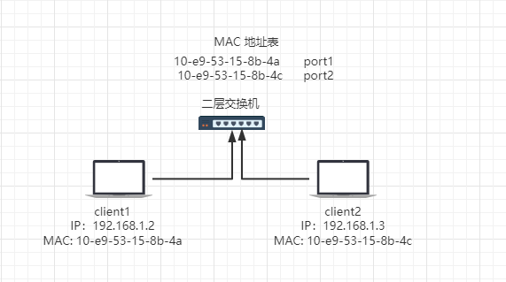
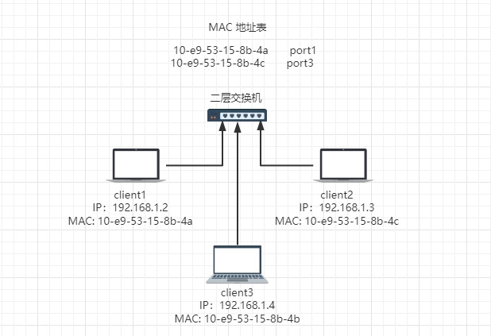

# ARP 欺骗

前提：了解什么是 ARP，可以参考 [ARP协议](/basic-skills/network/ARP协议)

**注意**：ARP 欺骗是内网（局域网）的一种攻击手段

## 什么是 ARP 欺骗

### 正常数据传输：



client1 与 client2 通信的过程：

**第一步**:

client1 检测到要通信的地址是同一网段的，会发出消息“谁是 192.168.1.3”

**第二步**：

交换机端口收到消息后，会将该消息在全局域网类进行关播，并将 client1 连接的端口与 MAC 写入 MAC 地址表中

**第三步**：

+ client2 接收到消息后，会回复 client1 “我是 192.168.1.3，MAC 地址是 10-e9-53-15-8b-4c”
+ client2 会将 client1 的 IP 与 MAC 写入 ARP 缓存表中
+ 交换机收到该消息后，会将 client2 连接的端口与 MAC 写入 MAC 地址表中
+ client1 会将 client2 的 IP 与 MAC 写入 ARP 缓存表中

**第四步**:

client1 将数据发送给 client2时，交换机会进行相应端口转发

**重点**：

+ ARP 缓存表有失效时间
+ client1 的缓存未失效时，不会重新发送消息查询 client2 的 MAC 地址

### “被欺骗”的数据传输



client1 与 client2 通信的过程：

**第一步**:

client1 检测到要通信的地址是同一网段的，会发出消息“谁是 192.168.1.3”

**第二步**：

交换机端口收到消息后，会将该消息在全局域网类进行关播，并将 client1 连接的端口与 MAC 写入 MAC 地址表中

**第三步**：

+ client3 接收到消息后，疯狂的回复 client1 “我是 192.168.1.3，MAC 地址是 10-e9-53-15-8b-4b”
+ client3 会将 client1 的 IP 与 MAC 写入 ARP 缓存表中
+ 交换机收到该消息后，会将 client3 连接的端口与 MAC 写入 MAC 地址表中
+ client1 会将 client3 的 IP 与 MAC 写入 ARP 缓存表中

**第四步**:

client1 将数据发送给 client2 时，交换机会进行相应端口转发，此时就会转发给 client3

### ARP 欺骗的原因

根据上面的例子可以看出，ARP 存在的原因：

+ 在 ARP回复时，发送请求包的主机 client1 并不会验证 ARP 回复包的真实性
+ client1 不能判断回复自己的是不是主机 client2 
+ 由此引出一个局域网攻击方式 ARP 欺骗

## ARP 欺骗的分类

+ 主机欺骗
  如同上面的例子，client3 欺骗 client1 
+ 网关欺骗
  局域网中的主机欺骗网关，从而获取其他主机的进流量

## ARP 攻击的危害

+ 造成局域网中的其他主机断网
+ 劫持局域网中其他主机或网关的流量，获取敏感信息等

## 如何防御 ARP 欺骗

ARP 欺骗是通过重复应答实现的，只需要在本机添加一条静态的 ARP 映射，这样就不需要询问网关 MAC 地址了，**这种方法只对主机欺骗有效**

### 步骤

#### 查看网络 

用管理身份运行命令提示符，输入 `netsh i i show in` 查看一下本机有哪些网络连接
```shell
netsh i i show in
```
#### 查询网关 MAC 

输入 `arp -a` 查询本机的网关信息
```shell
arp -a
```
::: warning 注意
如果正遭受 ARP 欺骗攻击，通过此方法查处的可能是虚假的 MAC 地址
:::
#### 绑定 IP 和 MAC

输入以下命令对网关的 IP 和 MAC 添加静态映射

```shell
netsh -c "i i" add neighbors 连接的Idx号 网关IP 网关MAC
netsh -c "i i" add neighbors 9 10.60.12.1 4c-5e-0c-64-73-f5
```