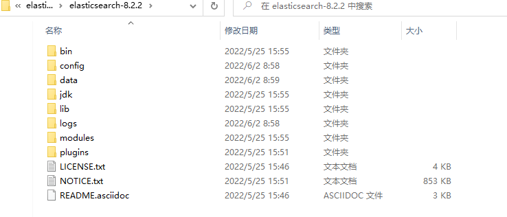
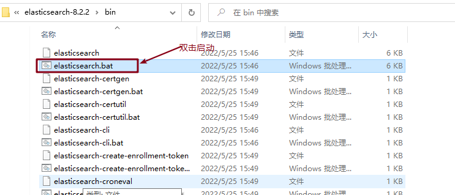
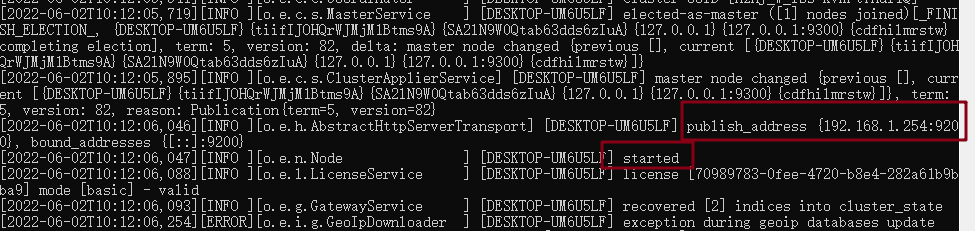
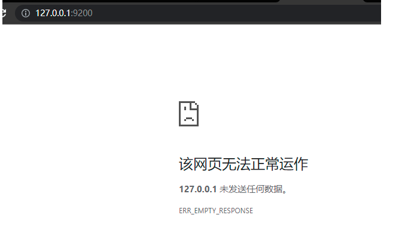
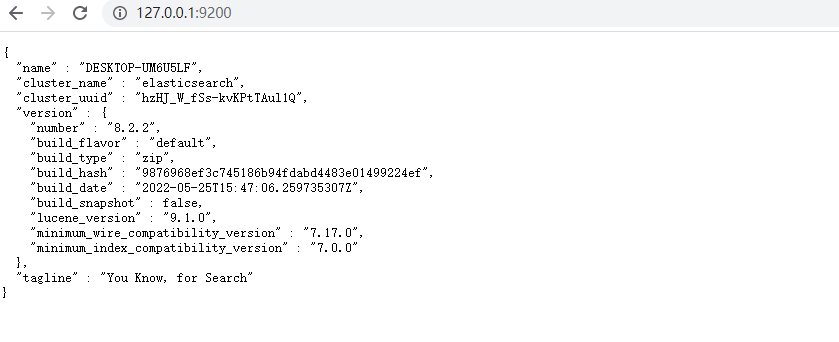
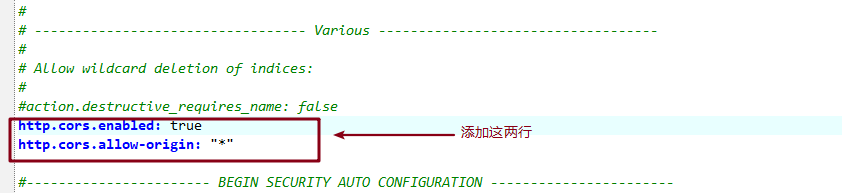
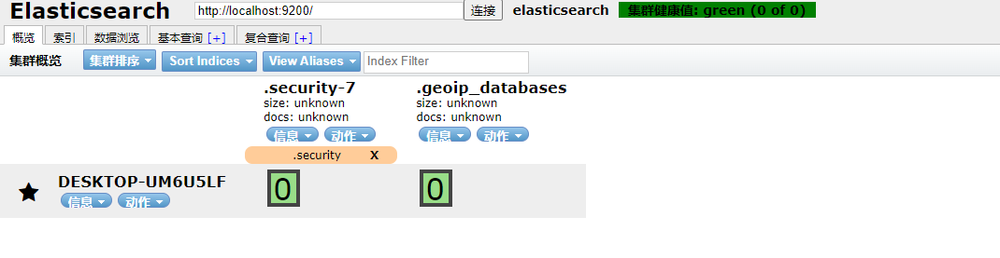

# Windows 下安装

**必须先安装 Java 环境**

本文中所述版本是 8.2.2

## 安装步骤

### 下载压缩包

官网地址：https://www.elastic.co/cn/downloads/elasticsearch

下载 Windows 环境的压缩包 8.2.2 版本

### 解压启动

将上面下载的压缩包进行解压



```
相关目录介绍：

bin：启动文件

config：配置文件

log4j2：日志配置文件

jvm.options：java 虚拟机相关的配置

elasticsearch.yml：elasticsearch 的配置文件！ 默认 9200 端口！ 跨域！

lib：相关jar包

logs：日志

modules：功能模块

plugins；插件
```

启动：





访问 9200 端口时：

有报错信息：

```shell
[2022-05-18T15:59:34,697][WARN ][o.e.x.s.t.n.SecurityNetty4HttpServerTransport] [DESKTOP-0QU7RUU] received plaintext http traffic on an https channel, closing connection Netty4HttpChannel{localAddress=/127.0.0.1:9200, remoteAddress=/127.0.0.1:52407}
```

访问页面：



**解决方案**：

修改 Elasticsearch-8.2.2 安装目录下，/config/elasticsearch.yml 文件

将 `xpack.security.enabled: true` 修改为 `xpack.security.enabled: false`

修改完成后重新启动：



## 安装可视化界面 es head 的插件

**必须安装 node 环境**

下载地址：https://github.com/mobz/elasticsearch-head/

下载完成后进入目录执行：

```javascript
npm install
npm run start
```

启动后可以看到：

```javascript
> elasticsearch-head@0.0.0 start G:\elasticsearch-head
> grunt server

Running "connect:server" (connect) task
Waiting forever...
Started connect web server on http://localhost:9100

```

打开 9100 端口：


出现上述情况的原因是**跨域**

**解决方案**：

修改 es 的配置文件如下：



重启 es 后重新连接



（完）