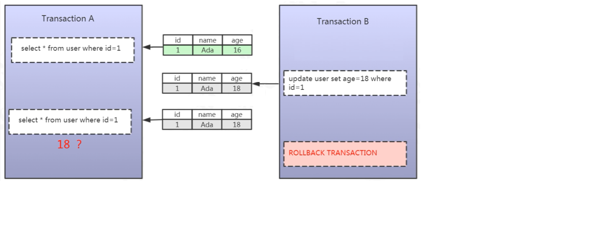
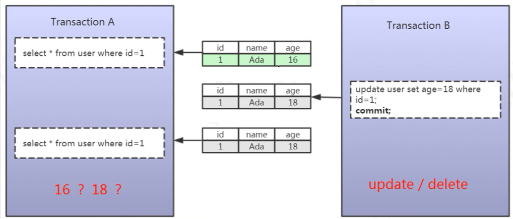
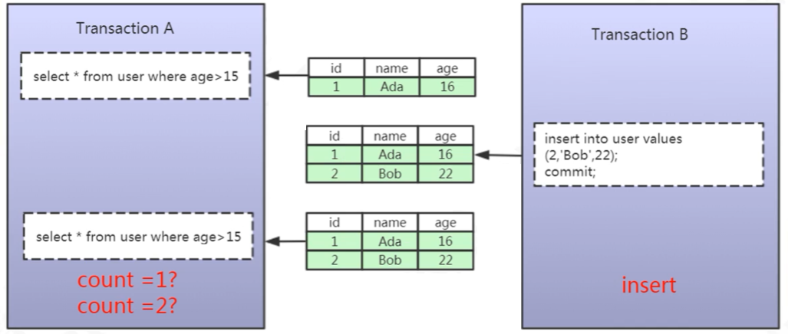
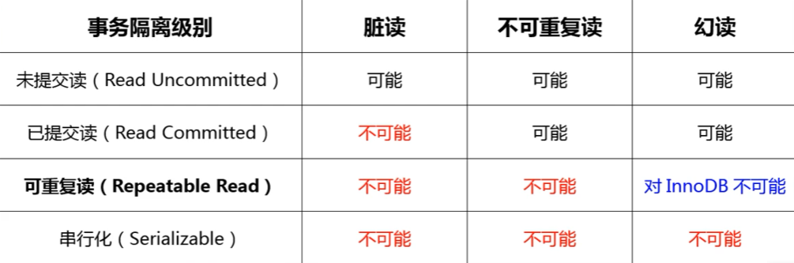

# MySql 事务

## 什么是事务

+ 是数据库管理系统(DBMS)执行过程中的一个逻辑单位
+ 由一个有限的数据库操作序列构成

**常见的业务场景**：
+ 转账
+ 订单
+ 修改数据库的数据内容

**支持事务的存储引擎**：
+ InnoDB
+ NDB

## 数据库的事务

### 默认事务

查看是否自动开启，默认是 ON
```shell
show VARIABLES like 'autocommit'
```
数据库默认是开启事务的，这会使得使用关键字时会提交事务，例如
```shell
update student set sname = '1111' where id =1;
```

### 自定义事务

语法：
```shell
begin或 start TRANSACTION;
update student set sname = '1111' where id =1;
commit # 提交事务
rollback # 回滚事务
```
### 事务的结束
两种方式：
+ commit
+ rollback

## 事务的四大特性

+ 原子性(Atomicity)
  + 数据库事务的最小的逻辑单位
  + 事务要么全部成功，要么全部失败
+ 一致性(Consistency)
  + 数据库自身的完整性约束
  + 用户自定义的完整性
+ 隔离性(Isolation)
+ 持久性(Durablity)

A、I、D 都是为了保证 C

## 事务并发存在的问题

对数据的增删改都会存在提交事务，如果操作的是同一个数据库的同一张表，会出现哪些问题？

### 脏读



+ 第一次查询时后，执行了其他未提交的事务
+ 第二次查询时，查询的结果是未提交事务的数据
+ 两次查询的结果不一致

### 不可重复读



+ 第一次查询时后，执行了其他未提交的事务
+ 第二次查询时，查询的结果是已提交事务的数据
+ 两次查询的结果不一致

### 幻读



+ 第一次查询时后，执行了其他未提交的事务
+ 第二次查询时，查询的结果中包含了已提交事务的数据
+ 两次查询的结果不一致

::: warning 总结
+ 事务并发的三大问题都是数据库**读一致性**问题
+ 读一致性的问题必须由数据库提供一定的事务隔离机制来解决(SQL92 ANSI/ISO 标准)
  + Read Uncommitted(未提交读)
  + Read Committed(已提交读)：解决脏读
  + Repeatable Read(可重复读)：解决脏读、不可重复读
  + Serializable(串行化)：解决事务并发的所有问题，但效率低
+ update/delete 属于不可重复读，insert 属于幻读
:::

### 如何实现事务隔离

事务隔离级别：



#### LBCC(Lock Based Concurrency Control)

读数据前，对其加锁，阻止其他事务对数据进行修改

#### MVCC(Mutil Version Concurrency Control)

+ 生成一个数据请求时间的一致性数据快照
+ 并用这个快照来提供一定级别(语句级或事务级)的一致性读取

## 参考文档

[MySql 事务](https://www.bilibili.com/video/BV1x54y1979n?spm_id_from=333.337.search-card.all.click)

（完）