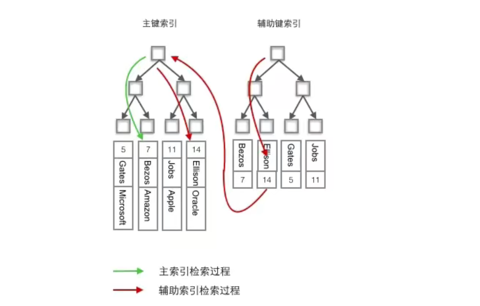
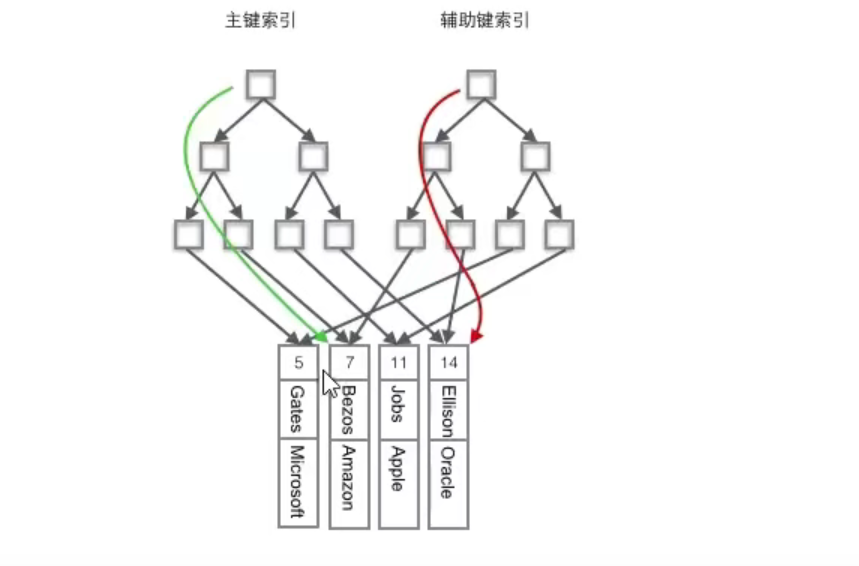

# 聚簇索引与非聚簇索引

## 什么是聚簇索引

+ 将数据存储与索引结构放到了一块
+ 索引结构的叶子节点保存了行数据

::: tip 注意
+ 主键索引一定是聚簇索引
+ 聚簇索引不一定就是主键索引
:::

## 什么是非聚簇索引

+ 将数据与索引结构分开存储
+ 索引结构的叶子节点指向了数据对应的位置
+ InnoDB 中建立在主键索引之上的辅助索引都是非聚簇索引
+ 非聚簇索引中的叶子节点存储的不是行的物理位置，而是主键值
+ 辅助索引查找数据时总是需要二次查找

::: danger 重点
为什么非聚簇索引中的叶子节点存的是主键 id 而不是数据的地址？

因为数据库的增删改，会使得地址改变
:::

## InnoDB 与 MyISAM 中索引对比

### InnoDB 中

+ 使用的是聚簇索引，将主键组织到一颗 B+树 中，行数据存储在叶子节点上
+ 使用 `where id=14` 查找主键，则按照 B+树 的检索算法即可找到对应的叶节点获取数据
+ 若对 Name 列进行条件搜索需要两个步骤(在建立非聚簇索引的情况下)：
  + 在辅助索引 B+树 中检索 Name，在对应的叶子节点上获取对应的主键
  + 使用主键在主键索引 B+树 中再执行 B+树 检索操作，最终到达叶子节点获取整行数据
+ 聚簇索引默认是主键：
  + 如果没有定义主键，InnoDB 会选择一个**唯一且非空的索引(unique 索引)**代替
  + 如果没有这样的索引，InnoDB 会**隐式定义一个主键(类似于 oracle 中的 RowId)**作为聚簇索引
  + 如果已经设置了主键为聚簇索引，又希望单独设置其他的聚簇索引，必须先删除主键添加想要的聚簇索引，然后恢复主键

### MyISAM 中

+ 使用的是非聚簇索引
+ 非聚簇索引的两颗 B+树 结构一致，只有存储的内容不一致
+ 主键索引 B+树 的节点存储了主键，辅助索引 B+树 存储了辅助键
+ 表数据存储在独立的地方
+ 两颗 B+树 的叶子节点都使用一个地址指向真正的表数据
+ 由于索引树是独立的，通过辅助键检索无需访问主键的索引树

### 聚簇索引的优势

每次使用辅助索引检索都要经过两次 B+树 查找，看上去聚簇索引的效率明显要低于非聚簇索引，那聚簇索引的优势在哪？

+ 由于数据和聚簇索引的叶子节点存储在一起，同一页会有多条行数据，访问同一数据页不同行记录时，已经把页加载到 Buffer(缓存器)，再次访问时，会在内存在访问，不用进行 I/O 操作这样主键和行数据是一起被载入内存的，找到叶子节点就可以立刻将行数据返回了，如果按照主键 Id 来组织数据，获得数据更快
+ 辅助索引的叶子节点，存储主键值，不是数据的存放地址
+ 当行数据发生变化时，索引树的节点也需要分裂变化
+ 需要查找数据时，在上一次 IO 读写的缓存中没有，需要发生一次新的 IO 操作时，可以避免对辅助索引的维护工作，只要维护聚簇索引树就好了
+ 辅助索引存放的是主键值，减少了辅助索引占用的存储空间大小

## 使用聚簇索引的注意点

+ 使用主键为聚簇索引时，主键最好不要使用 uuid，uuid 的值太过离散，不适合排序且可能出现新增记录的 uuid 会插入在索引树中间位置，导致索引树调整复杂度变大，消耗更多的时间和资源
+ 建议使用 int  类型的自增，方便排序且默认会在索引树的末尾增加主键值，对索引树的结构影响最小而且，主键值占用的存储空间越大，辅助索引中保存的主键值也会跟着变大，占用存储空间，也会影响到 IO 操作读取到的数据量

## 为什么主键通常建议使用自增 id

+ 聚簇索引的数据的物理存放顺序与索引顺序是一致的，即：只要索引是相邻的，那么对应的数据一定也是相邻存放在磁盘上
+ 如果主键不是自增 id ，会不断调整数据的物理地址、分页
+ 如果是自增的，只需要一页一页的写，索引结构相对紧凑，磁盘碎片少，效率也高

## 什么情况下无法利用索引

+ 查询语句中使用 like 关键字
  + 如果匹配字符串的第一个字符为 % ，索引不会被使用
  + 如果 % 不是在第一个位置，索引会被使用

+ 查询语句中使用多列索引
  + 只有查询条件中使用了这些字段中的第一个字段，索引才会被使用
+ 查询语句中使用 or 关键字
  + 如果 or 前后的两个条件的列都是索引，那么会使用索引
  + 如果 or 前后有一个列不是索引，那么不会使用索引

## 参考文档

[Clustered and Secondary Indexes](https://dev.mysql.com/doc/refman/8.0/en/innodb-index-types.html)

[聚簇索引与非聚簇索引](https://www.bilibili.com/video/BV19y4y127h4?p=3)

（完）