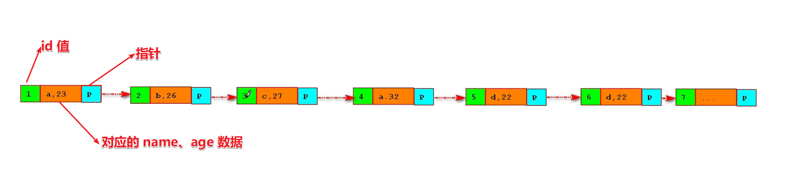
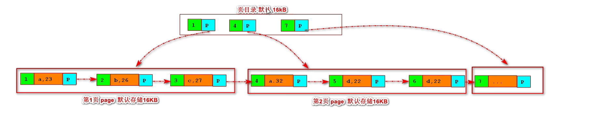

# 索引结构

先来看个例子：
```
# 建表
create table t_emp(id int primary key,name varchar(20),age int);

# 插入数据
insert into t_emp values(5,'d',22);
insert into t_emp values(6,'d',23);
insert into t_emp values(4,'e',25);
insert into t_emp values(1,'a',24);
insert into t_emp values(2,'b',26);
insert into t_emp values(3,'f',22);

# 查询数据
select * from t_emp
```
查询结果中发现，数据根据主键索引排序了

| id   | name | age  |
| ---- | ---- | ---- |
| 1    | a    | 24   |
| 2    | b    | 26   |
| 3    | f    | 22   |
| 4    | e    | 25   |
| 5    | d    | 22   |
| 6    | d    | 23   |

**排序的目的**：为了快速查询

## 索引原理

根据上面的例子，数据的存储结构图：



**优点**：
+ 每一块都含有 id、数据、指针(磁盘地址信息)
+ 根据指针将数据按顺序链接起来
+ 查询数据的时候就比较快

**缺点**：
+ 如果在数据量特别大的时候，比如查询第 1w 条数据，那就要查询 1w 次
+ 排序链表的时间复杂度(On)非常大

针对上面的缺点，MySQL 进行了优化，基于**页的管理**：



+ 将链表进行分页管理，InnoDB 中默认每页存储 16KB
+ 生成页目录管理
+ 页目录中存储每一页的第一个 id 值和指针
+ 页目录中的指针指向每一页的数据
+ 进行数据匹配时，会先在页目录中匹配在哪页，然后去相应的页中匹配数据
+ 页目录中也是页，每一页也是 16KB，如果数据太多，也可以分页向上在来一层

这种多层级的由上而下的就是 **B+树**
::: tip 注意
+ 一般 MySQL 的树 2~4 层
+ 如果达到三层，就能存储 10亿 左右的数据
:::
我们可以算下上面 t_emp 的数据量：

int 类型：4 个字节

vachar 类型：20 个字节

指针：4~8 个字节

一条数据的字节数：4+20+4+8=36

一页的数据条数：16KB * 1024 / 36 = 455

页目录中的一页的页数：16KB * 1024 / 12 = 1368

一页的数据量：1368 * 455 = 622440 


## B+树

**B+树**：
+ B+树是在 B树的基础上的一种优化
+ 只有叶子节点才存储数据，非叶子节点不存储数据，减少树的深度

**B树**：
+ 无论是叶子还是非叶子节点都存储数据
+ 页目录上存储数据后会使得页数变少，同样的数据量会使得树的深度更深

::: danger 重点
+ MySQL 会将树根常驻内存，加快查询速度
+ 查找某一键值的行记录时最多只需要 1~3 次 I/O 操作
+ 非聚簇索引(非主键索引)在查询数据时，会先根据索引查相应数据的 id ，然后再根据主键索引查询
  + 比如根据 name 索引查询数据，会先在 name 索引结构中查询到相应列在索引中的 id 
  + 根据 id 去主键索引中查询，相应的数据
+ 主键索引使用 int 类型的原因就是 int 类型能排序
:::


## 参考文档

[索引结构](https://www.bilibili.com/video/BV19y4y127h4?p=2))

（完）
