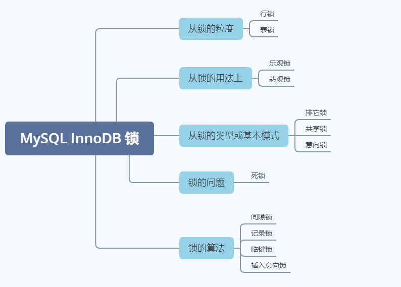
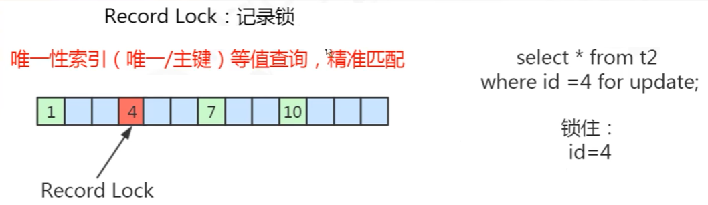
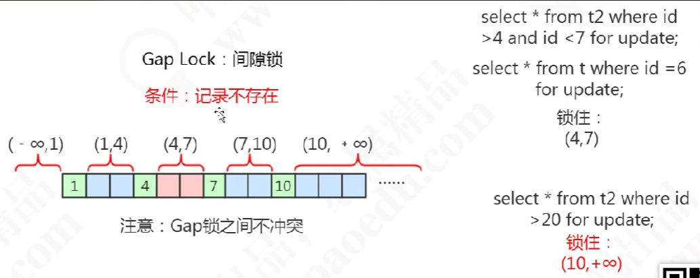
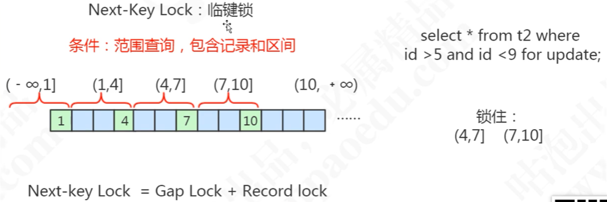

# MySql 锁

作用：为了解决资源(数据库中的数据)竞争的问题

存储引擎支持的锁：
+ InnoDB 中支持行锁和表锁
+ MYISAM 中只支持表锁

## 锁的分类



### 行锁

#### 共享锁(S 锁)

**定义**：
+ 又称为读锁
+ 多个事务对于同一个数据可以共享一把锁，都能访问到数据，但是只能读不能修改

**加锁方式**：
```shell
select * from student where id = 1 LOCK IN SHARE MODE;
```
**解锁**:
```shell
commit/rollback;
```

#### 排他锁(X 锁)

**定义**:
+ 又称为写锁
+ 不能与其他锁并存
+ 一个事务获取了一个数据行的排它锁，其他事务就不能再获取该行的锁
+ 只有获取了排它锁的事务是可以对数据行进行读取和修改

**加锁方式**：
```shell
# 自动
delete/update/insert 默认加上 X 锁
# 手动
select * from student where id = 1 FOR UPDATE;
```
**解锁**:
```shell
commit/rollback;
```

### 意向锁

+ 是一种表锁
+ 由数据库引擎自己维护
+ 用户无法手动操作意向锁

使用意向锁的目的：提高加表锁的效率的一个标志


#### 意向共享锁(IS 锁)

**定义**:
+ 表示事务准备给数据行加入共享锁
+ 一个数据行加共享锁前必须先取得该表的 IS 锁


#### 意向排它锁(IX 锁)

**定义**:
+ 表示事务准备给数据行加入排它锁
+ 一个数据行加排它锁前必须先取得该表的 IX 锁

::: tip 表锁与行锁的区别：
+ 锁定粒度：表锁 > 行锁
+ 加锁效率：表锁 > 行锁
+ 冲突概率：表锁 > 行锁
+ 并发性能：表锁 < 行锁
:::

### 锁的算法

#### 记录锁

作用：锁定记录

使用场景：



#### 间隙锁

作用：锁定范围

目的：阻塞插入

使用条件：



#### 临键锁

作用：锁定范围加记录

使用条件：




## MySQL 锁到底锁住了什么

**锁定了聚簇索引项**


## 参考文档

[InnoDB 存储引擎](https://dev.mysql.com/doc/refman/8.0/en/innodb-locking.html)

[MySql 锁](https://www.bilibili.com/video/BV1x54y1979n?spm_id_from=333.337.search-card.all.click)

（完）