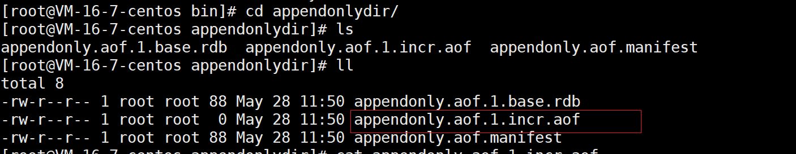
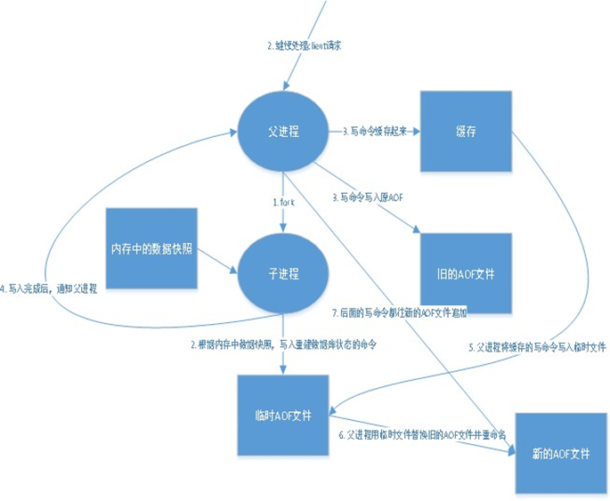
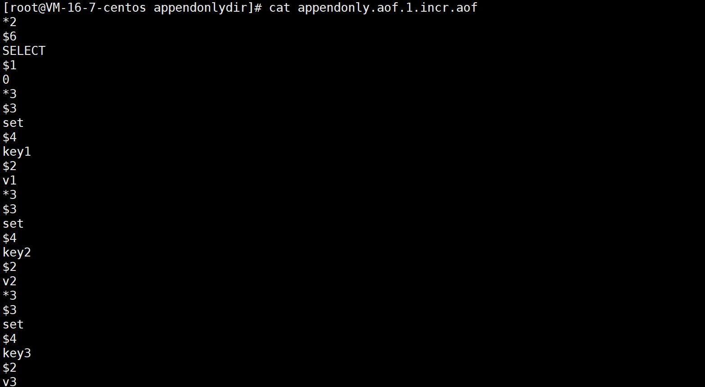
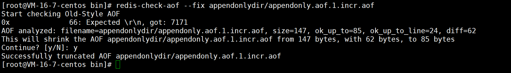

# 持久化之 AOF

## 什么是 AOF

AOF：Append Only File

+ 以日志的形式记录每个写的操作
+ 只许追加文件，但不可以改写文件
+ Redis 启动时会读取这个文件，将所有指令重新执行
+ 默认不开启，需要修改配置文件手动开启
+ AOF 保存的是 appendonly.aof 文件

```shell
# Please check https://redis.io/topics/persistence for more information.
appendonly no

appendfilename "appendonly.aof"
```
修改配置文件后，重启 Redis 即可

默认文件路径在 appendonlydir 目录下



## 实现原理



连接 Redis 进行一些操作后，查看该文件:
```shell
127.0.0.1:6379> set key1 v1
OK
127.0.0.1:6379> set key2 v2
OK
127.0.0.1:6379> set key3 v3
OK
```


::: warning 注意
如果 AOF 文件有错误，这时 Redis 是启动不成功的，需要修复这个 AOF 文件

Redis 给我们提供了一个工具 `redis-check-aof --fix`
:::



文件正常后就可以正常启动

## AOF 优缺点

```shell
appendonly no                #默认是不开启 aof模式的，默认是使用 rdb 方式持久化的，在大部分所有的情况下，rdb 完全够用！
appendfilename "appendonly.aof"    #持久化的文件的名字
# appendfsync always               #每次修改都会 sync，消耗性能
appendfsync everysec               #每秒执行一次 sync，可能会丢失这 1s 的数据！
# appendfsync no                   #不执行 sync，这个时候操作系统自己同步数据，速度最快！
```

**优点**：
+ 每一次修改都会同步，文件的完整性会更加好
+ 没秒同步一次，可能会丢失一秒的数据
+ 从不同步，效率最高

**缺点**：
+ 相对于数据文件来说，AOF 远远大于 RDB，修复速度比 RDB 慢！
+ AOF 运行效率也要比  RDB 慢，所以我们redis默认的配置就是 RDB 持久化

（完）