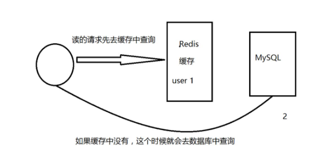
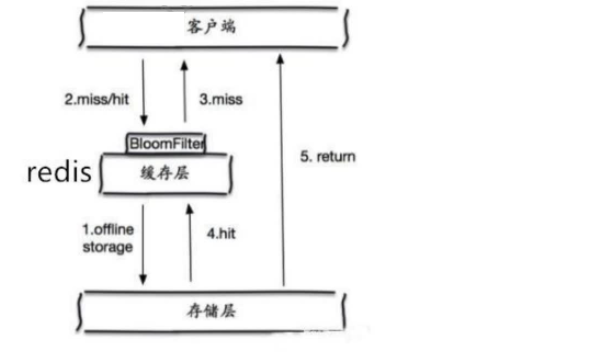
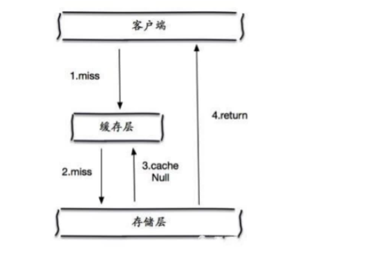
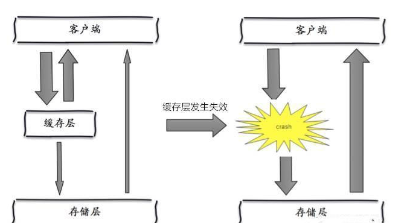

# 缓存穿透与雪崩

Redis 缓存的使用，极大的提升了数据查询方面的性能和效率

同时也带来了一些问题：

+ 其中最严重的就是数据一致性问题，如果对数据的一致性要求很高，就不能使用缓存

+ 另外典型的问题：缓存穿透、缓存击穿和缓存雪崩

## 缓存穿透

### 什么是缓存穿透

一般在数据库之前都会有一个缓存

+ 默认情况下，用户请求数据时，会先在缓存中查找

+ 若在缓存中没找到，再去数据库查找

+ 数量少时可能问题不大，一旦大量的请求数据(如秒杀场景)缓存中都没有命中，就会全部转移到数据库上，给数据库造成极大的压力，可能导致其崩溃

::: tip 总结

缓存穿透的主要原因就是：**查不到**

:::

### 解决方案

#### 布隆过滤器

+ 对所有可能查询的参数以 Hash 形式存储
+ 在控制层先进行校验，不符合规则丢弃，避免了对底层存储系统的查询压力

#### 缓存空对象

+ 当存储层不命中后，将返回的空对象也缓存起来，同时设置一个过期时间
+ 之后在访问这个数据会从缓存中获取，保护后端数据源

**但这种方法存在两个问题**：

+ 存储空对象也需要空间，大量的空对象会耗费一定的空间，存储效率并不高，解决这个问题的方式就是设置较短过期时间

+ 即使对空值设置了过期时间，还是会存在缓存层和存储层的数据会有一段时间窗口的不一致，这对于需要保持一致性的业务会有影响

  

## 缓存击穿

### 什么缓存击穿

相较于缓存穿透，缓存击穿的目的性更强

+ 一个热点的 key ，大并发集中对这一个点进行访问

+ 在缓存过期的一刻，这些请求都会击穿到 DB，造成瞬时 DB  请求量大、压力骤增
+ 这就是缓存被击穿，只是针对其中某个key 的缓存不可用而导致击穿，但是其他的 key 依然可以使用缓存响应

比如热搜排行榜，一个热点新闻被同时大量访问就可能导致缓存击穿

::: tip 总结

缓存击穿的主要原因就是：**量太大，缓存过期**

:::

### 解决方案

#### 设置热点数据永不过期

+ 从缓存层面，没有设置过期时间，就不会出现热点数据过期的情况
+ 但是当 Redis 内存空间满的时候也会清理部分数据，而且此种方案会占用空间，一旦热点数据多了起来，就会占用部分空间

#### 加互斥锁

+ 使用分布式锁，保证对于每个 key 同时只有一个线程去查询后端
+ 其他线程没有获得分布式锁的权限，只需等待即可
+ 这种方式将高并发的压力转移到了分布式锁

## 缓存雪崩

### 什么是缓存雪崩

+ 在指定某一个时间段，大量缓存集中过期或缓存服务宕机
+ 造成瞬时 DB 请求量大、压力骤增，引起雪崩

### 解决方案

#### Redis 高可用

+ 既然 Redis 有可能挂掉，那我多增设几台 Redis
+ 一台挂掉之后其他的还可以继续工作，其实就是搭建的集群

#### 限流降级

+ 在缓存失效后，通过加锁或者队列来控制读数据库写缓存的线程数量
+ 比如对某个 key 只允许一个线程查询数据和写缓存，其他线程等待

#### 数据预热

+ 在正式部署之前，我先把可能的数据先预先访问一遍，这样部分可能大量访问的数据就会加载到缓存中
+ 在即将发生大并发访问前手动触发加载缓存不同的 key，设置不同的过期时间，让缓存失效的时间点尽量均匀
  

（完）