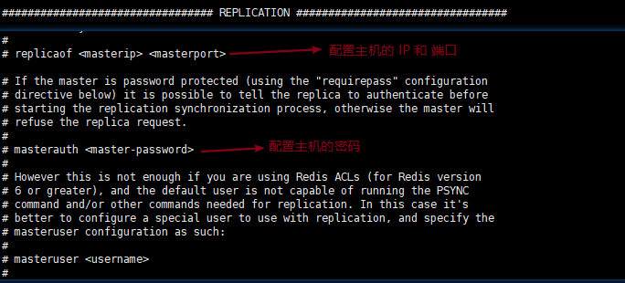

# Redis 主从复制

## 什么是主从复制

+ 将一台 Redis 服务器的数据，复制到其他 Redis 服务器
+ 前者称为主节点，后者称为从节点
+ **数据的复制是单向的，只能由主节点复制到从节点**
+ 主节点以写为主，从节点以读为主

## 主从复制的作用

+ 数据冗余：主从复制实现了数据的热备份，是持久化之外的一种数据冗余的方式
+ 故障恢复：当主节点故障时，从节点可以暂时替代主节点提供服务，是一种服务冗余的方式
+ 负载均衡：在主从复制的基础上，配合读写分离，由主节点进行写操作，从节点进行读操作，分担服务器的负载；尤其是在多读少写的场景下，通过多个从节点分担负载，提高并发量
+ 高可用基石：主从复制还是哨兵和集群能够实施的基础

## 为什么要使用集群

+ 单台服务器难以负载大量的请求
+ 单台服务器故障率高，系统崩坏概率大
+ 单台服务器内存容量有限

## 集群环境配置

主要实现的是单机多服务集群

### 以命令的形式配置

查看当前库的信息：

```shell
127.0.0.1:6379> info replication
# Replication
role:master             # 角色
connected_slaves:0      # 从机数量
master_failover_state:no-failover
master_replid:053d096358fe090b7c3ec8616e4ae90402ccd42d
master_replid2:0000000000000000000000000000000000000000
master_repl_offset:0
second_repl_offset:-1
repl_backlog_active:0
repl_backlog_size:1048576
repl_backlog_first_byte_offset:0
repl_backlog_histlen:0
```

#### 一主二从配置

**第一步**：

+ 需要启动多个服务，就需要多个配置文件
+ 每个配置文件对应修改以下信息
  + 端口号
  + pid 文件名
  + 日志文件名
  + rdb 文件名

启动单机多服务集群，查看进程：

```shell
[root@test redis-config]# ps -ef|grep redis
root     30315     1  0 11:24 ?        00:00:00 redis-server 127.0.0.1:6379
root     30321     1  0 11:24 ?        00:00:00 redis-server 127.0.0.1:6380
root     30328     1  0 11:25 ?        00:00:00 redis-server 127.0.0.1:6381
root     30335 30283  0 11:25 pts/5    00:00:00 grep redis
```

**第二步**：

+ 默认情况下，每台 Redis 服务都是主节点

+ 使用 `slaveof host post` 配置从机

将 80、81 配置为从机

```shell
----------------------------80---------------------------------
127.0.0.1:6380> SLAVEOF 127.0.0.1 6379
OK
127.0.0.1:6380> info replication
# Replication
role:slave                                # 变成从机了
master_host:127.0.0.1
master_port:6379
master_link_status:up
master_last_io_seconds_ago:4
master_sync_in_progress:0
slave_read_repl_offset:42
slave_repl_offset:42
slave_priority:100
slave_read_only:1
replica_announced:1
connected_slaves:0
master_failover_state:no-failover
master_replid:727048f272ec1e7bff9d178bdd2b97a8c37eb6cf
master_replid2:0000000000000000000000000000000000000000
master_repl_offset:42
second_repl_offset:-1
repl_backlog_active:1
repl_backlog_size:1048576
repl_backlog_first_byte_offset:15
repl_backlog_histlen:28

----------------------------81---------------------------------
127.0.0.1:6381> SLAVEOF 127.0.0.2 6379
OK
127.0.0.1:6381> info replication
# Replication
role:slave                              # 变成从机了
master_host:127.0.0.1
master_port:6379
master_link_status:down
master_last_io_seconds_ago:-1
master_sync_in_progress:0
slave_read_repl_offset:0
slave_repl_offset:0
master_link_down_since_seconds:-1
slave_priority:100
slave_read_only:1
replica_announced:1
connected_slaves:0
master_failover_state:no-failover
master_replid:ae95e721f4791b7b7dc28df51329f44e24f5533d
master_replid2:0000000000000000000000000000000000000000
master_repl_offset:0
second_repl_offset:-1
repl_backlog_active:0
repl_backlog_size:1048576
repl_backlog_first_byte_offset:0
repl_backlog_histlen:0
```

主机上查看：

```shell
127.0.0.1:6379> info replication
# Replication
role:master
connected_slaves:2                      # 有 2 个从机
slave0:ip=127.0.0.1,port=6380,state=online,offset=350,lag=1
slave1:ip=127.0.0.1,port=6381,state=online,offset=350,lag=0
master_failover_state:no-failover
master_replid:727048f272ec1e7bff9d178bdd2b97a8c37eb6cf
master_replid2:0000000000000000000000000000000000000000
master_repl_offset:350
second_repl_offset:-1
repl_backlog_active:1
repl_backlog_size:1048576
repl_backlog_first_byte_offset:1
repl_backlog_histlen:350

```

#### 使用规则

+ 从机只能读，不能写，主机可读可写，一般主机主要用于写

```shell
----------------------------主机79-------------------------------
127.0.0.1:6379> set k1 v1
OK
127.0.0.1:6379> set k2 v2
OK
127.0.0.1:6379> get k2
"v2"
----------------------------从机80-------------------------------
127.0.0.1:6380> set k3 v3
(error) READONLY You can't write against a read only replica.    # 写入失败
127.0.0.1:6380> get k2
"v2"
----------------------------从机81-------------------------------
127.0.0.1:6381> set k4 v4
(error) READONLY You can't write against a read only replica.   # 写入失败
127.0.0.1:6380> get k2
"v2"
```

+ 当主机断电宕机后，默认情况下从机的角色不会发生变化 ，集群中只是失去了写操作，当主机恢复以后，又会连接上从机恢复原状
+ 当从机断电宕机后，若不是使用配置文件配置的从机，再次启动后会作为主机，无法获取之前主机的数据的，若此时重新配置称为从机，又可以获取到主机的所有数据
+ 第二条中提到，默认情况下，主机故障后，不会出现新的主机，有两种方式可以产生新的主机：
  - 从机手动执行命令 `slaveof no one`，这样执行以后从机会独立出来成为一个主机
  - 使用哨兵模式（自动选举）

### 以配置文件形式配置

上面是以命令的形式进行配置的，这种是短暂的

如果要进行永久配置，是需要修改配置文件的




## 主从复制原理

+ slave 启动成功连接到 master 后会发送一个 sync 同步命令
+ master 接到指令，启动后台的存盘进程，同时收集所有接收到的用于修改数据集命令
+ 在后台进程执行完毕后，master 将传送整个数据文件到 slave，并完成一次同步

**全量复制**：slave 服务在接收到数据库文件数据后，将其存盘并加载到内存

**增量复制**：master 继续将新的所有收集到的修改命令依次传给 slave，完成同步

::: tip 总结

slave 在第一次启动时，实行的是全量复制，后续是增量复制

:::

（完）