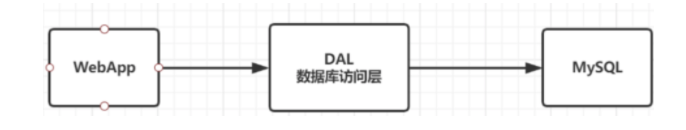
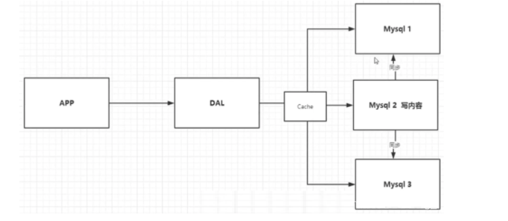
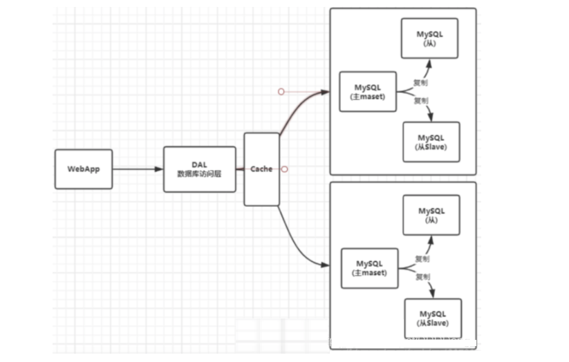
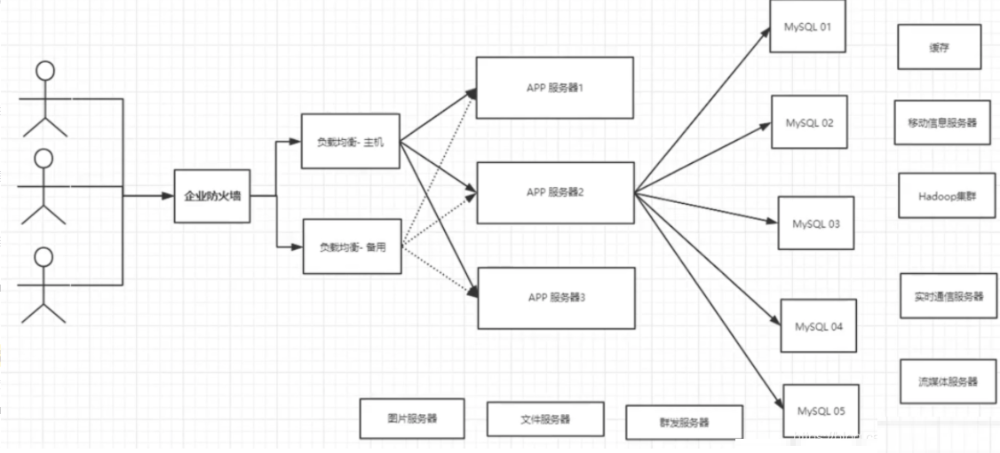

# NoSQL 

## 为什么要使用 NoSQL

### 发展历程

#### 单机 MySQL

90 年代 一个网站的访问量一般不会太大，单个数据库完全够用

但随着用户增多，会出现以下问题：

+ 数据量增加到一定程度，单机数据库就放不下了
+ 数据的索引（B+ Tree）,一个机器内存也存放不下
+ 访问量变大后（读写混合），一台服务器承受不住

为了解决上述的问题，可以加入缓存和将表垂直拆分

#### Memcached(缓存) + Mysql + 垂直拆分（读写分离）

+ 网站 80% 的情况都是在读，每次都要去查询数据库的话就十分的麻烦

+ 希望减轻数据库的压力，可以使用缓存来保证效率

**优化过程经历了以下几个过程**：

+ 优化数据库的数据结构和索引(难度大)

+ 文件缓存，通过 IO 流获取比每次都访问数据库效率略高，但是流量爆炸式增长时候，IO 流也承受不了

+ MemCache，通过在数据库和数据库访问层之间加上一层缓存，第一次访问时查询数据库，将结果保存到缓存，后续的查询先检查缓存，若有直接拿去使用，效率显著提升

#### 分库分表 + 水平拆分 + Mysql 集群

### 为什么要用NoSQL

目前一个基本的互联网项目

+  如今信息量井喷式增长，各种各样的数据出现（用户定位数据，图片数据等）
+ 用户的个人信息，社交网络，地理位置
+ 用户自己产生的数据，用户日志等等爆发式增长

这时候就需要使用 NoSQL 数据库的，NoSQL 可以很好的处理以上的情况

## 什么是 NoSQL

**NoSQL = Not Only SQL（不仅仅是SQL**

关系型数据库：列+行，同一个表下数据的结构是一样的

非关系型数据库：数据存储没有固定的格式，并且可以进行横向扩展

NoSQL 泛指非关系型数据库

## NoSQL 的特点

+ 方便扩展：数据之间没有关系，很好扩展

+ 大数据量高性能：Redis 一秒可以写 8 万次，读 11 万次，NoSQL 的缓存记录级，是一种细粒度的缓存，性能会比较高

+ 数据类型是多样型的：不需要事先设计数据库，随取随用
+ 传统的 RDBMS 和 NoSQL

**传统的 RDBMS**：

+ 结构化组织
+ SQL
+ 数据和关系都存在单独的表中 
+ 严格的一致性
+ 基础的事务
+ .....

**NoSQL**：

+ 不仅仅是数据
+ 没有固定的查询语言
+ 键值对存储、列存储、文档存储、图形存储
+ 最终一致性
+ 高性能、高可用、高扩展
+ .....

## NoSQL 的四大分类

### KV 键值对

- 新浪：**Redis**
- 美团：Redis + Tair
- 阿里、百度：Redis + Memcache

### 文档型数据库(bson 格式)

- MongoDB
  - 基于分布式文件存储的数据库
  - C++编写，用于处理大量文档
  - MongoDB 是 RDBMS 和 NoSQL 的中间产品
  - MongoDB 是非关系型数据库中功能最丰富的，NoSQL 中最像关系型数据库的数据库
- ConthDB

### 列存储数据库

- HBase(大数据必学)
- 分布式文件系统

### 图关系数据库

+ 用于广告推荐，社交网络
+ **Neo4j**、InfoGrid

（完）