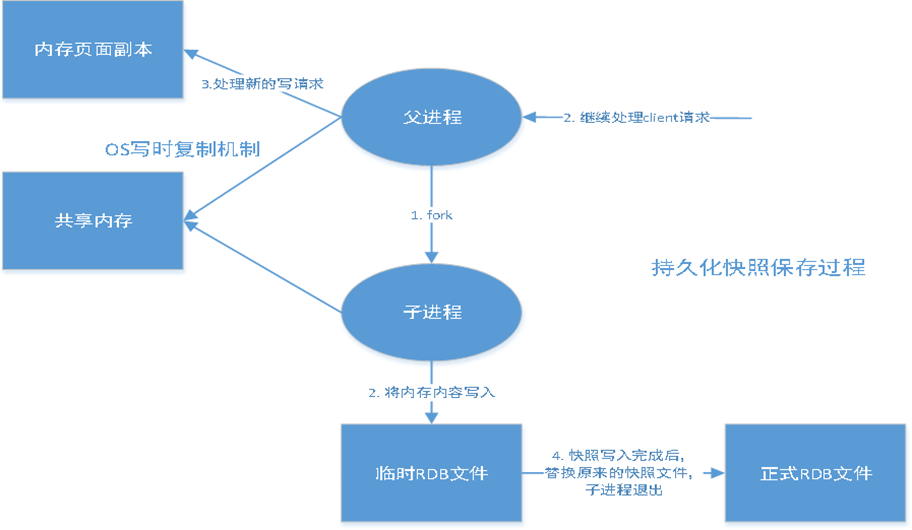

# 持久化之 RBD

## 什么是 RDB

RDB：Redis Databases

+ 持久化实现的方式之一
+ 在指定时间间隔后，将内存中的数据集快照写入数据库
+ 在恢复的时候，直接读取快照文件，进行数据恢复
+ 默认情况下，Redis 将 RDB 保存在 dump.rdb 文件中，可以在配置文件中自定义


## 工作原理

先了解下 RDB 的两个命令：save 和 bgsave

### save 命令

+ 使用 save 命令，会直接调用 rdbsave 函数，立刻对当前内存中的数据进行持久化
+ 会阻塞 Redis 主线程，直到数据同步保存完成，不会接收其他操作
+ 若 Redis 数据非常多时，save 执行的速度会非常慢

### bgsave 命令

+ 会 fork 一个子进程，负责调用 rdbsave 函数
+ 在保存完毕完成后向主线程发送信号通知主进程保存完毕
+ 主进程可以处理其他客户端操作

### RDB 实现



在进行 RDB 的时候，Redis 的主线程是不会做 io 操作的，主线程会 fork 一个子线程来完成该操作；
+ Redis 调用 fork，同时拥有父进程和子进程
+ 子进程将数据集写入到一个临时 RDB 文件中
+ 当子进程完成对新 RDB 文件的写入时，Redis 用新 RDB 文件替换原来的 RDB 文件，并删除旧的 RDB 文件
+ 这种工作方式使得 Redis 可以从写时复制（copy-on-write）机制中获益(因为是使用子进程进行写操作，而父进程依然可以接收来自客户端的请求)

## 触发机制

+ save 的规则满足的情况下，会自动触发 RDB 原则
+ 执行 flushall 命令，也会触发我们的 RDB 原则
+ 退出 redis，也会自动产生 RDB 文件


**恢复 RDB 文件**：
+ 只需要将 RDB 文件放在 Redis 启动目录就行，Redis 启动会自动检查 dump.rdb 恢复其中的数据
+ 查看需要存放的位置
```shell
127.0.0.1:6379> config get dir
1) "dir"
2) "usr/local/bin"
```

## RDB 优缺点

**优点**:

+ 适合大规模的数据恢复
+ 对数据的完整性要求不高

**缺点**:
+ 需要一定的时间间隔进行操作，如果 Redis 意外宕机了，这个最后一次修改的数据就没有了
+ fork 进程的时候，会占用一定的内容空间

（完）