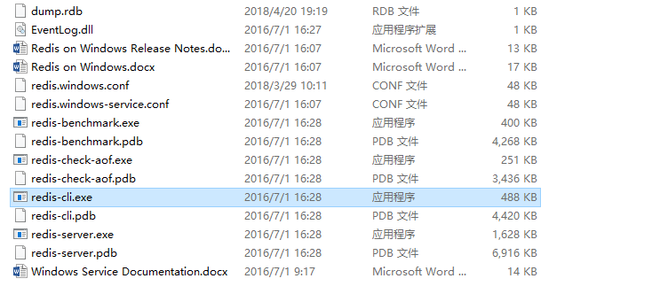
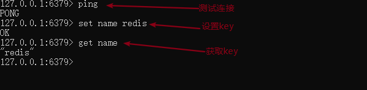

# 安装 Redis

官网：https://redis.io/

中文网：http://www.redis.cn/

推荐使用 Linux 服务器学习

Windows 版本的 Redis 已经停更很久了…

## Windows 安装

下载安装包后解压安装包



启动 redis-server.exe

启动 redis-cli.exe 测试



## Linux 安装

在`/opt` 目录下下载包

```shell
wget https://download.redis.io/releases/redis-7.0.0.tar.gz
```

解压

```shell
tar -zvxf redis-7.0.0.tar.gz
```

基本环境安装

```shell
# 先检查是否有 gcc 环境
gcc -v
# 没有时安装
yum install gcc-c++
# 进入 redis 目录
make
make install
```

将 Redis 的配置文件复制到 程序安装目录 `/usr/local/bin/config`下

```shell
# 进入默认安装路径
cd /usr/local/bin
# 新建一个文件夹
mkdir config
# 复制配置文件
cp /opt/redis-7.0.0/redis.conf config
```

修改配置文件，后台启动 Redis

```shell
# 找到 daemonize 将 no 改为 yes
daemonize yes
```

通过指定的配置文件启动 Redis 服务

```shell
redis-server config/redis.conf
```

使用 `redis-cli` 连接指定端口号测试

```shell
redis-cli -p 6379

[root@teakoo-test bin]# redis-cli -p 6379
127.0.0.1:6379> ping
PONG
127.0.0.1:6379> set name redis
OK
127.0.0.1:6379> get name
"redis"

```

查看 Redis 进程是否开启

```shell
ps -ef|grep redis
```

关闭 Redis 服务

```shell
# 在连接中关闭
shutdown
# 退出
exit
```

（完）