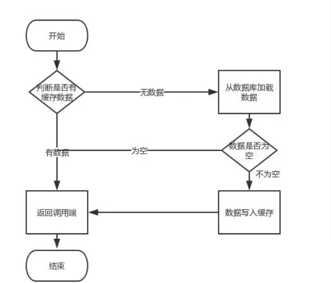

# Redis 与 MySQL 如何保证数据一致性

## 为何用 Redis 做缓存

**原因**：
+ 在高并发的业务场景下，数据库大多数情况是用户并发访问最薄弱的环节
+ 需要使用 Redis 做缓存，让请求先访问的 Redis，减少数据库的 IO，提升性能

**整体流程**：



## 为什么产生数据不一致

**原因**：
+ 一份数据同时保存在 M有SQL 和 Redis 中，当数据发生变化时，需要同时更新 Redis 和 MySQL
+ 更新数据是有先后顺序的，Redis 并不像 MySQL 中的事务操作可以满足 ACID 的特性，所以会出现数据不一致的问题

## 如何保证数据一致性

不管是先写 MySQL 数据库，再更新 Redis 缓存；还是先删除缓存，再写库，都有可能出现数据不一致的情况  

举一个例子：
+ 如果删除了缓存 Redis，还没有来得及写库 MySQL，另一个线程就来读取，发现缓存为空，则去数据库中读取数据写入缓存，此时缓存中为脏数据
+ 如果先写了库，在更新缓存，如果缓存失败，也会出现数据不一致情况

因为写和读是并发的，没法保证顺序,就会出现缓存和数据库的数据不一致的问题

### 解决方案

>> 采用延时双删策略

写库前后都进行 `redis.del(key)` 操作，并设置合理的超时时间

伪代码如下：
```java
public void write( String key, Object data )
{
	redis.delKey( key );
	db.updateData( data );
	Thread.sleep( 500 );
	redis.delKey( key );
}
```

**具体步骤**：
- 先删除缓存
- 再写数据库
- 休眠 500 毫秒
- 再次删除缓存

**如何确定休眠时间**：
- 需要评估项目的读数业务逻辑的耗时，确保请求结束，写请求可以删除度请求造成的缓存脏数据
- 需要考虑 Redis 与 MySQL 主从同步的耗时，最终的耗时时间是在读数据的业务逻辑的基础耗时上加上主从同步的耗时

**设置过期时间**：
- 理论上说，设置过期时间，可以保证最终一致性
- 所有的写操作以数据库为准，只要达到缓存过期时间，后面的请求就会从数据库中去读新的值回填缓存

**该方案的缺点**：
结合双删策略 + 缓存超时设置，这样最差的情况就是在超时时间内数据存在不一致，而且又增加了写请求的耗时

>> 异步更新缓存（基于订阅 binlog 的同步机制）

**技术整体思路**： MySQL binlog 增量订阅消费 + 消息队列 + 增量数据更新到 Redis

- 读 Redis：热数据基本都在 Redis
- 写 MySQL：增删改都是操作 MySQL 
- 更新 Redis 数据：MySQ的数据操作binlog，来更新到Redis

**Redis 更新**：

- 数据操作主要分为两大块
  - 一个是全量（将全部数据一次写入到 Redis）
  - 一个是增量（实时更新）这里说的是增量,指的是mysql的update、insert、delate变更数据
- 读取 binlog后分析 ，利用消息队列,推送更新各台的redis缓存数据
  - 一旦 MySQL 中产生了新的写入、更新、删除等操作，就可以把 binlog 相关的消息推送至 Redis
  - Redis 再根据 binlog 中的记录，对 Redis 进行更新
  - 这种机制，很类似 MySQL 的主从备份机制，因为 MySQL 的主备也是通过 binlog 来实现的数据一致性
  - 这里可以结合使用 canal（阿里的一款开源框架），通过该框架可以对 MySQL 的 binlog 进行订阅，而 canal 正是模仿了 mysql 的 slave 数据库的备份请求，使得 Redis 的数据更新达到了相同的效果
  - 这里的消息推送工具你也可以采用别的第三方：Kafka、rabbitMQ 等来实现推送更新 Redis

（完）