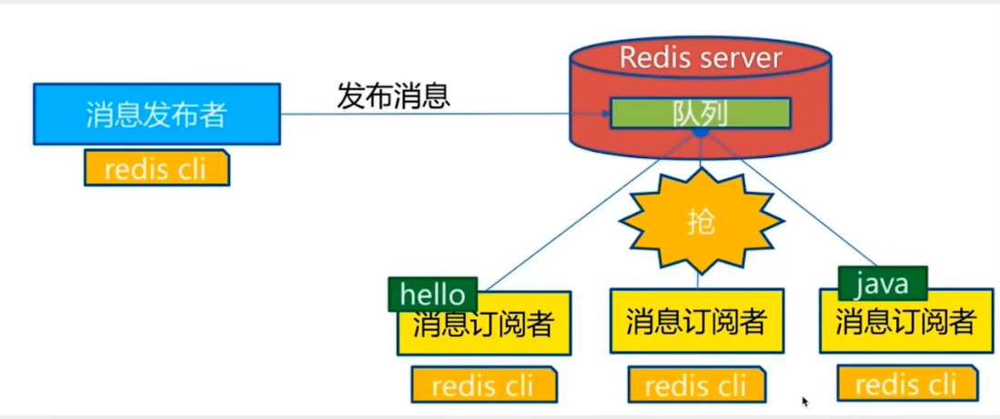
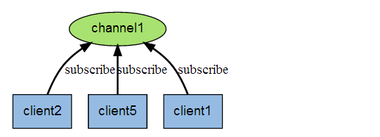
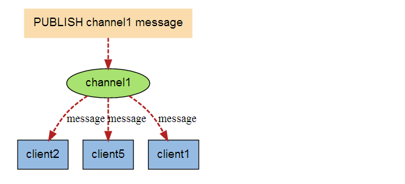
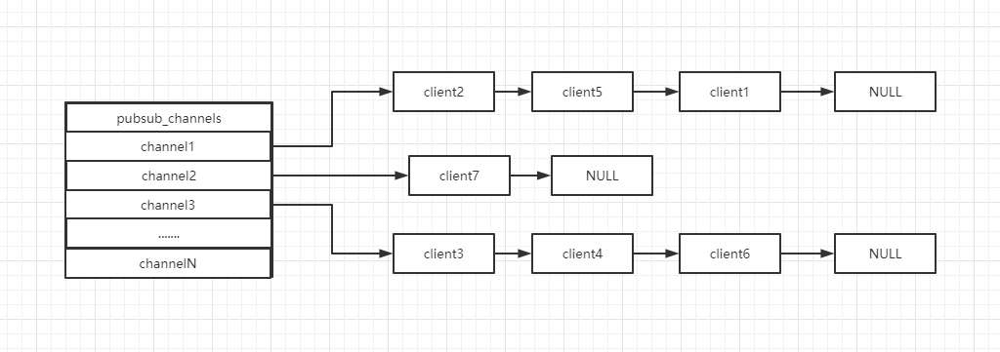

# Redis 发布订阅

## 什么是 Redis 发布订阅

+ 是一种消息通信模式
+ 发送者(pub)发送消息，订阅者(sub)接收消息
+ Redis 客户端可以订阅任意数量的频道

订阅/发布消息图：



下图展示了频道 channel1 ， 以及订阅这个频道的三个客户端 —— client2 、 client5 和 client1 之间的关系：



当有新消息通过 PUBLISH 命令发送给频道 channel1 时， 这个消息就会被发送给订阅它的三个客户端：



## 发布订阅命令

列出了常用的发布订阅命令：

| 命令 | 描述             |
| ---- |----------------|
| PSUBSCRIBE pattern [pattern ...]     | 订阅一个或多个符合给定模式的频道 ||
|	PUBSUB subcommand [argument [argument ...]] | 查看订阅与发布系统状态    |
|	PUBLISH channel message | 将信息发送到指定的频道    |
| 	PUNSUBSCRIBE [pattern [pattern ...]] | 退订所有给定模式的频道    |
| SUBSCRIBE channel [channel ...] | 订阅给定的一个或多个频道的信息 |
| UNSUBSCRIBE [channel [channel ...]] | 退订一个或多个频道      |

**示例**：
```bash
---------------------------订阅端-----------------------------
127.0.0.1:6379> SUBSCRIBE redisChat
 
Reading messages... (press Ctrl-C to quit)
1) "subscribe"
2) "redisChat"
3) (integer) 1
# 订阅者的客户端会显示如下消息
1) "message"
2) "redisChat"
3) "Redis is a great caching technique"
1) "message"
2) "redisChat"
3) "Learn redis by w3cschool.cc"

---------------------------消息发布端-----------------------------
127.0.0.1:6379> PUBLISH redisChat "Redis is a great caching technique"
 
(integer) 1
127.0.0.1:6379> PUBLISH redisChat "Learn redis by w3cschool.cc"
 
(integer) 1
```

## 原理

+ 通过 SUBSCRIBE 命令订阅频道后，redis-server 服务器进程都维护着一个字典
+ 字典的键为正在被订阅的频道， 而字典的值则是一个链表
+ 链表中保存了所有订阅这个频道的客户端
+ SUBSCRIBE 命令的关键就是将客户端添加到指定 channel 的订阅链表中



客户端订阅，就被链接到对应频道的链表的尾部，退订则就是将客户端节点从链表中移除

+ 通过 PUBLISH 命令向订阅者发送消息，redis-server 会使用指定的频道作为键
+ 在所维护的 channel 字典中查找订阅了该频道的所有客户端链表
+ 遍历链表，将消息发送给所有订阅者

**缺点**：
+ 如果一个客户端订阅了频道，但读取消息的速度不快，不断积压的消息会使 Redis 输出缓冲区的体积变得越来越大，这可能使得 Redis 本身的速度变慢，甚至直接崩溃
+ 这和数据传输可靠性有关，如果在订阅方断线，那么他将会丢失所有在短线期间发布者发布的消息

**应用场景**:
+ 消息订阅：公众号订阅，微博关注等等（起始更多是使用消息队列来进行实现）
+ 实时聊天（频道当作聊天室，将信息回显给所有人）
+ 实时消息系统

稍微复杂的场景就会使用消息中间件 MQ 处理

## 参考文档

[官方文档-Redis 发布订阅](https://www.redis.net.cn/tutorial/3514.html)

（完）