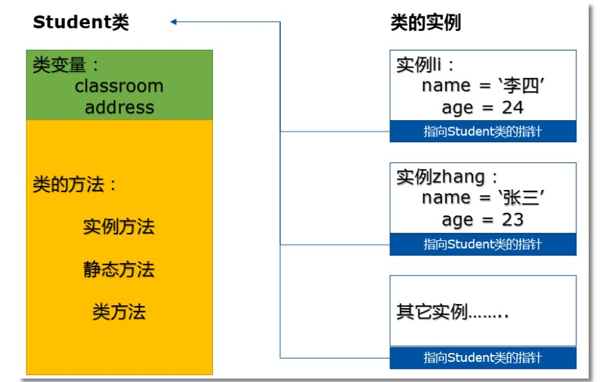

# 类与实例

## 类与实例定义

### 类

**定义**： 具有相同属性和方法的对象的集合 

**基本结构**：

```python
class 类名(父类列表)：
	pass
```

**命名方式**：驼峰式命名

**继承**：

+  可同时继承多个父类（也叫基类、超类） 
+  继承的基类有先后顺序 

### 实例

**定义**：  根据类创建出来的一个个具体的“对象” 

**实例化方法 `__init__`**：构建类的实例

```python
class Student:   
    def __init__(self, name, age):
        self.name = name
        self.age = age
        
zhang = Student("张三", 23)
```

::: danger 类创建对象的过程：

+ 类在实例化时，会先调用 `__new__` 方法创建实例，然后对实例进行 `__init__` 初始化
+ 如果类没有指定 `__new__` 方法，就会调用 Object 的

:::


## 类与实例变量

### 类变量

**定义**： 在类中，但在方法之外的变量

```python
class Student:
    classroom = '101'       # 类变量
    address = 'beijing'     # 类变量

    def __init__(self, name, age):
        self.name = name
        self.age = age

    def print_age(self):
        print('%s: %s' % (self.name, self.age))
zhang = Student("张三", 23)
```

**使用**：

+ 通过 类名.变量名(Student.classroom) 使用
+ 通过 实例.变量名(zhang.classroom) 使用

### 实例变量

**定义**： 实例本身拥有的变量 

```python
class Student:
    classroom = '101'     
    address = 'beijing'     

    def __init__(self, name, age):
        self.name = name   #实例变量
        self.age = age     #实例变量

    def print_age(self):
        print('%s: %s' % (self.name, self.age))

li = Student("李四", 24)
zhang = Student("张三", 23)
```

**使用**：

+ 通过 实例名.变量名 方式

**注意**：使用上方式使用变量时

+ 现在实例变量列表中查询是否有该实例变量
+ 实例变量列表中没有，再去类变量列表中查询

```python
>>> class Student:              # 类的定义体
    classroom = '101'           # 类变量
    address = 'beijing'

    def __init__(self, name, age):
        self.name = name
        self.age = age

    def print_age(self):
        print('%s: %s' % (self.name, self.age))


>>> li = Student("李四", 24)        # 创建一个实例
>>> zhang = Student("张三", 23)     # 创建第二个实例
>>> li.classroom # li本身没有classroom实例变量，所以去寻找类变量，它找到了！
'101'
>>> zhang.classroom # 与li同理
'101'
>>> Student.classroom   # 通过类名访问类变量
'101'
>>> li.classroom = '102'    # 关键的一步！实际是为li创建了独有的实例变量，只不过名字和类变量一样，都叫做classroom。
>>> li.classroom    # 再次访问的时候，访问到的是li自己的实例变量classroom
'102'
>>> zhang.classroom # zhang没有实例变量classroom，依然访问类变量classroom
'101'
>>> Student.classroom   # 保持不变
'101'
>>> del li.classroom    # 删除了li的实例变量classroom
>>> li.classroom        # 一切恢复了原样
'101'
>>> zhang.classroom
'101'
>>> Student.classroom
'101'
```

 防止发生上面的混淆情况，对于类变量，请使用`类名.类变量`的访问方式，不要用实例去访问类变量 

**特点**：  实例的变量名虽然一样，但他们保存的值却是各自独立的 

```
print(li.name)
print(li.age)
print(zhang.name)
print(zhang.age)
------------------------
李四
24
张三
23
```

## 类中的方法

### 实例方法

**特点**：

+  由实例调用，至少包含一个`self` 参数 
+  执行实例方法时，会自动将调用该方法的实例赋值给 `self` 
+  `self` 代表的是类的实例，而非类本身 
+  `self` 不是关键字，而是 Python 约定成俗的命名

 Student 类中的 print_age() 就是实例方法  :

```python
def print_age(self):
        print('%s: %s' % (self.name, self.age))

# --------------------------
# 调用方法
li.print_age()
zhang.print_age()
```

### 静态方法

**特点**： 

+ 由类调用，无默认参数 
+  实例方法参数中的 self 去掉，然后在方法定义上方加上 @staticmethod 
+  属于类，和实例无关 
+  建议只使用 类名.静态方法 的调用方式 

```python
class Foo:

    @staticmethod
    def static_method():
        pass

#调用方法
Foo.static_method()
```

### 类方法

**特点**：

+  由类调用 
+  用 @classmethod 装饰，至少传入一个 cls（代指类本身，类似 self）参数 
+  执行类方法时，自动将调用该方法的类赋值给 cls 
+  建议只使用 类名.类方法 的调用方式 

```python
class Foo:
    @classmethod
    def class_method(cls):
        pass

Foo.class_method()
```

## 类与实例中变量、方法在内存中的保存



**总结**：

+  类、类的所有方法以及类变量在内存中只有一份，所有的实例共享
+  每一个实例都在内存中独立的保存自己和自己的实例变量 
+  创建实例时， 会保存一个类对象指针，该值指向实例所属的类的地址 
+  实例可以寻找到自己的类，并进行相关调用，而类无法寻找到自己的某个实例 

（完）