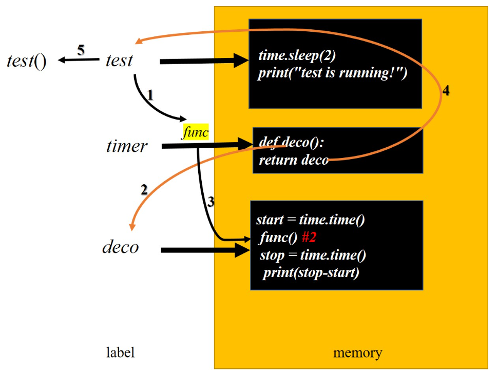

# 装饰器

## 前提准备

在学习装饰器之前，需要了解以下几个内容：

+ 关于函数“变量”（或“变量”函数）的理解
+ 关于高阶函数的理解
+ 关于嵌套函数的理解

## 什么是装饰器

**定义**：装饰对象的器件

**本质**：闭包

**作用**：

+ 不修改被装饰的函数的源代码

+ 不修改被装饰的函数的调用方式

+ 满足前面两种情况下给程序增添功能

**装饰器的原则组成**：

函数 + 实参高阶函数 + 返回值高阶函数 + 嵌套函数 + 语法糖 = 装饰器

## 为什么要使用装饰器

先来看个需求：

```python
improt time
def test():
    time.sleep(2)
    print("test is running!")
test()
```

需要统计上述代码的执行时间，但是原有的代码不能被修改，这时装饰器的作用就体现了

## 如何自定义装饰器

分析上面的需求，可以重新定义一个函数，并把当前函数传入，然后在新的函数中运行，就可以实现了

```python
improt time

def test():
    time.sleep(2)
    print("test is running!")
print("test id:{}".format(id(test)))
    
def deco(func):
    start = time.time()
    print(id(func))
    func() 
    stop = time.time()
    print(stop-start)

deco(test)
```

结果：

```python
test id:2731040652976
func id:2731040652976
test is running!
1.0034470558166504
```

从结果中看出，此时 test == func，指向同一个地址

虽然上述优化的代码，实现了统计时间的功能，但是**修改了函数的运行方式**，运行的是 `deco()` 这个函数，而不是运行 `test()`

基于函数的运行方式，重新修改代码：

```python
improt time

def test():
    time.sleep(2)
    print("test is running!")

def deco(func):  
    print(func)
    return func 
t = deco(test)
t()
```

上面的方案，test == func == t ，虽然最后原函数的调用方式没变，但是无法统计运行时间

既要能统计运行时间，又要保证原函数的调用方式不变，那要如何设计？

综合上面的一些设计，分析：

+ 要想统计运行时间，就必须在 test 运行前后进行统计
+ 要想保留原函数的调用方式，那就必须最后执行的函数要使用 `test()` 方式执行
+ 结合上面两次修改的代码，发现可以使用嵌套函数来实现

```python
import time

def test():
    time.sleep(1)
    print("test is running!")

print("test1 id:{}".format(id(test)))

def timer(func):
    def deco():
        start = time.time()
        print("func id:{}".format(id(func)))
        func()
        stop = time.time()
        print(stop - start)
    return deco

test = timer(test)
print("test2 id:{}".format(id(test)))
test()
```

结果：

```python
test1 id:1627287797424
test2 id:1627288937824
func id:1627287797424
test is running!
1.002009630203247
```

由结果可以看出，test == func == test 

**流程**：

<div style="text-align: center;">
    
</div>

至此，上面的需求已经实现了，但用 timer 来装饰函数时，都要写上下面的一行代码

```python
test = timer(test)
```

Python 提供了一种语法糖，使用 @timer 与上面作用等同：

```python
@timer
def test(parameter): 
    time.sleep(2)
    print("test is running!") 
test()
```

### 被装饰的函数带参

上面的原函数是没有参数的，那如果原函数有参数，使用装饰器需要怎么传参呢？

以上面的 test 为例

**分析**：

+ test 有参数，就等于在 deco 中的 func 有参数
+ 要给 test 传参，那就可以在 deco 中传参，内部的 func 可以读取参数

```python
improt time
def timer(func):
    def deco(*args,**kwargs):
        start = time.time()
        # print("func id:{}".format(id(func)))
        func(*args,**kwargs)
        stop = time.time()
        print(stop - start)
    return deco

@timer
def test(num):
    time.sleep(1)
    print("test is running!")
    print(num+1)

test(2)
```

结果：

```python
test is running!
3
1.0060534477233887
```

#### 如果原函数有返回值

只需要将 func 执行的结果返回即可

```python
improt time
def timer(func):
    def deco(*args,**kwargs):
        start = time.time()
        # print("func id:{}".format(id(func)))
        res = func(*args,**kwargs)
        stop = time.time()
        print(stop - start)
        return res
    return deco

@timer
def test(num):
    time.sleep(1)
    print("test is running!")
    return num+1

res = test(2)
print(res)
```

### 装饰器有参数

比如有一个新的需求：

```python
def task1():
    time.sleep(2)
    print("in the task1")

def task2():
    time.sleep(2)
    print("in the task2")

task1()
task2()
```

要对这两个函数分别统计运行时间，但是要求统计之后输出:

```python
the task1/task2 run time is : 2.00……
```

于是就要构造一个装饰器，要告诉装饰器哪个是 task1，哪个是 task2

```python
@timer(parameter='task1') 
def task1():
    time.sleep(2)
    print("in the task1")

@timer(parameter='task2') 
def task2():
    time.sleep(2)
    print("in the task2")

task1()
task2()
```
方法有了，那我们如何把这个 parameter 参数传递到装饰器中？

那就再加一层函数来接受参数，根据嵌套函数的概念，要想执行内函数，就要先执行外函数，才能调用到内函数：
```python
import time

def timer(parameter):
    def outer_wrapper(func):
        def wrapper(*args, **kwargs):
            if parameter == 'task1':
                start = time.time()
                func(*args, **kwargs)
                stop = time.time()
                print("the task1 run time is :", stop - start)
            elif parameter == 'task2':
                start = time.time()
                func(*args, **kwargs)
                stop = time.time()
                print("the task2 run time is :", stop - start)
        return wrapper
    return outer_wrapper

@timer('task1')
def task1():
    time.sleep(2)
    print("in the task1")

@timer('task2')
def task2():
    time.sleep(2)
    print("in the task2")

task1()
task2()
```
结果：
```python
in the task1
the task1 run time is : 2.009113073348999
in the task2
the task2 run time is : 2.0099661350250244
```
timer(parameter)，接收参数 parameter=’task1/2’，而 @timer(parameter) 也恰巧带了括号，那么就会执行这个函数，那么就是相当于：
```python
timer = timer(parameter)
task1 = timer(task1)
```

## 类装饰器

上面讲的都是函数装饰器，类装饰器的原理与函数装饰器的一致
**原理**：类中重写 `__call__`方法，使得类可以像函数一样被调用

### 不带参类装饰器

```python
import time

class Timer():
    def __init__(self,func):
        self.func = func

    def __call__(self, *args, **kwargs):
        start = time.time()
        self.func()
        stop = time.time()
        print(stop - start)

@Timer
def run():
    time.sleep(2)
    print("hello")

run()
```

### 被装饰的函数带参

```python
class Timer():
    def __init__(self,func):
        self.func = func

    def __call__(self, *args, **kwargs):
        start = time.time()
        res = self.func(*args, **kwargs)
        stop = time.time()
        print(stop - start)
        return res

@Timer
def run(a,b):
    time.sleep(2)
    return a+b

print(run(1,4))
```

### 装饰器有参数

```python
import time

class Timer():
    def __init__(self,prefix):
        self.prefix = prefix

    def __call__(self, func):
        def wrapper(*args, **kwargs):
            start = time.time()
            res = func(*args, **kwargs)
            stop = time.time()
            print(f'{self.prefix}:{stop - start}')
            return res
        return wrapper


@Timer('curent time:')
def run(a,b):
    time.sleep(2)
    return a+b

print(run(1,4))
```

## 参考文档

[装饰器](https://www.liaoxuefeng.com/wiki/1016959663602400/1017451662295584)

[Python 装饰器](https://blog.csdn.net/u013471155/article/details/68960244)

（完）

