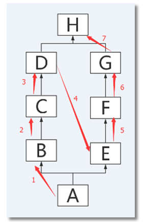

# 继承

**语法结构**：

```python
class Foo(superA, superB,superC....):
    pass
class DerivedClassName(modname.BaseClassName): ## 当父类定义在另外的模块时
    pass
```

**优点**：

+  实现了代码的复用，多个类公用的代码部分可以只在一个类中提供，其他类只需要继承这个类即可 
+  子类获得了父类的全部变量和方法的同时，又可以根据需要进行修改、拓展 

## 继承方式

### 单继承

**定义**：只继承于一个父类

```python
# 父类定义
class people:
    def __init__(self, name, age, weight):
        self.name = name
        self.age = age
        self.__weight = weight
    def speak(self):
        print("%s 说: 我 %d 岁。" % (self.name, self.age))

# 单继承示例
class student(people):
    def __init__(self, name, age, weight, grade):
        # 调用父类的实例化方法
        people.__init__(self, name, age, weight)
        self.grade = grade
    # 重写父类的speak方法
    def speak(self):
        print("%s 说: 我 %d 岁了，我在读 %d 年级" % (self.name, self.age, self.grade))

s = student('ken', 10, 30, 3)
s.speak()
```

### 多继承

**定义**：有多个父类

```python
class A:
    pass
class B:
    pass
class C(A,B):
    pass
```

**注意**：需要注意括号内基类的顺序

多继承时，若是基类中有相同的方法名，并且在子类使用时未指定，Python 会从左至右搜索基类中是否包含该方法。一旦查找到则直接调用，后面不再继续查找 

## 继承机制

 Python3 的继承机制不同于 Python2 

### Python3

**核心原则**：

+ 子类在调用某个方法或变量的时候，首先在自己内部查找，如果没有找到，则开始根据继承机制在父类里查找。
+ 根据父类定义中的顺序，以**深度优先**的方式逐一查找父类

**深度优先**：

例：

```python
class D:
    def show(self):
        print("i am D")
    pass

class C(D):
    pass

class B(C):

    pass

class G:
    pass

class F(G):
    pass

class E(F): 
    def show(self):
        print("i am E")
    pass

class A(B, E):
    pass

a = A()
a.show()
```

查询顺序：


再例：

```python 
class H:
    def show(self):
        print("i am H")
    pass

class D(H):
    pass

class C(D):
    pass

class B(C):
    pass

class G(H):
    pass

class F(G):
    pass

class E(F): 
    def show(self):
        print("i am E")
    pass

class A(B, E):
    pass

a = A()
a.show()
```

你以为的结果："i am H"

实际上的结果："i am E"

搜索顺序：




### super() 函数

**作用**： super调用父类的实例化方法 `__init__` 

**语法**：

```python
super(子类名, self).方法名()
```

例：

```python
class A:
    def __init__(self, name):
        self.name = name
        print("父类的__init__方法被执行了！")
    def show(self):
        print("父类的show方法被执行了！")

class B(A):
    def __init__(self, name, age):
        super(B, self).__init__(name=name)
        self.age = age

    def show(self):
        super(B, self).show()

obj = B("jack", 18)
obj.show()
```

## 多态

子类继承了父类后，也拥有父类的类型

```python
class Animal:

    def kind(self):
        print("i am animal")


class Dog(Animal):

    def kind(self):
        print("i am a dog")


class Cat(Animal):

    def kind(self):
        print("i am a cat")
        
def show_kind(animal):
    animal.kind()
    
d = Dog()
c = Cat()

print(instance(d,Animal))
show_kind(d)
show_kind(c)
---------------------------------------
结果：
i am a dog
i am a cat
```

（完）